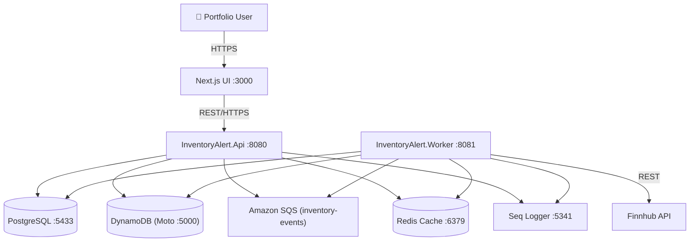

# Architecture Overview

## System Context

InventoryAlert is a real-time stock alerting and portfolio management system. The diagram below shows how it interacts with external systems and internal services.

## Lean Vertical Slice Consolidation

To improve maintainability and reduce project-reference overhead, the solution uses a **Lean Vertical Slice** architecture since v2.

- **Consolidated Business Logic**: There is no separate `Application` layer. Services live in `InventoryAlert.Api` and are grouped by feature slice (e.g., `StockDataService`, `AlertRuleService`, `PortfolioService`, `WatchlistService`).
- **Repository Strategy**: Repositories are feature-specific rather than purely generic. `StockListingRepository` encapsulates EF Core queries, `TradeRepository` computes net holdings via `SUM(Buy) - SUM(Sell)`.
- **Observability-first**: All events flow through **Seq** (structured logging) with correlation IDs. No relational `SystemEvent` tables — keeps the DB clean.

## Tech Stack

### Backend

| Layer | Technology | Notes |
|---|---|---|
| Runtime | .NET 10 / C# 12 | Primary constructors, collection expressions |
| Web Framework | ASP.NET Core 10 | Minimal API + Controllers |
| ORM | EF Core 10 + Npgsql | `AsNoTracking()` on all reads |
| Background Jobs | Hangfire (PostgreSQL storage) | Dashboard at `/hangfire` |
| Event Bus | Amazon SQS | Mocked locally with Moto |
| Cache | Redis via StackExchange.Redis | 30s quote TTL, 30min dedup TTL |
| Logging | Serilog → Seq | Structured logs, searchable at `:5341` |
| Validation | FluentValidation | Applied at Web layer; Application layer trusts validated inputs |

### Frontend

| Layer | Technology | Notes |
|---|---|---|
| Framework | Next.js 15 (App Router + RSC) | Server + Client component split |
| Language | TypeScript | Strict mode |
| Styling | Tailwind CSS v4 | Finance-themed design system |
| Server State | React Query | Auto-refresh, stale-while-revalidate, optimistic updates |
| UI State | Zustand | Modal, filter, and selection state |
| Charts | Recharts | PriceLineChart, EarningsBarChart, RecommendationDonut |

### Infrastructure

| Component | Tool | Notes |
|---|---|---|
| Relational DB | PostgreSQL 17 | Via Docker, exposed on `5433` |
| NoSQL | Amazon DynamoDB | Moto for local emulation on `5000` |
| Observability | Seq (structured logs) | http://localhost:5341 |
| Containerization | Docker + Docker Compose | All services via single `compose up` |
| Notifications | In-App `Notification` table | Replaces legacy Telegram integration |
| Cache | Redis 7 | Dedup + quote + alert cooldown |

## Docker Services Summary

| Container | Image | Port | Role |
|---|---|---|---|
| `inventory-api` | Custom .NET 10 | `8080` | REST API |
| `inventory-worker` | Custom .NET 10 | `8081` | Background jobs |
| `inventory-db` | postgres:17-alpine | `5433` | PostgreSQL |
| `inventory-cache` | redis:7.2-alpine | `6379` | Redis |
| `inventory-seq` | datalust/seq | `5341` | Structured log viewer |
| `inventory-moto` | motoserver/moto | `5000` | DynamoDB + SQS emulator |
| `inventory-ui` | Custom Next.js | `3000` | Frontend |
