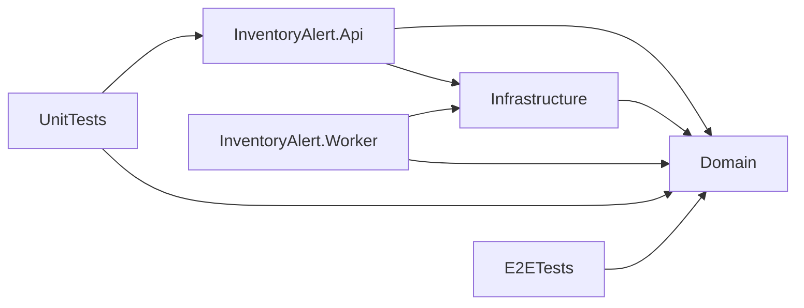

# Domain, Structure & DDD

## Lean Vertical Slice Architecture

InventoryAlert uses a **Lean Vertical Slice** approach. Business logic is co-located with the layer that owns the side effect — not forced into a generic Application layer.

## Project Structure

| Project | Responsibility | Key Namespaces |
|---|---|---|
| **InventoryAlert.Domain** | Pure entities, repository interfaces, DTOs, events, enums, and validators. Zero external dependencies. | `Domain.Entities`, `Domain.Interfaces`, `Domain.DTOs`, `Domain.Events`, `Domain.Validators` |
| **InventoryAlert.Infrastructure** | EF Core (PostgreSQL), DynamoDB, FinnhubClient, SQS queue, Redis, and UnitOfWork. | `Infrastructure.Persistence`, `Infrastructure.External`, `Infrastructure.Messaging` |
| **InventoryAlert.Api** | Thin REST controllers, service layer, FluentValidation, middleware, JWT auth, DI root. | `Api.Controllers`, `Api.Services`, `Api.Configuration`, `Api.Middleware` |
| **InventoryAlert.Worker** | Hangfire jobs, SQS listener, SQS event handlers. | `Worker.ScheduledJobs`, `Worker.IntegrationEvents` |
| **InventoryAlert.UnitTests** | xUnit + Moq + FluentAssertions. Covers all services, repositories. | - |
| **InventoryAlert.IntegrationTests** | EF Core InMemory repository tests. | - |
| **InventoryAlert.E2ETests** | Full HTTP roundtrip via RestSharp against running Docker stack. | - |
| **InventoryAlert.ArchitectureTests** | NetArchTest: Domain must have zero imports from Infrastructure/Api/Worker. | - |

### Dependency Direction



> **Rule**: `Domain` must never reference `Api`, `Infrastructure`, or `Worker`. Enforced by `InventoryAlert.ArchitectureTests` on every build.

---

## Solution Folder Structure

```
InventoryManagementSystem/
├── InventoryAlert.Api/              ← Web layer
│   ├── Controllers/
│   │   ├── AuthController.cs
│   │   ├── PortfolioController.cs
│   │   ├── StocksController.cs
│   │   ├── MarketController.cs
│   │   ├── WatchlistController.cs
│   │   ├── AlertRulesController.cs
│   │   ├── NotificationsController.cs
│   │   └── EventsController.cs
│   ├── Services/
│   │   ├── AuthService.cs
│   │   ├── PortfolioService.cs
│   │   ├── StockDataService.cs
│   │   ├── AlertRuleService.cs
│   │   ├── WatchlistService.cs
│   │   ├── NotificationService.cs
│   │   └── EventService.cs
│   ├── Configuration/
│   │   └── ApiSettings.cs           ← Extends AppSettings with JwtSettings
│   ├── Middleware/
│   └── Program.cs
│
├── InventoryAlert.Domain/           ← Core (zero dependencies)
│   ├── Entities/Postgres/
│   │   ├── User.cs
│   │   ├── StockListing.cs          ← was Product.cs — global ticker catalog
│   │   ├── WatchlistItem.cs         ← Composite PK: (UserId, TickerSymbol)
│   │   ├── AlertRule.cs             ← AlertCondition enum
│   │   ├── Trade.cs                 ← was StockTransaction.cs — TradeType enum
│   │   ├── PriceHistory.cs
│   │   ├── StockMetric.cs           ← Cached basic financials (PK = TickerSymbol)
│   │   ├── EarningsSurprise.cs
│   │   ├── RecommendationTrend.cs
│   │   ├── InsiderTransaction.cs
│   │   └── Notification.cs
│   ├── Entities/Dynamodb/
│   │   ├── MarketNewsDynamoEntry.cs
│   │   └── CompanyNewsDynamoEntry.cs
│   ├── Events/
│   │   ├── EventEnvelope.cs
│   │   ├── EventTypes.cs
│   │   └── Payloads/
│   ├── Interfaces/
│   │   ├── IUnitOfWork.cs
│   │   ├── IStockListingRepository.cs
│   │   ├── ITradeRepository.cs
│   │   ├── IWatchlistItemRepository.cs
│   │   ├── IAlertRuleRepository.cs
│   │   ├── IPriceHistoryRepository.cs
│   │   ├── IStockMetricRepository.cs
│   │   ├── IEarningsSurpriseRepository.cs
│   │   ├── IRecommendationTrendRepository.cs
│   │   ├── IInsiderTransactionRepository.cs
│   │   ├── INotificationRepository.cs
│   │   ├── IFinnhubClient.cs
│   │   ├── IStockDataService.cs
│   │   ├── IPortfolioService.cs
│   │   ├── IAlertRuleService.cs
│   │   ├── IWatchlistService.cs
│   │   ├── INotificationService.cs
│   │   └── IAuthService.cs
│   ├── Configuration/
│   │   └── AppSettings.cs           ← Shared base settings
│   └── DTOs/
│       ├── AuthDTOs.cs
│       ├── PortfolioDTOs.cs
│       ├── AlertRuleDTOs.cs
│       ├── StockDTOs.cs
│       ├── MarketDTOs.cs
│       ├── CalendarDTOs.cs
│       ├── NotificationDTOs.cs
│       ├── EventDTOs.cs
│       ├── PagedResult.cs
│       └── PaginationParams.cs
│
├── InventoryAlert.Infrastructure/   ← Data access + external clients
│   ├── Persistence/Postgres/
│   │   ├── AppDbContext.cs
│   │   ├── DatabaseSeeder.cs
│   │   ├── Migrations/
│   │   ├── Configurations/          ← EF Core entity configs
│   │   └── Repositories/
│   │       ├── GenericRepository.cs
│   │       ├── UnitOfWork.cs
│   │       ├── StockListingRepository.cs
│   │       ├── TradeRepository.cs
│   │       ├── AlertRuleRepository.cs
│   │       ├── PriceHistoryRepository.cs
│   │       ├── StockMetricRepository.cs
│   │       ├── EarningsSurpriseRepository.cs
│   │       ├── RecommendationTrendRepository.cs
│   │       ├── InsiderTransactionRepository.cs
│   │       ├── NotificationRepository.cs
│   │       ├── UserRepository.cs
│   │       └── WatchlistItemRepository.cs
│   ├── Persistence/DynamoDb/
│   │   └── Repositories/
│   │       ├── MarketNewsDynamoRepository.cs
│   │       └── CompanyNewsDynamoRepository.cs
│   ├── External/Finnhub/
│   │   └── FinnhubClient.cs
│   ├── Messaging/
│   │   └── SqsService.cs
│   ├── Caching/
│   │   └── RedisHelper.cs
│   └── DependencyInjection.cs
│
├── InventoryAlert.Worker/           ← Background job engine
│   ├── ScheduledJobs/
│   │   ├── SyncPricesJob.cs
│   │   ├── SyncMetricsJob.cs
│   │   ├── SyncEarningsJob.cs
│   │   ├── SyncRecommendationsJob.cs
│   │   ├── SyncInsidersJob.cs
│   │   ├── NewsSyncJob.cs
│   │   ├── CleanupPriceHistoryJob.cs
│   │   ├── ProcessQueueJob.cs
│   └── IntegrationEvents/
│       ├── Routing/IntegrationMessageRouter.cs
│       └── Handlers/
│           ├── MarketPriceAlertHandler.cs
│           ├── LowHoldingsHandler.cs
│           └── DefaultHandler.cs
│
├── InventoryAlert.UnitTests/
├── InventoryAlert.IntegrationTests/
├── InventoryAlert.E2ETests/
└── InventoryAlert.ArchitectureTests/
```

---

## Placement Decision Reference

| Type | Belongs In |
|---|---|
| Entity class | `Domain/Entities/` |
| Repository interface | `Domain/Interfaces/` |
| Service interface (shared) | `Domain/Interfaces/` |
| Request/Response DTO | `Domain/DTOs/` |
| FluentValidation validator | `Domain/Validators/` |
| SQS event payload | `Domain/Events/Payloads/` |
| EF Core configuration | `Infrastructure/Persistence/Configurations/` |
| Repository implementation | `Infrastructure/Persistence/Repositories/` |
| Caching / Messaging impl | `Infrastructure/Caching/` or `Infrastructure/Messaging/` |
| Controller | `Api/Controllers/` |
| API-level service | `Api/Services/` |
| Scheduled job | `Worker/ScheduledJobs/` |
| SQS event handler | `Worker/IntegrationEvents/Handlers/` |
