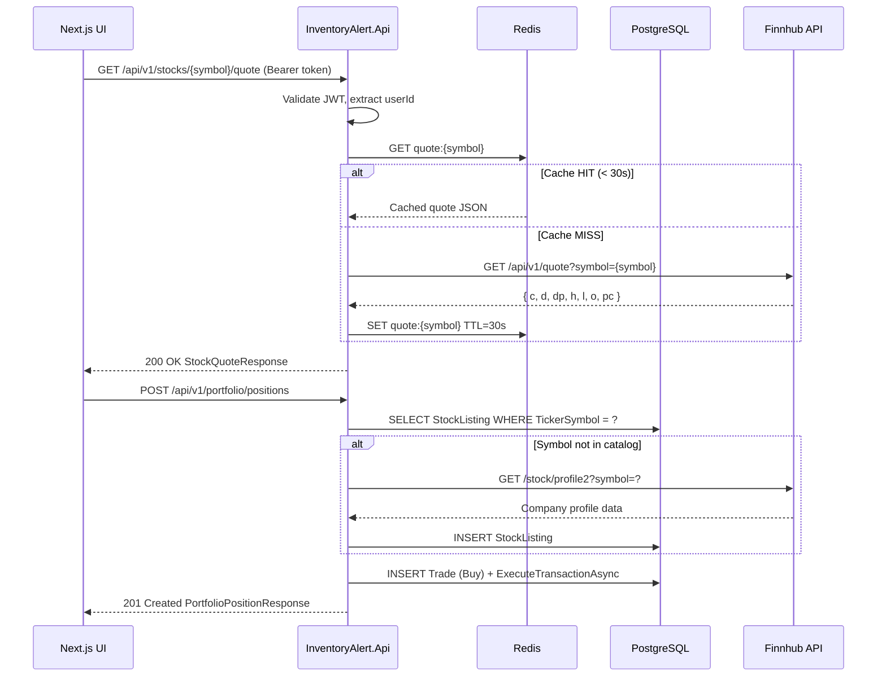
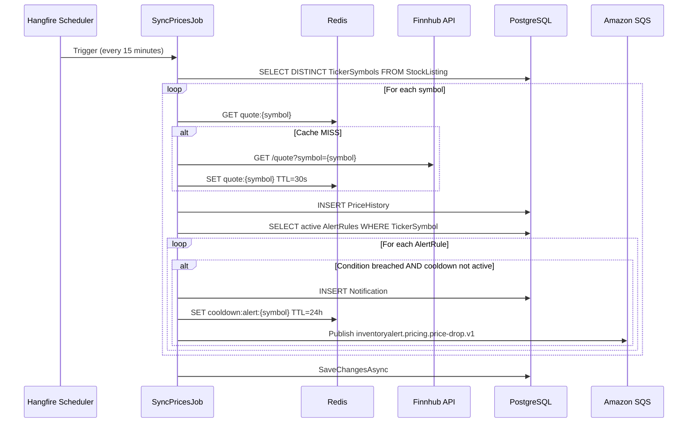
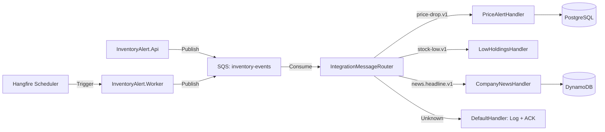

# Microservice Component Interactions

> How the individual project components communicate at runtime.

## Request–Response Flow (API)

---

## Background Worker Flow (Price Sync)

---

## SQS Message Flow

---

## Worker Isolation

The `InventoryAlert.Worker` runs as a **separate Docker container**. It communicates with `InventoryAlert.Api` only via:

1. **Shared PostgreSQL** — reads `StockListing`, writes `PriceHistory`, `Notification`, etc.
2. **Shared Redis** — reads/writes cache, dedup keys, cooldown keys.
3. **SQS** — consumes events published by the API, publishes events for handlers.
4. **SignalR Backplane (Redis)** — pushes real-time notifications from Worker to API-connected clients.

There are **no direct HTTP calls** between the API and Worker containers.
