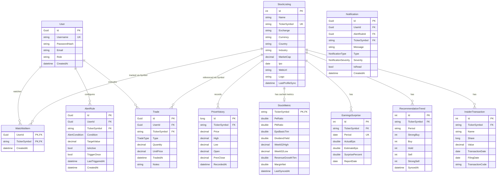
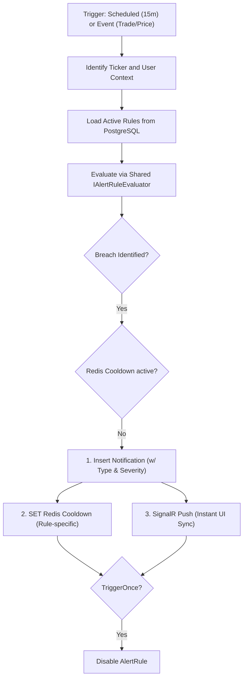

# Data Model

## Entity Relationship Diagram



---

## High-Performance Normalized Model

InventoryAlert uses a **Unified Global Architecture** to handle market-scale stock data while maintaining private user isolation.

### 1. Global Domain (PostgreSQL — `StockListings`, `PriceHistories`, `StockMetrics`, etc.)

Market reference data and analytical intelligence are stored once and shared across all users.

| Entity | Purpose |
|---|---|
| `StockListing` | Core market reference data (Ticker, Finnhub metadata) |
| `PriceHistory` | Point-in-time price snapshots for rendering charts and evaluating rules |
| `StockMetric` | Cached basic financials (PE, PB, margins, 52-week highs) |
| `EarningsSurprise` | Last 4 quarters of earnings actuals vs. estimates (Finnhub) |
| `RecommendationTrend` | Analyst consensus ratings |
| `InsiderTransaction` | Last 100 insider SEC filings |

> **Key Design Decision**: Symbol Resolution pattern mandates a DB-First check, falling back to Finnhub `/profile2` API on cache misses, permanently persisting new symbols into `StockListing`.

### 2. User Domain (PostgreSQL — `Trades`, `AlertRules`, `WatchlistItems`, `Notifications`)

Stored per-user. Fully isolated.

| Entity | User-Specific Data |
|---|---|
| `Trade` | Ownership ledger (Buy/Sell). Replaces older stock-counting structures to allow dynamic cost-basis tracking. |
| `AlertRule` | Supports specific target values, conditions (e.g. `PriceAbove`, `PercentDropFromCost`), and one-off/recurring modes. |
| `WatchlistItem` | Minimal join table linking a User to a TickerSymbol. |
| `Notification` | System and alert messages securely scoped to the user, synced with a UI bell-badge feed. |

### 3. Historical Archives (Amazon DynamoDB — `CompanyNews`, `MarketNews`)

Used for high-volume, unstructured market data that is never deleted.

| Table | PK | SK | Responsibility |
|---|---|---|---|
| `MarketNews` | `CATEGORY#<category>` | `TS#<unix_timestamp>` | General financial events covering forex/crypto/markets |
| `CompanyNews` | `SYMBOL#<ticker>` | `TS#<unix_timestamp>` | Ticker-specific press releases and articles |

---

## AlertCondition Enum

The robust trigger model handles both absolute value checks and advanced cost-basis evaluation:

```csharp
public enum AlertCondition
{
    PriceAbove,              // CurrentPrice > TargetValue
    PriceBelow,              // CurrentPrice < TargetValue
    PriceTargetReached,      // CurrentPrice == TargetValue (within technical bounds)
    PercentDropFromCost,     // Evaluates loss% dynamically via SUM(CostBasis)
    LowHoldingsCount         // Trigger when user's share count drops below TargetValue
}
```

## Notification Enums

```csharp
public enum NotificationType
{
    Price,
    Holdings,
    News,
    System
}

public enum NotificationSeverity
{
    Info,
    Warning,
    Critical
}
```

---

## Alert Evaluation Logic (Fan-Out)

InventoryAlert **v3** uses a high-performance **Hybrid Pipeline**:



### Business Rules

| Rule | Detail |
|---|---|
| **TriggerOnce** | If `Rule.TriggerOnce` is true, the rule is automatically disabled (`IsActive = false`) after firing. |
| **Deduplication** | Managed via Redis keys: `alert:cooldown:{userId}:{ruleId}` to prevent notification spam. |
| **Real-time Delivery** | Every notification is pushed via **SignalR** using the **Redis Backplane**. |
| **Cascade Behavior** | Deleting a position deletes owned trades and alerts. **Does not** delete the global `StockListing`. |
| **Notification Feed** | Instead of just sending alerts, breaches generate `Notification` rows to populate the web UI hub. |
