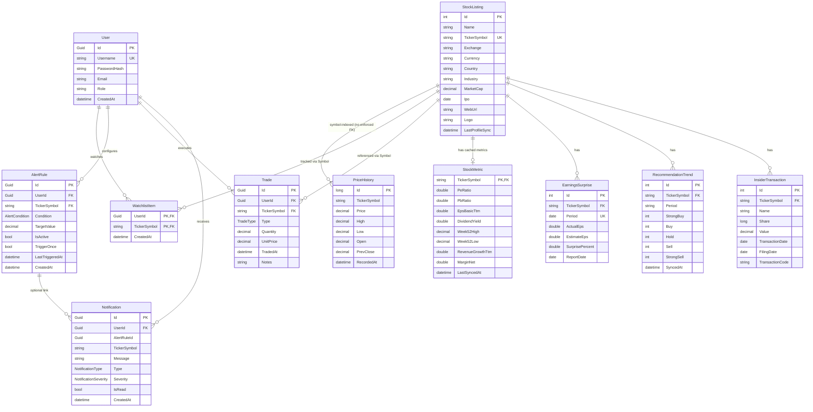
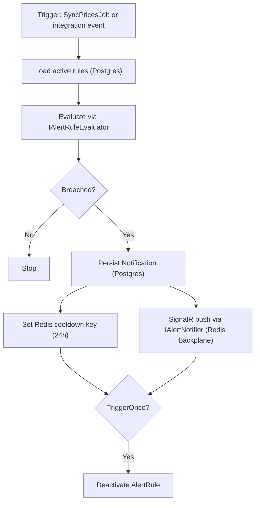

# Data Model

Last updated: **2026-05-01**

This page documents the current persisted data model used by InventoryAlert. It reflects the EF Core Postgres entities + the DynamoDB news read-models in the repository as of the date above.

## Entity Relationship Diagram (conceptual)



### Nullability notes (implementation detail)

The ER diagram above is conceptual; the actual EF Core model contains nullable fields (C# `?`) in several places:

- `StockListing`: `Exchange`, `Currency`, `Country`, `Industry`, `MarketCap`, `Ipo`, `WebUrl`, `Logo`, `LastProfileSync`
- `PriceHistory`: `High`, `Low`, `Open`, `PrevClose`
- `StockMetric`: most metric columns are nullable (e.g., `PeRatio`, `DividendYield`, `Week52High`, …)
- `EarningsSurprise`: `ActualEps`, `EstimateEps`, `SurprisePercent`, `ReportDate`
- `InsiderTransaction`: `Name`, `Share`, `Value`, `TransactionDate`, `FilingDate`, `TransactionCode`
- `Trade`: `Notes`
- `AlertRule`: `LastTriggeredAt`
- `Notification`: `AlertRuleId`, `TickerSymbol` (both nullable for system notifications)

---

## High-Performance Normalized Model

InventoryAlert uses a **Unified Global Architecture** to handle market-scale stock data while maintaining private user isolation.

### 1. Global Domain (PostgreSQL — `StockListings`, `PriceHistories`, `StockMetrics`, etc.)

Market reference data and analytical intelligence are stored once and shared across all users.

| Entity | Purpose |
|---|---|
| `StockListing` | Core market reference data (Ticker, Finnhub metadata) |
| `PriceHistory` | Point-in-time price snapshots for rendering charts and evaluating rules |
| `StockMetric` | Cached basic financials (PE, PB, margins, 52-week highs) |
| `EarningsSurprise` | Last 4 quarters of earnings actuals vs. estimates (Finnhub) |
| `RecommendationTrend` | Analyst consensus ratings |
| `InsiderTransaction` | Last 100 insider SEC filings |

> **Key Design Decision**: Symbol Resolution pattern mandates a DB-First check, falling back to Finnhub `/profile2` API on cache misses, permanently persisting new symbols into `StockListing`.

### 2. User Domain (PostgreSQL — `Trades`, `AlertRules`, `WatchlistItems`, `Notifications`)

Stored per-user. Fully isolated.

| Entity | User-Specific Data |
|---|---|
| `Trade` | Ownership ledger (Buy/Sell). Replaces older stock-counting structures to allow dynamic cost-basis tracking. |
| `AlertRule` | Supports specific target values, conditions (e.g. `PriceAbove`, `PercentDropFromCost`), and one-off/recurring modes. |
| `WatchlistItem` | Minimal join table linking a User to a TickerSymbol. |
| `Notification` | System and alert messages securely scoped to the user, synced with a UI bell-badge feed. |

#### Postgres tables (EF Core / migrations)

If you are comparing against the running database, use these as the source of truth for the current schema:

- `Users` (PK: `Id`, unique: `Username`)
- `watchlist_items` (composite PK: `(UserId, TickerSymbol)`)
- `alert_rules` (PK: `Id`, index: `(TickerSymbol, IsActive)`)
- `trades` (PK: `Id`, index: `(UserId, TickerSymbol, TradedAt)`)
- `notifications` (PK: `Id`, index: `(UserId, IsRead, CreatedAt)`, FK `AlertRuleId` is nullable)

**Trade table shape (current migration)**

- Columns: `Id`, `UserId`, `TickerSymbol`, `Type`, `Quantity`, `UnitPrice`, `TradedAt`, `Notes` (nullable)
- FKs:
  - `UserId` → `Users.Id` (`CASCADE`)
  - `TickerSymbol` → `stock_listings.TickerSymbol` (`RESTRICT`)

If your database “doesn’t have” the `trades` table (or is missing columns), it usually means migrations were not applied to that environment. In this repo, the `trades` table is created by the migration `20260414042036_RefactorToFinanceV2`.

### 3. Historical Archives (Amazon DynamoDB — News Read Models)

Used for high-volume, unstructured market data that is never deleted.

| DynamoDB Table | PK (Hash) | SK (Range) | Responsibility |
|---|---|---|---|
| `inventoryalert-market-news` | `PK="CATEGORY#<category>"` | `SK="TS#<unix_timestamp_ms>"` | General financial news feed by category |
| `inventoryalert-company-news` | `PK="SYMBOL#<ticker>"` | `SK="TS#<unix_timestamp_ms>"` | Ticker-specific articles and press releases |

Notes:

- The persisted key attribute names are `PK` and `SK` (not `Category`/`Symbol`).
- `Symbol`/`Category` fields are kept as denormalized attributes for querying/display.

---

## AlertCondition Enum

The robust trigger model handles both absolute value checks and advanced cost-basis evaluation:

```csharp
public enum AlertCondition
{
    PriceAbove,              // CurrentPrice > TargetValue
    PriceBelow,              // CurrentPrice < TargetValue
    PriceTargetReached,      // CurrentPrice == TargetValue (within technical bounds)
    PercentDropFromCost,     // Evaluates loss% dynamically via SUM(CostBasis)
    LowHoldingsCount         // Trigger when user's share count drops below TargetValue
}
```

## Notification Enums

```csharp
public enum NotificationType
{
    Price,
    Holdings,
    News,
    System
}

public enum NotificationSeverity
{
    Info,
    Warning,
    Critical
}
```

---

## Alert Evaluation Logic (Fan-Out)

Alert evaluation is driven by:

- **Scheduled price sync**: `SyncPricesJob` (Hangfire recurring job) fetches quotes, writes `PriceHistory`, evaluates active rules, persists `Notification`, then pushes via SignalR.
- **Event-driven handlers**: e.g. `MarketPriceAlertHandler` evaluates rules for a specific symbol/price payload; `LowHoldingsHandler` persists and pushes a holdings alert.

The shared evaluator (`IAlertRuleEvaluator`) provides the rule logic plus Redis deduplication/cooldown.



### Business Rules

| Rule | Detail |
|---|---|
| **TriggerOnce** | If `Rule.TriggerOnce` is true, the rule is automatically disabled (`IsActive = false`) after firing. |
| **Deduplication** | Managed via Redis cooldown keys (example: `inventoryalert:alerts:cooldown:v1:{userId}:{ruleId}`) to prevent notification spam. |
| **Real-time Delivery** | Notifications are pushed via **SignalR**. Worker and API communicate via Redis backplane (channel prefix `InventoryAlert_SignalR`). |
| **Position Removal** | Removing a position deletes the user's watchlist item + trades; it is blocked if there are active alert rules for the symbol. Global `StockListing` is never deleted by user actions. |
| **Notification Feed** | Instead of just sending alerts, breaches generate `Notification` rows to populate the web UI hub. |
