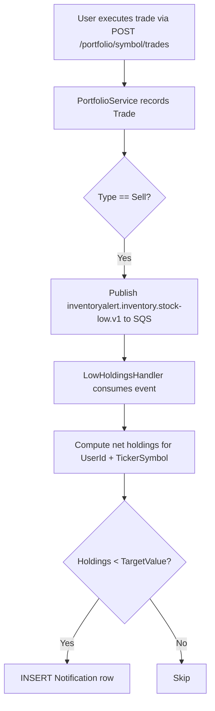

# Alert Dispatch Flow

> How the system evaluates alert rules and delivers in-app notifications.

## Overview

Alert dispatch in InventoryAlert v2 uses a **single unified pipeline** via `AlertRule` entities — evaluated inside `SyncPricesJob` during the price sync loop. In-app `Notification` rows are the primary delivery mechanism, replacing the legacy Telegram integration.

---

## Alert Evaluation Flow (In `SyncPricesJob`)

```mermaid
flowchart TD
    A[SyncPricesJob runs every 15 min] --> B[For each TickerSymbol in StockListing]
    B --> C[Fetch quote from Finnhub or Redis cache]
    C --> D[INSERT PriceHistory row]
    D --> E[Load active AlertRules for symbol]
    E --> F{For each AlertRule}
    F --> G{Condition type?}
    G -- PriceAbove/Below --> H[Compare CurrentPrice vs TargetValue]
    G -- PercentDropFromCost --> I[Compute cost basis from Trade ledger for this user/symbol]
    G -- LowHoldingsCount --> J[SUM Buy - SUM Sell from Trade ledger]
    H & I & J --> K{Condition breached?}
    K -- No --> F
    K -- Yes --> L{Redis cooldown active?}
    L -- Yes --> M[Skip — cooldown:alert:{symbol} exists]
    L -- No --> N[INSERT Notification row for UserId]
    N --> O[SET cooldown:alert:{symbol} TTL=24h]
    O --> P[Publish inventoryalert.pricing.price-drop.v1 to SQS]
    P --> Q{TriggerOnce?}
    Q -- Yes --> R[UPDATE AlertRule SET IsActive = false]
    Q -- No --> F
```

---

## LowHoldingsCount (Handled by `LowHoldingsHandler`)

This condition is **event-driven** — triggered immediately when a `Sell` trade is recorded (not on the 15-minute sync cycle):



---

## SQS Event Contracts

### `PriceDropPayload` → `PriceAlertHandler`

```json
{
  "eventType": "inventoryalert.pricing.price-drop.v1",
  "payload": { "Symbol": "AAPL" }
}
```

### `LowHoldingsAlertPayload` → `LowHoldingsHandler`

```json
{
  "eventType": "inventoryalert.inventory.stock-low.v1",
  "payload": {
    "UserId": "00000000-0000-0000-0000-000000000002",
    "TickerSymbol": "MSFT",
    "Threshold": 5
  }
}
```

---

## Notification Delivery

All alert breaches write a `Notification` row:

```csharp
new Notification
{
    UserId = rule.UserId,
    AlertRuleId = rule.Id,
    TickerSymbol = rule.TickerSymbol,
    Message = $"⚠️ {rule.TickerSymbol} price dropped to ${currentPrice:F2} — breaches your {rule.Condition} rule ({rule.TargetValue})",
    IsRead = false,
    CreatedAt = DateTime.UtcNow
}
```

The UI polls `GET /api/v1/notifications/unread-count` every 30 seconds to update the bell badge.

---

## Deduplication

All SQS messages pass through `ProcessQueueJob` which uses Redis `SET NX`:
- Key: `dedup:sqs:{messageId}` — TTL 30 min
- Per-symbol alert cooldown: `cooldown:alert:{symbol}` — TTL 24 hours
