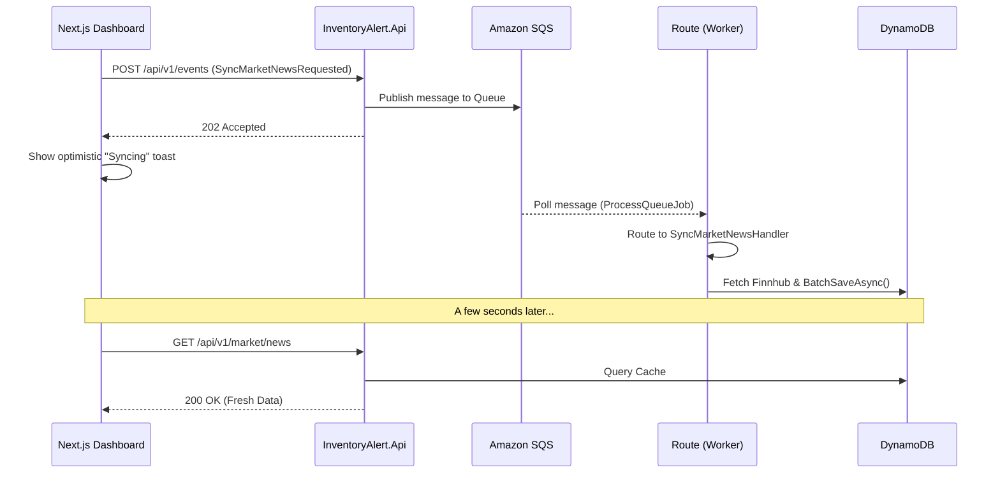

# CQRS Event Flow (Async Commands)

> How the system processes "Commands" from the UI using decoupling via SQS and Hangfire.

To prevent blocking the primary API, heavy commands (such as fetching live market news from external providers) follow a **CQRS / Event-Driven Architecture**. By offloading this work to the background Worker, the API remains highly responsive.

## Sync Market News Example

When a user requests fresh market news from the Dashboard:



### 1. Command Invocation (UI)
The frontend generates a generic Command payload:
```json
{
  "eventType": "inventoryalert.news.sync-requested.v1",
  "payload": {}
}
```
This is sent to the `EventsController` (`POST /api/v1/events`).

### 2. Event Publishing (API)
The API wraps this command in an `EventEnvelope` (adding telemetry like `CorrelationId` and `MessageId`) and publishes it directly to SQS. It immediately returns `HTTP 202 Accepted`.

### 3. Queue Processing (Worker)
The native continuous poller (`ProcessQueueJob`) reads the queue. Assuming it passes Redis deduplication guarantees, it passes the Event to the `IntegrationMessageRouter`.

### 4. Background Handler Execution (Worker)
The router detects `SyncMarketNewsRequested` and enqueues `SyncMarketNewsHandler` via Hangfire.
The handler queries `IFinnhubClient`, maps the raw data, and writes the batch to DynamoDB. The UI will pick up this fresh data naturally on its next React-Query polling cycle.
