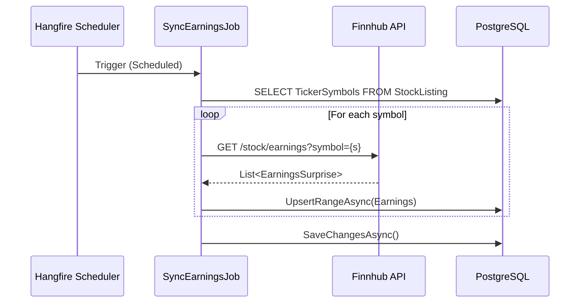

# Earnings Surprise Synchronization Flow

> Orchestration pipeline for fetching historical earnings performance and surprise metrics.

## Sequence

## Data Points

| Field | Description |
|---|---|
| **Actual EPS** | The actual Earnings Per Share reported by the company. |
| **Estimate EPS** | The consensus analyst estimate for EPS. |
| **Surprise %** | The percentage difference between actual and estimate. |
| **Period** | The fiscal quarter/year for the reported data. |

## Implementation Details

| Feature | Detail |
|---|---|
| **Upsert Logic** | Uses `UpsertRangeAsync` to handle updates to existing periods or additions of new reports. |
| **PostgreSQL Store** | Unlike news, earnings data is stored in PostgreSQL for relational analysis and reporting. |
| **Sequential Processing** | Currently processed sequentially per symbol to respect API rate limits for non-premium tiers. |
