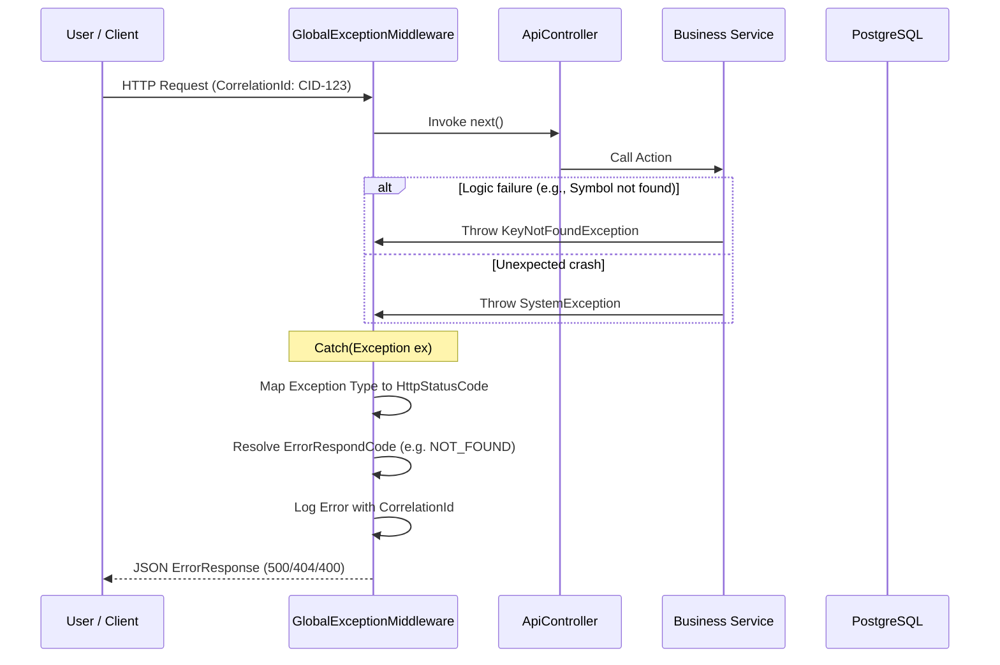

# Error Handling & Standardized Response Flow

> Global pipeline for intercepting failures, mapping them to business-friendly status codes, and ensuring diagnostic traceability.

## Sequence



## Error Mapping Strategy

The system uses a centralized mapping logic to ensure consistency across all endpoints:

| Exception Type | HTTP Status | Business Error Code |
|---|---|---|
| `UserFriendlyException` | *Dynamic (Mapped)* | *Dynamic (Mapped)* |
| `KeyNotFoundException` | 404 Not Found | `IA.NOT_FOUND` |
| `ValidationException` | 400 Bad Request | `IA.BAD_REQUEST` |
| `UnauthorizedAccessException` | 401 Unauthorized | `IA.UNAUTHORIZED` |
| `System.Exception` | 500 Internal Error | `IA.GENERAL_ERROR` |

---

## Response Structure

All errors follow the same JSON schema to allow the frontend to display uniform error alerts:

```json
{
  "error": {
    "code": "InventoryAlert.NOT_FOUND",
    "message": "Symbol 'XYZ' is not recognized."
  },
  "correlationId": "CID-123",
  "timestamp": "2026-05-04T12:00:00Z"
}
```

---

## Logic Highlights

| Feature | Detail |
|---|---|
| **Diagnostic Trace** | Every error response includes the `correlationId`, allowing users to provide a reference for support logs. |
| **User Friendly Messages** | `UserFriendlyException` allows services to pass safe, translated messages to the UI while keeping technical details in logs. |
| **Validation Integration** | Automatically captures and formats `FluentValidation` failures into the standard error schema. |
| **Transaction Rollback** | Since the middleware catches exceptions at the top level, incomplete DB transactions are naturally rolled back by the Unit of Work. |
