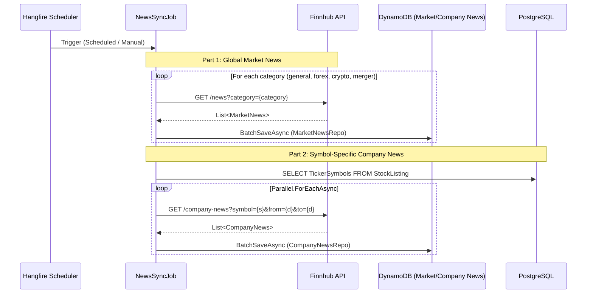

# News Synchronization Flow

> Orchestration pipeline for fetching global market news and symbol-specific company news, persisting to DynamoDB with TTL.

## Sequence

## Data Persistence Strategy

| Entity | Store | Key Schema (Partition / Sort) | TTL |
|---|---|---|---|
| **Market News** | DynamoDB | `PK: CATEGORY#{CAT}` / `SK: TS#{UNIX}#ID#{ID}` | 7 Days |
| **Company News** | DynamoDB | `PK: SYMBOL#{SYM}` / `SK: TS#{UNIX}#ID#{ID}` | 7 Days |

## Logic Highlights

| Feature | Detail |
|---|---|
| **Multi-Category** | Fetches general, forex, crypto, and merger news in a single job run. |
| **Deduplication** | Uses `DistinctBy(a => a.Id)` to prevent redundant processing of the same article. |
| **Throughput Optimization** | Uses `Parallel.ForEachAsync` with `WorkerSettings.MaxDegreeOfParallelism` for company-specific news. |
| **DynamoDB Batching** | Implements `BatchSaveAsync` to reduce write I/O costs and latency. |
| **Auto-Cleanup** | TTL attribute ensures stale news is automatically removed by DynamoDB. |
