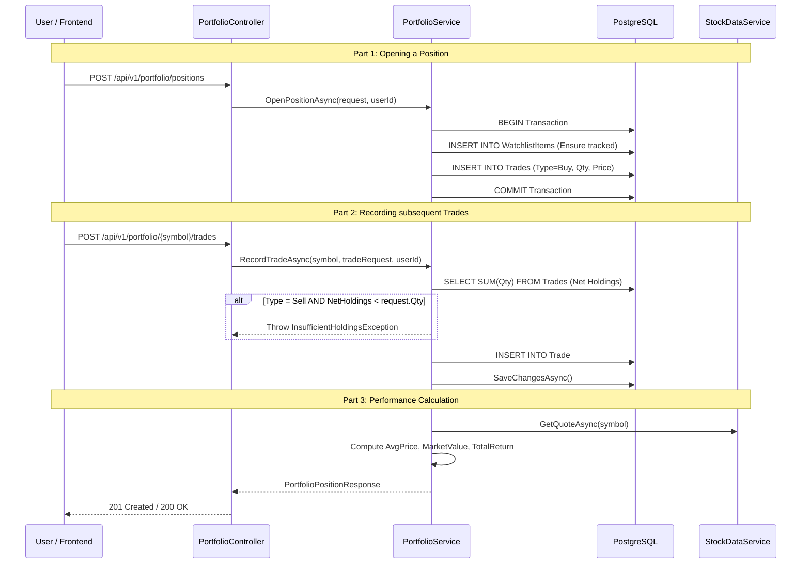

# Portfolio Management Flow

> Orchestration for user-specific portfolios, trade history, and real-time performance tracking.

## Overview

The Portfolio flow manages the lifecycle of a user's financial positions. It tracks **Trades** (Buys/Sells), computes **Cost Basis**, and aggregates real-time **Market Value** and **Total Return** using live price data.

---

## Position Lifecycle (Sequence)

---

## Performance Calculation Logic

The system computes performance metrics on-the-fly to ensure accuracy:

1.  **Net Holdings**: `SUM(BuyQuantity) - SUM(SellQuantity)`
2.  **Total Buy Cost**: `SUM(BuyQuantity * BuyPrice)`
3.  **Average Price (Cost Basis)**: `TotalBuyCost / TotalBuyQuantity`
4.  **Market Value**: `NetHoldings * CurrentMarketPrice`
5.  **Total Cost**: `NetHoldings * AveragePrice`
6.  **Total Return**: `MarketValue - TotalCost`
7.  **Total Return %**: `(TotalReturn / TotalCost) * 100`

---

## Removal Constraints

To maintain data integrity, a position can only be removed if:
- It has **no active Alert Rules**.
- The removal operation deletes the `WatchlistItem` and **all associated `Trade` records** in a single transaction.

---

## Logic Highlights

| Feature | Detail |
|---|---|
| **Transaction Safety** | Uses `ExecuteTransactionAsync` to ensure trades and watchlist entries are in sync. |
| **Validation** | Prevents "Short Selling" by validating net holdings before a `Sell` trade is recorded. |
| **Bulk Import** | Supports importing multiple positions via `BulkImportPositionsAsync` for easy migration. |
| **Real-Time Enrichment** | Integrates with `IStockDataService` to provide live P&L (Profit and Loss) metrics. |
