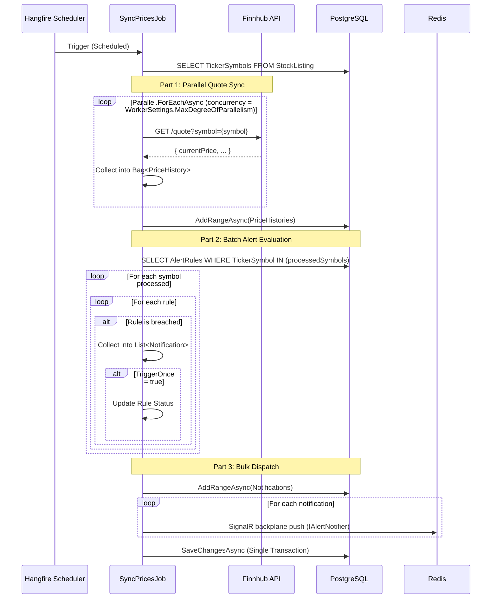

# Price Sync Flow

> Orchestration pipeline for global market synchronization, alert evaluation, and in-app notification delivery.

## Sequence (current architecture)

---

## Alert Trigger Conditions

| Condition | Evaluation Logic |
|---|---|
| `PriceAbove` | `quote.CurrentPrice > rule.TargetValue` |
| `PriceBelow` | `quote.CurrentPrice < rule.TargetValue` |
| `PriceTargetReached` | `|quote.CurrentPrice - rule.TargetValue| < tolerance` |
| `PercentDropFromCost` | `(costBasis - currentPrice) / costBasis * 100 >= rule.TargetValue` |
| `LowHoldingsCount` | `SUM(BuyQty) - SUM(SellQty) < rule.TargetValue` |

---

## Logic Highlights

| Feature | Detail |
|---|---|
| **Parallel I/O** | `SyncPricesJob` uses `Parallel.ForEachAsync` to fetch quotes, significantly reducing latency. |
| **Bulk Persistence** | Uses `AddRangeAsync` for PriceHistories and Notifications to minimize EF Core overhead. |
| **N+1 Avoidance** | Fetches all relevant `AlertRules` in a single query using `GetBySymbolsAsync`. |
| **Evaluator + Cooldown** | `IAlertRuleEvaluator` applies rule logic and enforces a Redis cooldown key to prevent alert storms. |
| **In-App Notification** | Alert breaches write to the `Notification` table, then are pushed via SignalR (`IAlertNotifier`). |
| **Single Transaction** | All state changes (history, notifications, rule updates) are saved in one unit of work. |
| **TriggerOnce** | If `rule.TriggerOnce = true`, rule is disabled automatically after first breach. |
| **User Isolation** | `LowHoldingsCount` and `PercentDropFromCost` always filter by `(UserId, TickerSymbol)`. |

---

## Relationship to SQS (integration events)

SQS is used for event-driven evaluation paths that are separate from the scheduled `SyncPricesJob`:

- The API can publish an `EventEnvelope` to SQS (see `POST /api/v1/events`).
- The Worker polls SQS continuously (`ProcessQueueJob`) and routes known event types:
  - `inventoryalert.pricing.price-drop.v1` → `MarketPriceAlertHandler`
  - `inventoryalert.inventory.stock-low.v1` → `LowHoldingsHandler`
  - `inventoryalert.news.sync-requested.v1` → enqueue `NewsSyncJob`
