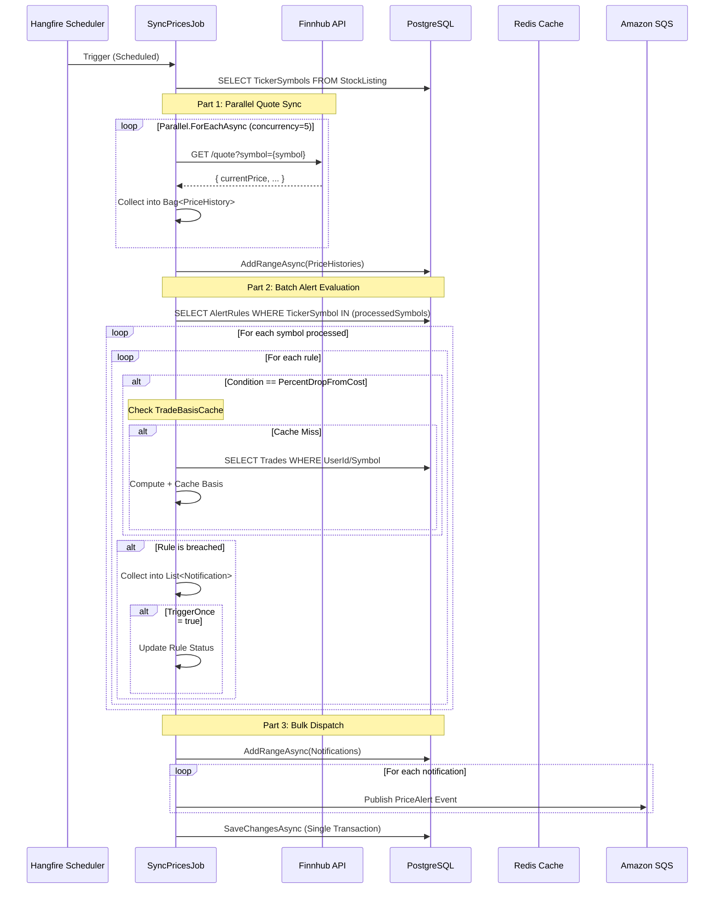

# Price Sync Flow

> Orchestration pipeline for global market synchronization, alert evaluation, and in-app notification delivery.

## Sequence (v3 Architecture - Optimized)



---

## Alert Trigger Conditions

| Condition | Evaluation Logic |
|---|---|
| `PriceAbove` | `quote.CurrentPrice > rule.TargetValue` |
| `PriceBelow` | `quote.CurrentPrice < rule.TargetValue` |
| `PriceTargetReached` | `|quote.CurrentPrice - rule.TargetValue| < tolerance` |
| `PercentDropFromCost` | `(costBasis - currentPrice) / costBasis * 100 >= rule.TargetValue` |
| `LowHoldingsCount` | `SUM(BuyQty) - SUM(SellQty) < rule.TargetValue` |

---

## Logic Highlights

| Feature | Detail |
|---|---|
| **Parallel I/O** | `SyncPricesJob` uses `Parallel.ForEachAsync` to fetch quotes, significantly reducing latency. |
| **Bulk Persistence** | Uses `AddRangeAsync` for PriceHistories and Notifications to minimize EF Core overhead. |
| **N+1 Avoidance** | Fetches all relevant `AlertRules` in a single query using `GetBySymbolsAsync`. |
| **Trade Memoization** | Caches (User, Symbol) cost basis calculations to avoid redundant trade history lookups. |
| **In-App Notification** | Alert breaches write to the `Notification` table — UI badge updates instantly. |
| **Single Transaction** | All state changes (history, notifications, rule updates) are saved in one unit of work. |
| **TriggerOnce** | If `rule.TriggerOnce = true`, rule is disabled automatically after first breach. |
| **User Isolation** | `LowHoldingsCount` and `PercentDropFromCost` always filter by `(UserId, TickerSymbol)`. |

---

## SQS Event Payload

The `inventoryalert.pricing.price-drop.v1` event published by `SyncPricesJob` follows the `EventEnvelope` pattern:

```json
{
  "eventType": "inventoryalert.pricing.price-drop.v1",
  "correlationId": "...",
  "payload": {
    "symbol": "TSLA"
  }
}
```

`PriceAlertHandler` in the Worker consumes this and performs a secondary evaluation to confirm the breach is still valid before triggering any additional side-effects (e.g., third-party relay).
