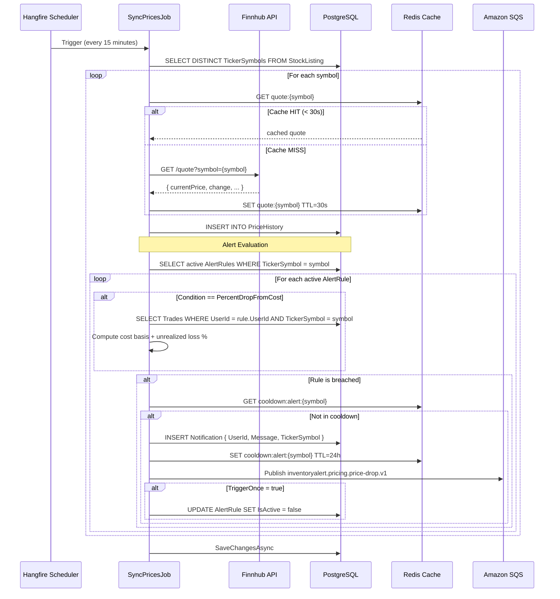

# Price Sync Flow

> Orchestration pipeline for global market synchronization, alert evaluation, and in-app notification delivery.

## Sequence (v2 Architecture)



---

## Alert Trigger Conditions

| Condition | Evaluation Logic |
|---|---|
| `PriceAbove` | `quote.CurrentPrice > rule.TargetValue` |
| `PriceBelow` | `quote.CurrentPrice < rule.TargetValue` |
| `PriceTargetReached` | `|quote.CurrentPrice - rule.TargetValue| < tolerance` |
| `PercentDropFromCost` | `(costBasis - currentPrice) / costBasis * 100 >= rule.TargetValue` |
| `LowHoldingsCount` | `SUM(BuyQty) - SUM(SellQty) < rule.TargetValue` |

---

## Logic Highlights

| Feature | Detail |
|---|---|
| **Global Normalization** | `SyncPricesJob` fetches only distinct tickers. 50 users watching AAPL = 1 Finnhub call. |
| **30s Quote Cache** | Prevents duplicate Finnhub calls within a single sync cycle. Key: `quote:{symbol}`. |
| **Trade-Based Cost Basis** | `PercentDropFromCost` evaluates against the user's actual bought positions, not a stale snapshot. |
| **In-App Notification** | Alert breaches write to the `Notification` table — UI badge updates instantly. |
| **24h Cooldown** | `cooldown:alert:{symbol}` Redis key prevents repeated alerts within 24 hours for the same symbol. |
| **TriggerOnce** | If `rule.TriggerOnce = true`, rule is disabled automatically after first breach. |
| **User Isolation** | `LowHoldingsCount` and `PercentDropFromCost` always filter by `(UserId, TickerSymbol)`. Never aggregate across users. |

---

## SQS Event Payload

The `inventoryalert.pricing.price-drop.v1` event published by `SyncPricesJob` follows the `EventEnvelope` pattern:

```json
{
  "eventType": "inventoryalert.pricing.price-drop.v1",
  "correlationId": "...",
  "payload": {
    "symbol": "TSLA"
  }
}
```

`PriceAlertHandler` in the Worker consumes this and performs a secondary evaluation to confirm the breach is still valid before triggering any additional side-effects (e.g., third-party relay).
