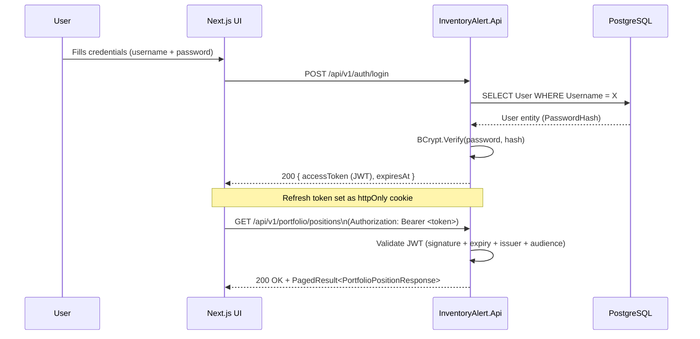
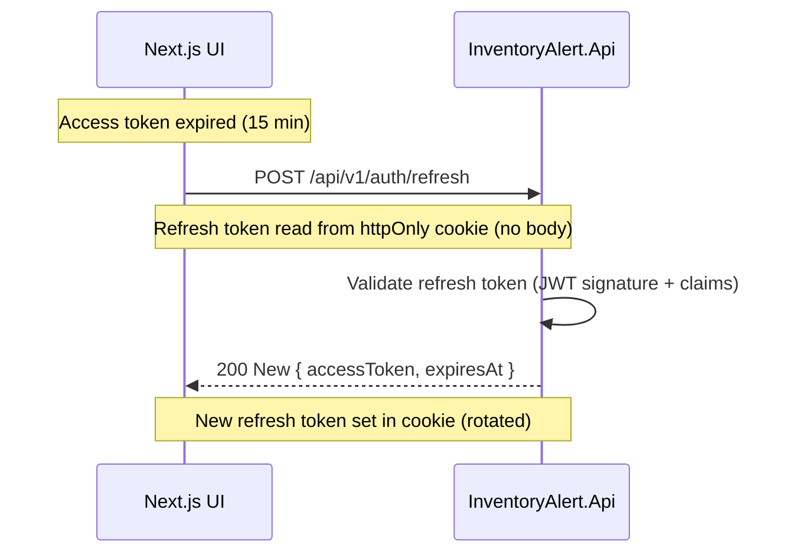
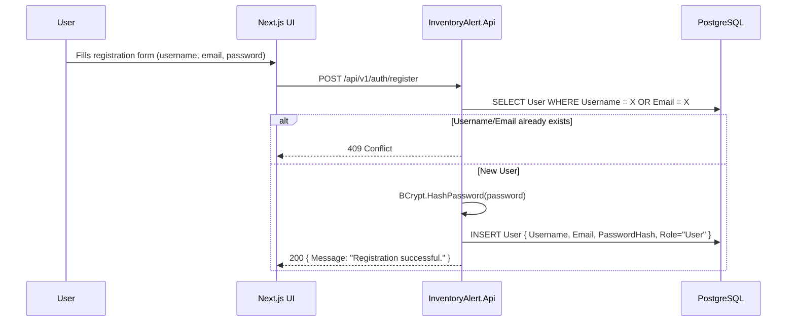

# User Authentication Flow

> How users register, log in, refresh tokens, and access protected resources.

## JWT Token Lifecycle

Access token TTL = **15 minutes**. Refresh token TTL = **7 days** (stored as `httpOnly; Secure; SameSite=Strict` cookie).



---

## Token Refresh Flow



---

## Registration Flow



---

## JWT Token Claims

```json
{
  "sub": "00000000-0000-0000-0000-000000000001",
  "http://schemas.xmlsoap.org/ws/2005/05/identity/claims/name": "admin",
  "http://schemas.microsoft.com/ws/2008/06/identity/claims/role": "Admin",
  "jti": "unique-token-id",
  "iss": "InventoryAlert.Api",
  "aud": "InventoryAlert.UI",
  "exp": 1713000000
}
```

| Claim | Purpose |
|---|---|
| `sub` | User ID (Guid) — used by all services to scope data access |
| `name` | Username — displayed in UI |
| `role` | `User` or `Admin` — controls endpoint authorization |
| `exp` | Token expiry — 15 minutes from issuance |
| `iss` / `aud` | Validated on every request to prevent token reuse |

---

## Authorization Levels

| Endpoint | Required |
|---|---|
| `POST /auth/login`, `POST /auth/register`, `POST /auth/refresh` | `[Public]` — no token needed |
| All other endpoints | `[Authorize]` — valid JWT required |
| `POST /stocks/sync`, `GET/POST /events/*` | `[Authorize(Roles = "Admin")]` |
| `GET /market/status` | `[AllowAnonymous]` — explicitly public |

---

## Security Considerations

- Passwords are hashed with **BCrypt** (default work factor 11).
- Access token delivered in JSON body; **refresh token in `httpOnly` cookie** — not accessible to JavaScript.
- Refresh tokens are **single-use** (rotated on each refresh call).
- All sensitive config (`Jwt:Key`, `Database:ConnectionString`, `Finnhub:ApiKey`) lives in `appsettings.*.json` which is **gitignored**. Only `appsettings.Example.json` is committed.
- Login endpoint is **429 rate-limited** to prevent brute-force attacks.
