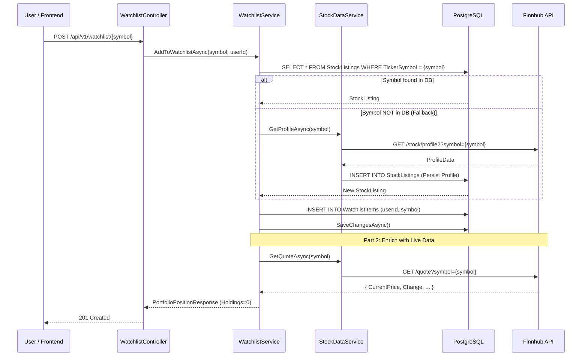

# Watchlist Management Flow

> Orchestration for user-specific stock watchlists, including DB-first resolution and Finnhub fallback.

## Overview

The Watchlist flow allows users to track stock symbols without having a financial position. It leverages a **DB-first resolution strategy** to minimize API costs, with a fallback to Finnhub for unknown symbols.

---

## Addition Flow (Sequence)

---

## Retrieval Flow

When a user views their watchlist, the system:
1. Fetches all `WatchlistItems` for the `userId`.
2. For each item, builds a `PortfolioPositionResponse`.
3. Sets `HoldingsCount`, `MarketValue`, and `TotalReturn` to **0** (since it is a watchlist-only item).
4. Fetches the latest price via `IStockDataService` (which uses internal Redis caching).

---

## Removal Flow

1. The system verifies the item exists for the user.
2. Removes the `WatchlistItem` record.
3. **Note**: This does *not* delete the `StockListing` record, as other users might be watching it.

---

## Logic Highlights

| Feature | Detail |
|---|---|
| **DB-First Resolution** | Always checks `StockListings` before calling Finnhub to save credits. |
| **Auto-Discovery** | Unknown symbols are automatically discovered, persisted, and shared system-wide. |
| **Unified Response** | Uses `PortfolioPositionResponse` for both Watchlist and Portfolio for frontend consistency. |
| **Traceability** | Every addition/removal is logged with the `UserId` for auditability. |
