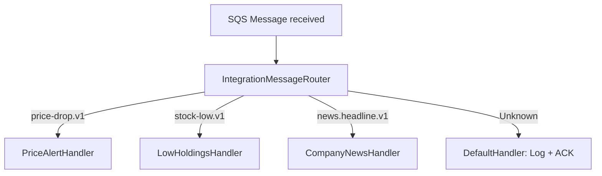

# Event Handling

> How domain events are published, routed, and consumed across the system via Amazon SQS.

## Event Architecture

The system uses a **direct SQS messaging** pattern. Events flow through a single `inventory-events` queue.

| Queue | Direction | Purpose |
|---|---|---|
| `inventory-events` | API/Worker → Worker | Domain signals (alert triggers, news requests) |

---

## Supported Event Types

| Event Type String | Publisher | Consumer | Description |
|---|---|---|---|
| `inventoryalert.pricing.price-drop.v1` | `SyncPricesJob` | `PriceAlertHandler` | Fired when a price alert rule is breached |
| `inventoryalert.inventory.stock-low.v1` | Portfolio trade commits | `LowHoldingsHandler` | Fired when share count drops below `LowHoldingsCount` threshold |
| `inventoryalert.news.headline.v1` | `CompanyNewsJob` | `CompanyNewsHandler` | Forces immediate company news sync to DynamoDB |

> Retrieve the full list at runtime via `GET /api/v1/events/types`.

---

## Message Envelope Structure

All events are wrapped in a standard `EventEnvelope`:

```json
{
  "eventType": "inventoryalert.pricing.price-drop.v1",
  "source": "InventoryAlert.Worker",
  "messageId": "550e8400-e29b-41d4-a716-446655440000",
  "correlationId": "req-abc-123",
  "payload": "{\"Symbol\": \"TSLA\"}",
  "timestamp": "2026-04-13T10:00:00Z"
}
```

```csharp
// Domain/Events/EventEnvelope.cs
public class EventEnvelope
{
    public string EventType { get; init; } = string.Empty;
    public string Source { get; init; } = string.Empty;
    public string MessageId { get; init; } = Guid.NewGuid().ToString();
    public string CorrelationId { get; init; } = Guid.NewGuid().ToString();
    public string Payload { get; init; } = string.Empty;
}
```

---

## Message Routing (`IntegrationMessageRouter`)

Incoming SQS messages are routed by `EventType` to the appropriate handler:



---

## Processing Guarantee: Exactly-Once via Redis

`ProcessQueueJob` uses Redis `SET NX` deduplication before routing:

```csharp
var dedupKey = $"dedup:sqs:{envelope.MessageId}";
if (!await _redisDb.StringSetAsync(dedupKey, "1", TimeSpan.FromMinutes(30), When.NotExists))
    return; // Already processed — skip silently
```

---

## Alert Cooldown (24h per symbol)

`PriceAlertHandler` uses a Redis cooldown key to prevent repeated alerts within 24 hours for the same symbol — regardless of how many users have alerts for that symbol:

```csharp
var alertKey = $"cooldown:alert:{payload.Symbol}";
if (await _redisDb.KeyExistsAsync(alertKey))
    return; // Suppressed

await _redisDb.StringSetAsync(alertKey, "1", TimeSpan.FromHours(24));
// Create Notification rows per user...
```

---

## Dead Letter Queue (DLQ)

When `ApproximateReceiveCount > 5`, the message is considered a poison pill and acknowledged to unblock the queue:

```csharp
if (receiveCount > 5)
{
    _logger.LogWarning("[SqsWorker] Message {Id} exceeded retry limit. Dropping.", message.MessageId);
    return; // ACK to remove from main queue, ejects to DLQ
}
```

DLQ messages can be replayed via the AWS Console or Hangfire dashboard.

---

## Publishing Events (Admin API)

```bash
POST /api/v1/events
Authorization: Bearer <admin-jwt>

{
  "eventType": "inventoryalert.news.headline.v1",
  "payload": { "Symbol": "AAPL" }
}
```

Returns `202 Accepted: { "Status": "Queued" }`.
