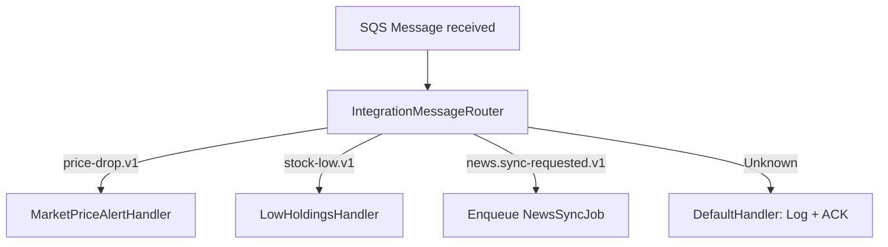

# Event Handling

> How integration events are published, routed, and consumed across the system via SNS → SQS.

## Event Architecture

The system uses **SNS fan-out to SQS**:

- `InventoryAlert.Api` publishes an `EventEnvelope` to an SNS topic.
- The topic fans out to a subscribed SQS queue consumed by `InventoryAlert.Worker`.

| Queue | Direction | Purpose |
|---|---|---|
| `inventory-events` | API → Worker | Integration events (alert triggers, news sync requests, test events) |

---

## Supported Event Types

| Event Type String | Publisher | Consumer | Description |
|---|---|---|---|
| `inventoryalert.pricing.price-drop.v1` | Admin API (`POST /api/v1/events`) | `MarketPriceAlertHandler` | Evaluate rules for a specific symbol + price payload |
| `inventoryalert.inventory.stock-low.v1` | (Planned) API emits on trade/position updates | `LowHoldingsHandler` | Low-holdings alert for a specific user + symbol |
| `inventoryalert.news.sync-requested.v1` | Admin API / UI command | enqueue `NewsSyncJob` | Run consolidated market + company news sync |
| `inventoryalert.news.company-sync-requested.v1` | (Reserved) | (Not routed) | Reserved for per-ticker news sync requests |
| `inventoryalert.test.failure.v1` | Tests/E2E | throws (for retry/DLQ testing) | Poison-message simulation |

> Retrieve the full list at runtime via `GET /api/v1/events/types`.

---

## Message Envelope Structure

All events are wrapped in a standard `EventEnvelope`:

```json
{
  "eventType": "inventoryalert.pricing.price-drop.v1",
  "source": "InventoryAlert.Worker",
  "messageId": "550e8400-e29b-41d4-a716-446655440000",
  "correlationId": "req-abc-123",
  "payload": "{\"symbol\":\"TSLA\",\"newPrice\":123.45}",
  "timestamp": "2026-04-13T10:00:00Z"
}
```

```csharp
// Domain/Events/EventEnvelope.cs
public class EventEnvelope
{
    public string EventType { get; init; } = string.Empty;
    public string Source { get; init; } = string.Empty;
    public string MessageId { get; init; } = Guid.NewGuid().ToString();
    public string CorrelationId { get; init; } = Guid.NewGuid().ToString();
    public string Payload { get; init; } = string.Empty;
}
```

---

## Message Routing (`IntegrationMessageRouter`)

Incoming SQS messages are routed by `EventType` to the appropriate handler:



---

## Processing Guarantee: Exactly-Once via Redis

`ProcessQueueJob` uses a Redis marker key to avoid re-processing the same SQS message id. The key is written **only after successful handling**, so failures still retry naturally via SQS redelivery:

```csharp
var dedupKey = $"msg:processed:{message.MessageId}";
if (await _redisDb.KeyExistsAsync(dedupKey))
    return; // Already processed — skip

// After successful processing:
await _redisDb.StringSetAsync(dedupKey, "1", TimeSpan.FromHours(24));
```

---

## Alert Cooldown (24h per rule)

`IAlertRuleEvaluator` uses a Redis cooldown key to prevent repeated alerts within 24 hours for the same user+rule:

```csharp
var cooldownKey = CacheKeys.AlertCooldown(rule.UserId, rule.Id);
if (await _redis.KeyExistsAsync(cooldownKey, ct))
    return (false, string.Empty);

await _redis.TryAcquireBestEffortLockAsync(cooldownKey, "1", TimeSpan.FromHours(24), ct);
```

---

## Dead Letter Queue (DLQ)

DLQ behavior is handled by AWS redrive policy: messages are deleted only on success. After the configured max receives, AWS moves the message to the DLQ automatically.

---

## Publishing Events (Admin API)

```bash
POST /api/v1/events
Authorization: Bearer <admin-jwt>

{
  "eventType": "inventoryalert.pricing.price-drop.v1",
  "payload": { "symbol": "AAPL", "newPrice": 172.50 }
}
```

Returns `202 Accepted: { "Status": "Queued" }`.
