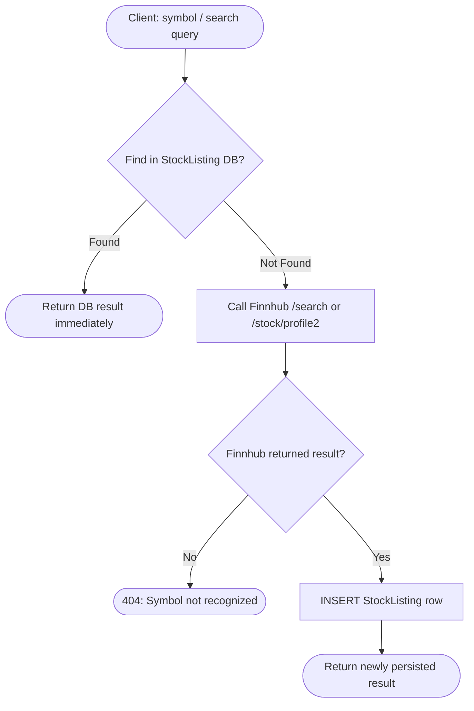

# Internal API Reference (v2)

> Core REST endpoints exposed by `InventoryAlert.Api`. All routes are prefixed with `/api/v1` unless otherwise noted. JWT Bearer Token required unless marked `[Public]`.

---

## Auth — `/api/v1/auth`

Authentication via secure JWTs and `httpOnly` Refresh Token cookies.

| Method | Endpoint | Auth | Description |
|---|---|---|---|
| POST | `/login` | `[Public]` | Authenticate and receive `AuthResponse` + Refresh token via Cookie. 429 rate-limited. |
| POST | `/register` | `[Public]` | Create a new user account. |
| POST | `/refresh` | `[Public]` | Exchange a valid `httpOnly` refresh token for a new access JWT. |
| POST | `/logout` | JWT | Revoke the current refresh token server-side. Clears cookie. |

### POST `/login` — Response

```json
{
  "accessToken": "eyJhbGci...",
  "expiresAt": "2026-04-14T07:29:43Z"
}
```

> Access token TTL = **15 minutes**. Refresh token TTL = **7 days**, delivered as `httpOnly; Secure; SameSite=Strict` cookie.

---

## Portfolio — `/api/v1/portfolio`

Personal position management. All data scoped strictly to the authenticated user.

> Positions are identified by `(UserId, TickerSymbol)` — no numeric position ID.

| Method | Endpoint | Description |
|---|---|---|
| GET | `/positions` | List user's paged holdings and portfolio metrics. |
| GET | `/positions/{symbol}` | Detailed breakdown for a single ticker position. |
| GET | `/alerts` | Portfolio positions that breached defined thresholds. |
| POST | `/positions` | Open a new ownership position. Symbol must be in catalog first. |
| POST | `/bulk` | Import multiple positions at once. |
| POST | `/{symbol}/trades` | Record a trade (Buy/Sell/Dividend/Split) to adjust holdings. |
| DELETE | `/positions/{symbol}` | Remove position. Cascades user's Trades + WatchlistItem. |

### POST `/positions` — Request

```json
{
  "tickerSymbol": "AAPL",
  "quantity": 10,
  "unitPrice": 172.50,
  "tradedAt": "2024-11-01T14:30:00Z"
}
```

### DELETE `/positions/{symbol}` — Cascade Scope

| Action | Deleted? |
|---|---|
| User's `Trade` ledger entries for this symbol | ✅ Yes |
| User's `WatchlistItem` for this symbol | ✅ Yes |
| `StockListing` (global catalog) | ❌ No |
| `PriceHistory` (global time-series) | ❌ No |
| `StockMetric`, `EarningsSurprise`, `RecommendationTrend` | ❌ No |

---

## Stocks (Market Intelligence) — `/api/v1/stocks`

Global market intelligence hub. Extensively cached locally to bypass strict external rate limits.

| Method | Endpoint | Description |
|---|---|---|
| GET | `/` | Browse full global `StockListing` catalog (paged, searchable). |
| GET | `/search` | Fuzzy symbol lookup by name, ISIN, or ticker (DB-first, Finnhub fallback). |
| GET | `/{symbol}/quote` | Real-time price quote from cache (30s TTL) or Finnhub. |
| GET | `/{symbol}/profile` | Core company metadata (Logo, Industry, MarketCap, IPO date). |
| GET | `/{symbol}/financials` | Basic financial metrics (P/E, P/B EPS, 52-week ranges, margins). |
| GET | `/{symbol}/earnings` | Last 4 quarters of reported Earnings Surprises (actual vs. estimate). |
| GET | `/{symbol}/recommendation` | Analyst consensus recommendations trend over the last 3 months. |
| GET | `/{symbol}/insiders` | Historical overview of the last 100 SEC-filed insider transactions. |
| GET | `/{symbol}/peers` | Lists similar companies within the sector. |
| GET | `/{symbol}/news` | Latest ticker-specific news from DynamoDB `CompanyNews`. |
| POST | `/sync` | `[Admin]` — Manually trigger global price sync job. |

### Symbol Discovery Strategy (DB-First)



---

## Market — `/api/v1/market`

Exchange-level and calendar data.

| Method | Endpoint | Auth | Description |
|---|---|---|---|
| GET | `/status` | JWT | Current open/closed status of major exchanges (US, LSE, HKEX). |
| GET | `/news` | JWT | Global financial news feed by category (market pulse). |
| GET | `/holiday` | JWT | Upcoming and past market holidays by exchange. |
| GET | `/calendar/earnings` | JWT | Upcoming earnings release calendar (1-month window). |
| GET | `/calendar/ipo` | JWT | Upcoming and recent IPOs. |

---

## Watchlist — `/api/v1/watchlist`

Watch-only tracking without requiring an open position.

| Method | Endpoint | Description |
|---|---|---|
| GET | `/` | List user's watchlist with live prices attached. |
| GET | `/{symbol}` | Single watchlist item with current metrics. |
| POST | `/{symbol}` | Add a ticker to the user's watchlist (DB-first symbol discovery). |
| DELETE | `/{symbol}` | Remove a ticker from watchlist. |

---

## Alert Rules — `/api/v1/alertrules`

Configure dynamic evaluation triggers executed globally by background workers.

| Method | Endpoint | Description |
|---|---|---|
| GET | `/` | List all alert rules for the authenticated user. |
| POST | `/` | Create a new alert rule (symbol is auto-resolved if missing from catalog). |
| PUT | `/{ruleId}` | Full replacement of an existing rule. |
| PATCH | `/{ruleId}/toggle` | Enable or disable without modifying rule parameters. |
| DELETE | `/{ruleId}` | Permanently remove an alert rule. |

### Alert Conditions

| Condition | Logic |
|---|---|
| `PriceAbove` | Trigger when current price > `TargetValue` |
| `PriceBelow` | Trigger when current price < `TargetValue` |
| `PriceTargetReached` | Trigger when price hits `TargetValue` (±tolerance) |
| `PercentDropFromCost` | Trigger when unrealized loss % > `TargetValue` (0.01–100) |
| `LowHoldingsCount` | Trigger when user's share count < `TargetValue` (whole number) |

---

## Notifications — `/api/v1/notifications`

In-app notification delivery. UI polls every 30 seconds.

| Method | Endpoint | Description |
|---|---|---|
| GET | `/` | Chronological notification feed. Pass `?OnlyUnread=true` for focused rendering. |
| GET | `/unread-count` | Returns `int` for navbar bell badge. |
| PATCH | `/{id}/read` | Mark one notification as acknowledged. |
| PATCH | `/read-all` | Batch acknowledge all notifications. |
| DELETE | `/{id}` | Permanently dismiss a notification. |

---

## Events — `/api/v1/events` `[Admin]`

Internal event publishing for SQS integration.

| Method | Endpoint | Description |
|---|---|---|
| POST | `/` | Publish an integration event to SQS. Returns `202 Accepted`. |
| GET | `/types` | List all supported event type strings. |

---

## Error Reference

| Code | HTTP Status | Description |
|---|---|---|
| `NotFound` | 404 | Resource (symbol, rule, position) does not exist. |
| `Conflict` | 409 | Duplicate create or locked state (e.g., active alert blocks position delete). |
| `BadRequest` | 400 | Validation failed (FluentValidation). |
| `Unauthorized` | 401 | Missing or invalid JWT. |
| `Forbidden` | 403 | Authenticated but lacks ownership of resource. |
| `UnprocessableEntity` | 422 | Semantic error (e.g., negative quantity, bad ticker). |
| `TooManyRequests` | 429 | Rate limit exceeded (login endpoint). |
| `Internal` | 500 | Unhandled server error. |

### Standard Error Body

```json
{
  "errorCode": "BadRequest",
  "userFriendlyMessage": "One or more validation errors occurred.",
  "errors": {
    "TickerSymbol": ["TickerSymbol must not be empty."],
    "Quantity": ["Quantity must be greater than 0."]
  }
}
```
