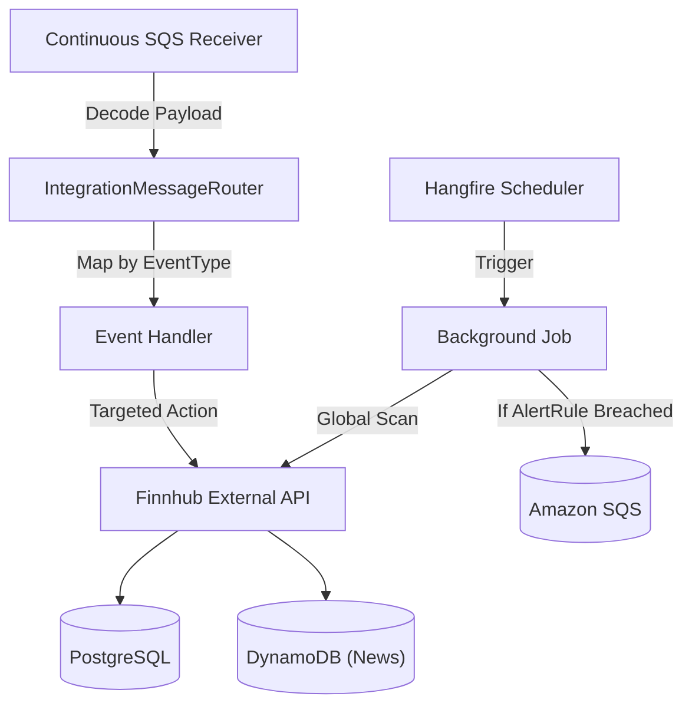

# Worker Engine

## Architecture: Hybrid Hangfire + SQS Strategy

The background worker operates in a highly-concurrent hybrid capacity targeting reliability and idempotency:

| Layer | Engine | Purpose |
| :--- | :--- | :--- |
| **Scheduled Jobs** | Hangfire (PostgreSQL Backed) | Recurring cron-based polling routines (Price Sync, Metrics Refresh, News Batching). |
| **Event Handlers** | Amazon SQS + Redis | Reactive tasks triggered by API events (price alerts, low holdings, news on-demand). |



---

## Scheduled Job Catalog

Running inside `InventoryAlert.Worker`, driven by Hangfire cron schedules.

| Job | Cron Schedule | Finnhub Endpoint | Key Duty |
|---|---|---|---|
| **SyncPricesJob** | `*/15 * * * *` (every 15 min) | `/quote` | Full sweep of `StockListing` → updates `PriceHistory` → evaluates `AlertRule` → writes `Notification` |
| **SyncMetricsJob** | `0 6 * * *` (daily 06:00 UTC) | `/stock/metric` | Updates `StockMetric` table for all active symbols |
| **SyncEarningsJob** | `0 7 * * *` (daily 07:00 UTC) | `/stock/earnings` | Refreshes `EarningsSurprise` rows for watchlisted symbols |
| **SyncRecommendationsJob** | `0 8 * * 1` (weekly, Monday) | `/stock/recommendation` | Refreshes `RecommendationTrend` for portfolio + watchlist symbols |
| **SyncInsidersJob** | `0 8 * * *` (daily 08:00 UTC) | `/stock/insider-transactions` | Pulls last 100 insider transactions for actively-watched symbols |
| **CompanyNewsJob** | `0 */6 * * *` (every 6 hours) | `/company-news` | Batch syncs company news → DynamoDB `CompanyNews` |
| **SyncMarketNewsHandler** | `0 */2 * * *` (every 2 hours) | `/news` | Hangfire Cron trigger OR SQS ad-hoc trigger → DynamoDB `MarketNews` |
| **CleanupPriceHistoryJob** | `@daily` (00:00 UTC) | — | Deletes `PriceHistory` rows older than 1 year (batched, `LIMIT 10000`) |
| **ProcessQueueJob** | Continuous long-poll | — | SQS consumer with Redis-based idempotency (30-min window) |

---

## The Core Evaluation Pipeline: `SyncPricesJob`

```text
1. Collect distinct active TickerSymbols from StockListing
2. For each symbol → Fetch Finnhub /quote → INSERT PriceHistory
3. Load all active AlertRules for this symbol
4. Evaluate breach conditions:
   - PriceAbove / PriceBelow: direct comparison
   - PercentDropFromCost: compute via Trade ledger (UserId + TickerSymbol)
   - LowHoldingsCount: SUM(Buy) - SUM(Sell) for user
5. On breach + not in 24h Redis cooldown:
   → Create Notification entity
   → Publish SQS event for async handler relay
6. Mark TriggerOnce rules as IsActive = false
```

### Key Design Decision: In-Memory Alert Evaluation

Evaluation happens inside `SyncPricesJob` while holding trade data in scope:
- **State Guarantee**: `PercentDropFromCost` evaluation requires the full `Trade` ledger for that user/ticker pair. Done while the data is fresh.
- **Cooldown**: Redis `cooldown:alert:{symbol}` (24h TTL) prevents alert storms.
- **Notification Creation**: `Notification` rows are written directly, populating the UI badge instantly before any SQS relay fires.

---

## Event Handlers (SQS Topology)

Located in `IntegrationEvents/Handlers`. Operating under CQRS Command-Query principles.

| Handler | SQS Event Type | Role |
|---|---|---|
| **MarketPriceAlertHandler** | `inventoryalert.pricing.price-drop.v1` | Price fetch → cache update → `PriceHistory` insert → full `AlertRule` evaluate for symbol |
| **LowHoldingsHandler** | `inventoryalert.inventory.stock-low.v1` | Queries `Trade` ledger by `(UserId, TickerSymbol)` → checks `AlertRule[LowHoldingsCount]` |
| **CompanyNewsAlertHandler** | `inventoryalert.news.headline.v1` | Immediate sync of ticker news → DynamoDB `CompanyNews` |
| **SyncCompanyNewsHandler** | `inventoryalert.news.company-sync-requested.v1` | Manual UI-triggered sync of specific ticker news |
| **SyncMarketNewsHandler** | `inventoryalert.news.sync-requested.v1` | On-demand UI command to refresh general Market News feed |
| **DefaultHandler** | `*` (unmatched) | Log + acknowledge. Prevents poison-message queue blockage. |

---

## Health Monitoring

The worker is equipped with health check endpoints exposed via HTTP (port `8080` internally, `8081` in Docker Compose):

- **Liveness & Readiness**: `GET /health`
- **Dependency Checks**: Verified connectivity to PostgreSQL on startup.
- **Docker Integration**: Configured with `interval: 10s` and `retries: 5` to ensure background services stay responsive.

---

## Protective Redundancy

1. **Failure Tolerance**: Handlers inherit a retry/timeout policy — absolute limit of **5 failure iterations** before the message is acknowledged and dropped.
2. **Dead-Letter Guarding**: Exceeding retry limits ejects payloads to DLQ for manual developer analysis.
3. **Idempotency**: `dedup:sqs:{messageId}` Redis key (30 min TTL) prevents double-processing across split-brain deployments.
4. **Rate Limit Guard**: `finnhub:ratelimit` Redis counter caps Finnhub calls at 55 rpm (buffer below the 60/min free limit).
