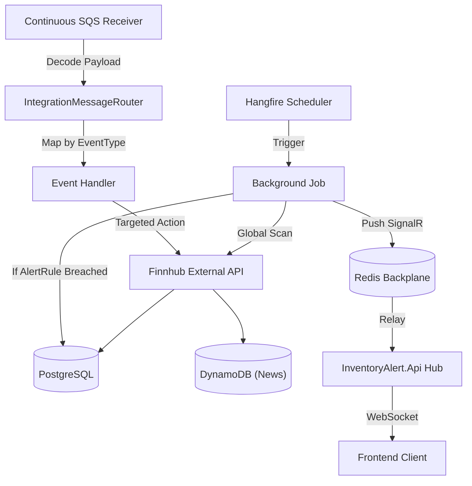

# Worker Engine

## Architecture: Hybrid Hangfire + SQS Strategy

The background worker operates in a highly-concurrent hybrid capacity targeting reliability and idempotency:

| Layer | Engine | Purpose |
| :--- | :--- | :--- |
| **Scheduled Jobs** | Hangfire (PostgreSQL Backed) | Recurring cron-based polling routines (Price Sync, Metrics Refresh, News Batching). |
| **Event Handlers** | Amazon SQS + Redis | Reactive tasks triggered by API events (price alerts, low holdings, news on-demand). |
| **Real-time Push** | SignalR + Redis Backplane | Instant delivery of detected alerts from Worker to UI. |



---

## Scheduled Job Catalog

Running inside `InventoryAlert.Worker`, driven by Hangfire cron schedules.

| Job | Cron Schedule | Finnhub Endpoint | Key Duty |
|---|---|---|---|
| **SyncPricesJob** | `*/15 * * * *` | `/quote` | Parallel fetch → updates `PriceHistory` → Batch evaluates `AlertRule` → writes `Notification` → SignalR Push |
| **SyncMetricsJob** | `0 6 * * *` | `/stock/metric` | Updates `StockMetric` table for all active symbols |
| **SyncEarningsJob** | `0 7 * * *` | `/stock/earnings` | Refreshes `EarningsSurprise` rows for watchlisted symbols |
| **SyncRecommendationsJob** | `0 8 * * 1` | `/stock/recommendation` | Refreshes `RecommendationTrend` for portfolio + watchlist symbols |
| **SyncInsidersJob** | `0 8 * * *` | `/stock/insider-transactions` | Pulls last 100 insider transactions for actively-watched symbols |
| **NewsSyncJob** | `0 */2 * * *` | `/news` & `/company-news` | **Consolidated:** Syncs global market categories AND symbol-specific news in parallel. |
| **CleanupPriceHistoryJob** | `@daily` | — | Deletes `PriceHistory` rows older than 1 year (batched, `LIMIT 10000`) |
| **ProcessQueueJob** | Continuous | — | SQS consumer with Redis-based idempotency (30-min window) |

---

## The Optimized Evaluation Pipeline: `SyncPricesJob`

The v3 architecture features high-concurrency and batch-resolution logic:

```text
1. Collect active TickerSymbols from StockListing.
2. PART 1 (Parallel Sync):
   - Fetch Finnhub /quote in parallel (MaxDegreeOfParallelism=5).
   - Batch insert into PriceHistory using AddRangeAsync.
3. PART 2 (Batch Alert Check):
   - Fetch all active AlertRules for processed symbols in ONE query.
   - Evaluate breach conditions (direct comparison or cost-basis math).
   - Use TradeBasisCache to memoize heavy User+Symbol cost calculations.
4. PART 3 (Real-time Notification):
   - Batch insert Notification records.
   - For each breach: Push via IHubContext (SignalR Redis Backplane).
5. COMMIT: Single SaveChangesAsync call for all history, notifications, and rule updates.
```

### Key Performance Highlights

- **Parallel I/O**: Reduces sync time by fetching multiple quotes simultaneously.
- **N+1 Avoidance**: Repository-level batch fetching for alert rules.
- **Backplane Delivery**: Alert detection in Worker triggers Hub delivery in Api instantly via Redis.

---

## Event Handlers (SQS Topology)

Located in `IntegrationEvents/Handlers`. Operating under CQRS Command-Query principles.

| Handler | SQS Event Type | Role |
|---|---|---|
| **MarketPriceAlertHandler** | `inventoryalert.pricing.price-drop.v1` | Price fetch → cache update → `PriceHistory` insert → full `AlertRule` evaluate for symbol |
| **LowHoldingsHandler** | `inventoryalert.inventory.stock-low.v1` | Queries `Trade` ledger by `(UserId, TickerSymbol)` → checks `AlertRule[LowHoldingsCount]` |
| **CompanyNewsAlertHandler** | `inventoryalert.news.headline.v1` | Immediate sync of ticker news → DynamoDB `CompanyNews` |
| **NewsSyncJob** (via Router) | `inventoryalert.news.sync-requested.v1` | On-demand UI command to refresh global news feed |
| **DefaultHandler** | `*` (unmatched) | Log + acknowledge. Prevents poison-message queue blockage. |

---

## Health Monitoring

The worker is equipped with health check endpoints exposed via HTTP (port `8080` internally, `8081` in Docker Compose):

- **Liveness & Readiness**: `GET /health`
- **Dependency Checks**: Verified connectivity to PostgreSQL on startup.
- **Docker Integration**: Configured with `interval: 10s` and `retries: 5` to ensure background services stay responsive.
