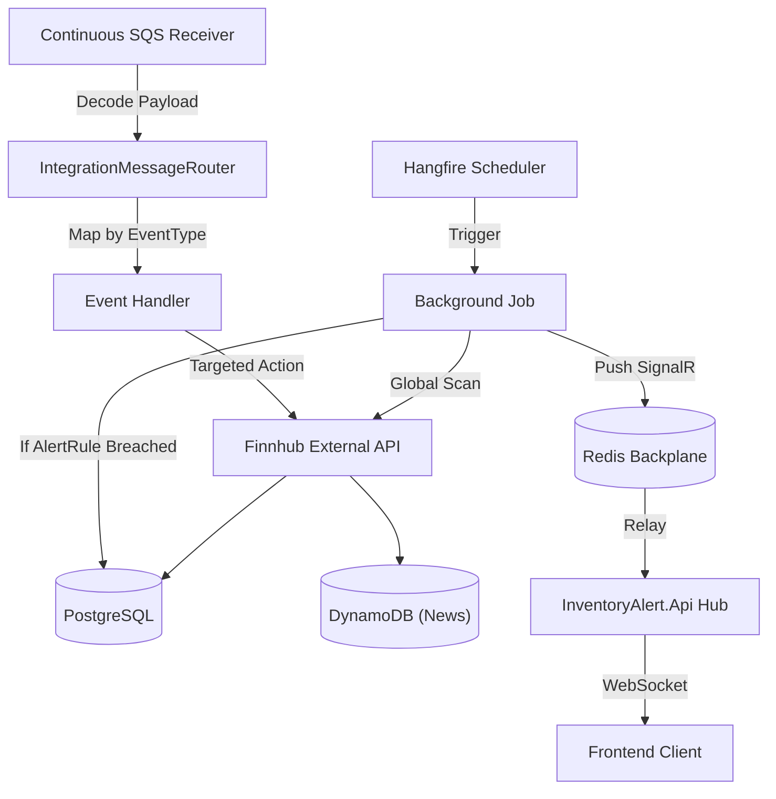

# Worker Engine

## Architecture: Hybrid Hangfire + SQS Strategy

The background worker operates in a highly-concurrent hybrid capacity targeting reliability and idempotency:

| Layer | Engine | Purpose |
| :--- | :--- | :--- |
| **Scheduled Jobs** | Hangfire (PostgreSQL Backed) | Recurring cron-based polling routines (Price Sync, Metrics Refresh, News Batching). |
| **Event Handlers** | Amazon SQS + Redis | Reactive tasks triggered by API events (price alerts, low holdings, news on-demand). |
| **Real-time Push** | SignalR + Redis Backplane | Instant delivery of detected alerts from Worker to UI. |



---

## Scheduled Job Catalog

Running inside `InventoryAlert.Worker`, driven by Hangfire cron schedules.

Schedules are configurable via `WorkerSettings.Schedules.*` (with sensible defaults in code and environment overrides via `appsettings*.json`).

InventoryAlert uses a total of **8 background jobs** (7 recurring via Hangfire + 1 continuous SQS listener).

| Job | Schedule setting | Finnhub Endpoint | Key duty |
|---|---|---|---|
| **SyncPricesJob** | `Schedules.SyncPrices` | `/quote` | Parallel fetch → insert `PriceHistory` → batch evaluate `AlertRule` → insert `Notification` → SignalR push |
| **SyncMetricsJob** | `Schedules.SyncMetrics` | `/stock/metric` | Refresh cached `StockMetric` rows |
| **SyncEarningsJob** | `Schedules.SyncEarnings` | `/stock/earnings` | Refresh `EarningsSurprise` rows |
| **SyncRecommendationsJob** | `Schedules.SyncRecommendations` | `/stock/recommendation` | Refresh `RecommendationTrend` rows |
| **SyncInsidersJob** | `Schedules.SyncInsiders` | `/stock/insider-transactions` | Refresh `InsiderTransaction` rows |
| **NewsSyncJob** | `Schedules.MarketNews` | `/news` & `/company-news` | Consolidated market + company news sync (DynamoDB read-model) |
| **CleanupPriceHistoryJob** | `Schedules.CleanupPrices` | — | Deletes `PriceHistory` rows older than 1 year |
| **ProcessQueueJob** | Continuous | — | Native SQS poller + router + idempotency |

---

## The Optimized Evaluation Pipeline: `SyncPricesJob`

The current architecture uses high-concurrency quote fetching and batch rule evaluation:

```text
1. Collect active TickerSymbols from StockListing.
2. PART 1 (Parallel Sync):
   - Fetch Finnhub /quote in parallel (MaxDegreeOfParallelism=5).
   - Batch insert into PriceHistory using AddRangeAsync.
3. PART 2 (Batch Alert Check):
   - Fetch all active AlertRules for processed symbols in ONE query.
   - Evaluate breach conditions (direct comparison or cost-basis math).
4. PART 3 (Real-time Notification):
   - Batch insert Notification records.
   - For each breach: Push via `IAlertNotifier` (SignalR via Redis backplane).
5. COMMIT: Single SaveChangesAsync call for all history, notifications, and rule updates.
```

### Key Performance Highlights

- **Parallel I/O**: Reduces sync time by fetching multiple quotes simultaneously.
- **N+1 Avoidance**: Repository-level batch fetching for alert rules.
- **Backplane Delivery**: Alert detection in Worker triggers Hub delivery in Api instantly via Redis.

---

## Event Handlers (SQS Topology)

Located in `IntegrationEvents/Handlers`, invoked by `IntegrationMessageRouter` after messages are pulled from SQS by `ProcessQueueJob`.

| Handler | SQS Event Type | Role |
|---|---|---|
| **MarketPriceAlertHandler** | `inventoryalert.pricing.price-drop.v1` | Evaluate rules for a specific symbol + price payload and push notifications |
| **LowHoldingsHandler** | `inventoryalert.inventory.stock-low.v1` | Persist + push a holdings notification for a specific user + symbol |
| **NewsSyncJob** (via Router) | `inventoryalert.news.sync-requested.v1` | Enqueue the consolidated news sync job |
| **DefaultHandler** | `*` (unmatched) | Log + acknowledge (prevents poison-message blockage) |

Notes:

- `inventoryalert.news.company-sync-requested.v1` is defined in `EventTypes`, but is not currently routed by `IntegrationMessageRouter`.

---

## Health Monitoring

The worker is equipped with health check endpoints exposed via HTTP (port `8080` internally, `8081` in Docker Compose):

- **Liveness & Readiness**: `GET /health`
- **Dependency Checks**: Verified connectivity to PostgreSQL on startup.
- **Docker Integration**: Configured with `interval: 10s` and `retries: 5` to ensure background services stay responsive.
