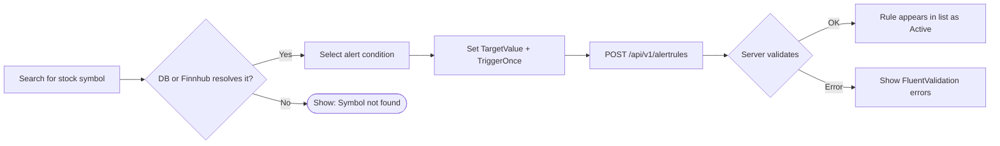
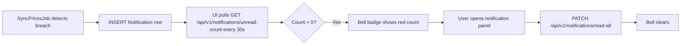

# Feature Breakdown

> Catalog of all user-facing features in the InventoryAlert UI (v1).

## Page & Feature Map

| Feature | Route | Auth | Description |
|---|---|---|---|
| **Login** | `/login` | Public | JWT authentication form. |
| **Register** | `/register` | Public | New account creation with username + email + password. |
| **Dashboard** | `/dashboard` | ✅ | Overview: portfolio summary, watchlist strip, market status, top news, alert badges. |
| **Portfolio** | `/portfolio` | ✅ | Paginated position list with search + filter. Cost basis, return %, market value. |
| **Position Detail** | `/portfolio/[symbol]` | ✅ | Price chart, trade history, alert rules scoped to this position. |
| **Stocks Catalog** | `/stocks` | ✅ | Browse/search global `StockListing` catalog with exchange + industry filters. |
| **Stock Detail** | `/stocks/[symbol]` | ✅ | Quote, profile, financials, earnings chart, analyst donut, insider table, peers, news. |
| **Watchlist** | `/watchlist` | ✅ | Live watchlist with quick-add via symbol search (DB-first discovery). |
| **Alert Rules** | `/alerts` | ✅ | Full CRUD for alert rules with active/inactive toggle and condition selector. |
| **Market Overview** | `/market` | ✅ | Exchange status grid, news feed, earnings calendar, IPO calendar, holiday list. |

---

## Alert Rule Editor (Key UX Flow)

---

## Notification Hub Flow

---

## Symbol Discovery UX

All flows that require resolving a ticker (portfolio add, watchlist add, alert create) use the same **DB-first + Finnhub fallback** strategy:

1. User types `NVDA` in search modal
2. `GET /api/v1/stocks/search?q=NVDA` → API checks `StockListing` table
3. If not found → calls Finnhub `/search` → persists result
4. UI renders result immediately — user selects and proceeds

---

## Portfolio Cascade Delete

When a user removes a position (`DELETE /api/v1/portfolio/positions/{symbol}`):

| Entity | Action |
|---|---|
| User's `Trade` ledger entries for symbol | ✅ Deleted |
| User's `WatchlistItem` for symbol | ✅ Deleted |
| User's `AlertRule` rows for symbol | ⛔ Blocked (user must delete active rules first — 409) |
| Global `StockListing` | ❌ Not touched |
| Global `PriceHistory` | ❌ Not touched |
