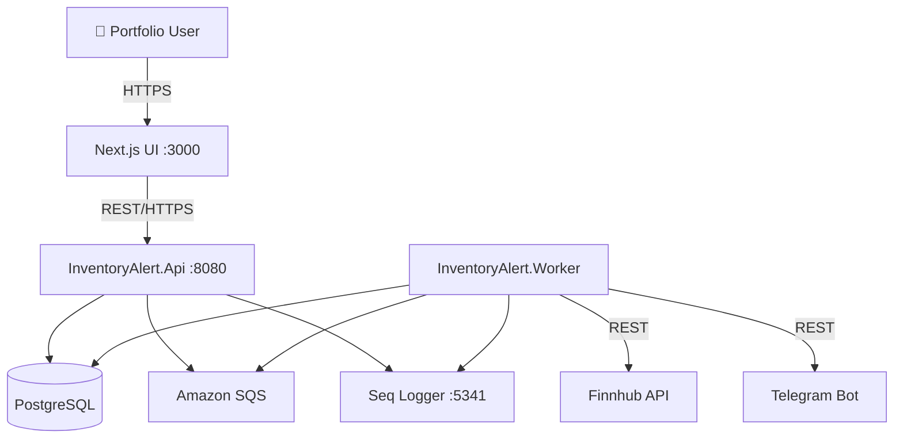

# Architecture Overview

## System Context

InventoryAlert is a real-time stock alerting system. The diagram below shows how it interacts with external systems.

## Tech Stack

### Backend
| Layer | Technology |
|---|---|
| Runtime | .NET 10 / C# 12 |
| Web Framework | ASP.NET Core 10 |
| ORM | Entity Framework Core 10 + Npgsql |
| Background Jobs | Hangfire (PostgreSQL storage) |
| Event Bus | Amazon SQS / SNS |
| Logging | Serilog → Seq |

### Frontend
| Layer | Technology |
|---|---|
| Framework | Next.js 15 (App Router + RSC) |
| Language | TypeScript |
| Styling | Tailwind CSS v4 |

### Infrastructure
| Component | Tool |
|---|---|
| Database | PostgreSQL 17 |
| Observability | Seq (structured logs) |
| Containerization | Docker + Docker Compose |
| Cloud Events | Amazon SQS / SNS |
| Notifications | Telegram Bot API |
