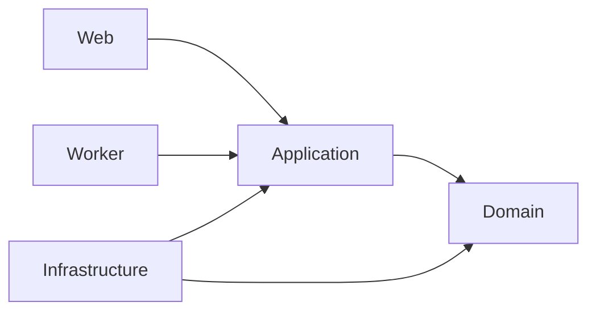

# Domain, Structure & DDD

## Clean Architecture Layers

InventoryAlert strictly enforces Clean Architecture. Each layer has exactly one responsibility and zero upward imports.

| Layer | Project | Responsibility |
|---|---|---|
| **Domain** | `InventoryAlert.Domain` | Entities, Value Objects, Domain Events, Interfaces — **zero dependencies** |
| **Application** | `InventoryAlert.Application` | Use Cases, Services, DTOs, Mappings |
| **Infrastructure** | `InventoryAlert.Infrastructure` | Repositories, DbContext, Finnhub/Telegram Clients |
| **Web** | `InventoryAlert.Api` | Controllers, Middleware, JWT config |
| **Worker** | `InventoryAlert.Worker` | Background services, event consumers, Hangfire jobs |

### Dependency Direction



> **Rule**: Domain never imports from Application, Infrastructure, or Web.

---

## Solution Folder Structure

```
InventoryManagementSystem/
├── InventoryAlert.Api/              ← Web layer
│   ├── Controllers/
│   │   ├── AuthController.cs
│   │   ├── ProductsController.cs
│   │   ├── AlertRulesController.cs
│   │   └── WatchlistsController.cs
│   ├── Middleware/
│   └── Program.cs
│
├── InventoryAlert.Application/      ← Business logic
│   ├── Services/
│   ├── DTOs/
│   └── Mappings/
│
├── InventoryAlert.Domain/           ← Core (zero dependencies)
│   ├── Entities/
│   │   ├── User.cs
│   │   ├── Product.cs
│   │   ├── AlertRule.cs
│   │   ├── WatchlistItem.cs
│   │   └── PriceHistory.cs
│   ├── Events/
│   └── Interfaces/
│
├── InventoryAlert.Infrastructure/   ← Data access + external clients
│   ├── Repositories/
│   ├── Persistence/
│   │   ├── AppDbContext.cs
│   │   └── Migrations/
│   └── ExternalClients/
│       ├── FinnhubClient.cs
│       └── TelegramClient.cs
│
└── InventoryAlert.Worker/           ← Background job engine
    ├── Jobs/
    ├── Handlers/
    └── Workers/
        ├── FinnhubPricesSyncWorker.cs
        └── MarketStatusWorker.cs
```
