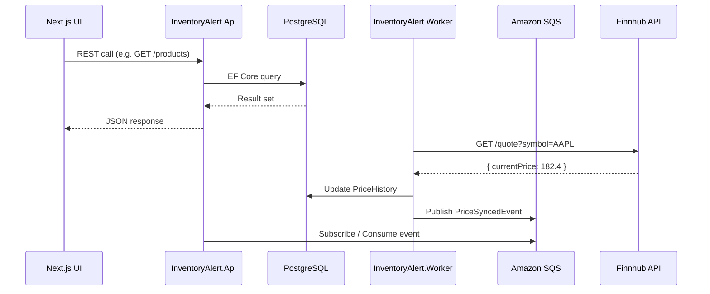

# Microservice Component Interactions

> How the individual project components communicate at runtime.

## Interaction Flow

```mermaid
sequenceDiagram
    participant UI as Next.js UI
    participant API as InventoryAlert.Api
    participant DB as PostgreSQL
    participant Worker as InventoryAlert.Worker
    participant SQS as Amazon SQS
    participant Finnhub as Finnhub API

    UI->>API: REST call (e.g. GET /products)
    API->>DB: EF Core query
    DB-->>API: Result set
    API-->>UI: JSON response

    Worker->>Finnhub: GET /quote?symbol=AAPL
    Finnhub-->>Worker: { currentPrice: 182.4 }
    Worker->>DB: Update PriceHistory
    Worker->>SQS: Publish PriceSyncedEvent
    API->>SQS: Subscribe / Consume event
```
