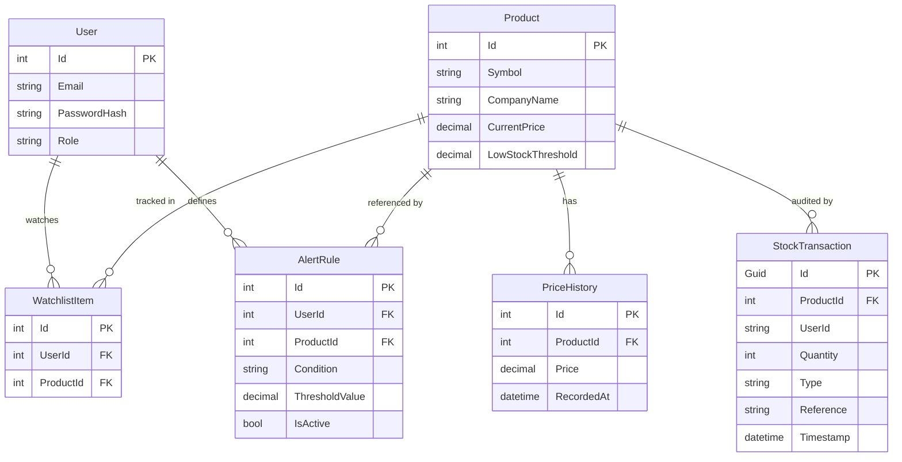

# Data Model

## Entity Relationship Diagram



---

## Alert Rule Business Logic

Alert rules define when the worker engine should dispatch a notification.

### Supported Conditions

| Condition | Description | Example |
|---|---|---|
| `PriceAbove` | Triggers when current price exceeds threshold | Alert if AAPL > $200 |
| `PriceBelow` | Triggers when current price drops below threshold | Alert if TSLA < $150 |
| `PercentChange` | Triggers on % movement from last recorded price | Alert if price changes ≥ 5% |

### Evaluation Pseudocode

```
foreach AlertRule in ActiveRules where market is open:
    currentPrice = GetCurrentPrice(rule.ProductId)
    if EvaluateCondition(rule.Condition, currentPrice, rule.ThresholdValue):
        DispatchAlert(rule)
        DeactivateRule(rule)   ← user must re-enable
```

### Business Rules
- Rules are only evaluated when the **market is open** (checked by `MarketStatusWorker`).
- A rule is **deactivated after a single trigger** — it must be manually re-enabled by the user.
- Multiple rules can target the same stock symbol.
