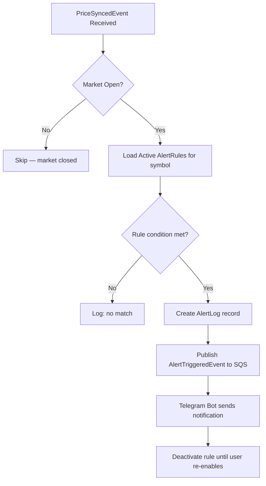

# Alert Dispatch Flow

> How the system evaluates alert rules and delivers notifications.

## Flow

```mermaid
flowchart TD
    A[PriceSyncedEvent Received] --> B{Market Open?}
    B -- No --> Z[Skip — market closed]
    B -- Yes --> C[Load Active AlertRules for symbol]
    C --> D{Rule condition met?}
    D -- No --> E[Log: no match]
    D -- Yes --> F[Create AlertLog record]
    F --> G[Publish AlertTriggeredEvent to SQS]
    G --> H[Telegram Bot sends notification]
    H --> I[Deactivate rule until user re-enables]
```
