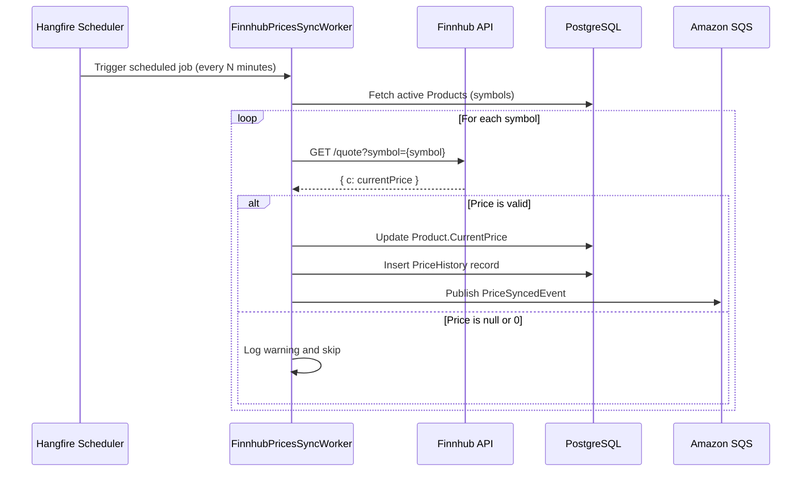

# Price Sync Flow

> How current stock prices are fetched from Finnhub and persisted.

## Sequence

```mermaid
sequenceDiagram
    participant Hangfire as Hangfire Scheduler
    participant Worker as FinnhubPricesSyncWorker
    participant Finnhub as Finnhub API
    participant DB as PostgreSQL
    participant SQS as Amazon SQS

    Hangfire->>Worker: Trigger scheduled job (every N minutes)
    Worker->>DB: Fetch active Products (symbols)
    loop For each symbol
        Worker->>Finnhub: GET /quote?symbol={symbol}
        Finnhub-->>Worker: { c: currentPrice }
        alt Price is valid
            Worker->>DB: Update Product.CurrentPrice
            Worker->>DB: Insert PriceHistory record
            Worker->>SQS: Publish PriceSyncedEvent
        else Price is null or 0
            Worker->>Worker: Log warning and skip
        end
    end
```
