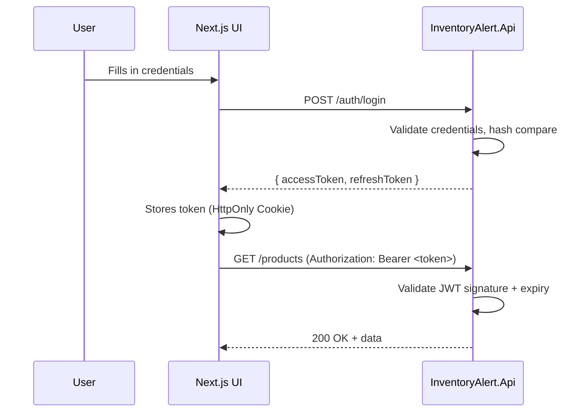

# User Authentication Flow

> How users register, log in, and access protected resources.

## JWT Token Lifecycle

## Authorization
- **User Role**: Full access to own watchlists and alert rules.
- **Admin Role**: Access to all users' data and Hangfire Dashboard.
