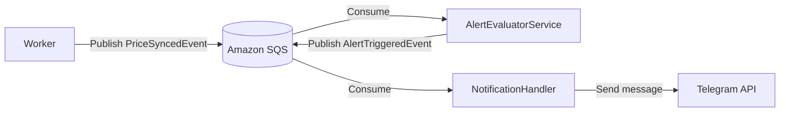

# Event Handling

> How domain events are published, routed, and consumed across the system.

## Domain Events

| Event | Publisher | Consumer | Description |
|---|---|---|---|
| `PriceSyncedEvent` | Worker | Api / AlertEvaluator | Fires after each successful Finnhub price fetch |
| `AlertTriggeredEvent` | AlertEvaluator | NotificationHandler | Fires when a rule condition is met |

## Message Flow



## Message Contract Example

```json
{
  "EventType": "PriceSyncedEvent",
  "ProductId": 42,
  "Symbol": "AAPL",
  "NewPrice": 193.25,
  "SyncedAt": "2026-04-09T01:30:00Z"
}
```
