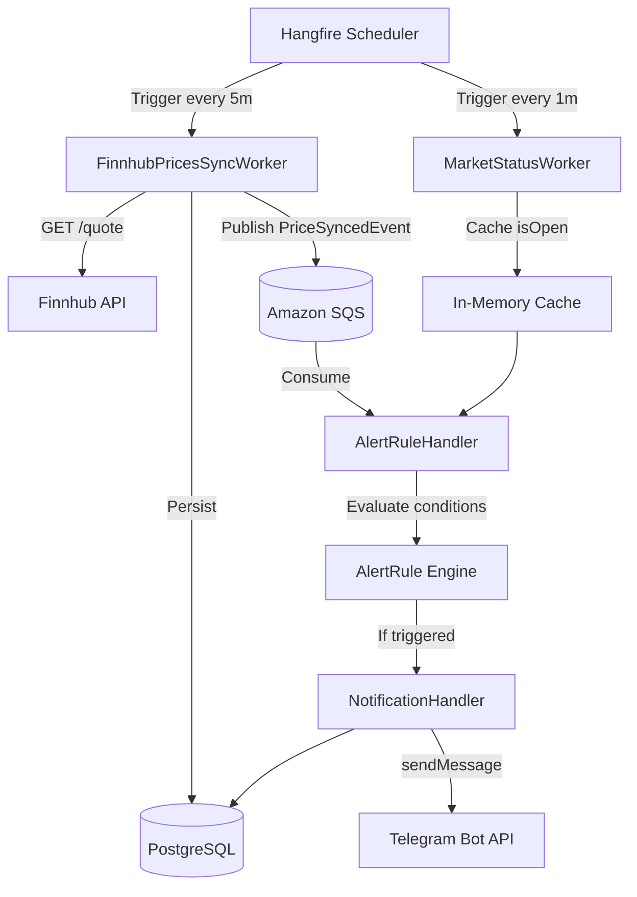

# Worker Engine

## Full Worker Architecture

## Scheduled Workers

| Worker | Schedule | Purpose |
|---|---|---|
| `FinnhubPricesSyncWorker` | Every 5 minutes | Fetches latest prices, updates DB, publishes `PriceSyncedEvent` |
| `MarketStatusWorker` | Every 1 minute | Checks if market is open; blocks alert evaluation when closed |

### FinnhubPricesSyncWorker — Step by Step

1. Fetch all active `Product` records from PostgreSQL
2. For each symbol: call `GET /quote?symbol={ticker}&token={API_KEY}` on Finnhub
3. If `currentPrice` is valid (non-null, non-zero):
   - Update `Product.CurrentPrice`
   - Insert a `PriceHistory` row
   - Publish `PriceSyncedEvent` to SQS
4. If `currentPrice` is invalid: log a warning and skip — **never throw**

### Internal Queue (SQS)

- **Polling**: Long-polling with a 20-second wait time
- **Visibility Timeout**: 30 seconds
- **DLQ**: Failed messages moved after 3 retries
- **Message Types**: `PriceSyncedEvent`, `AlertTriggeredEvent`

---

## Hangfire Dashboard

Navigate to `http://localhost:8080/hangfire` (requires Admin role).

| Dashboard Tab | Purpose |
|---|---|
| Enqueued | Jobs waiting to be picked up |
| Processing | Jobs currently executing |
| Succeeded | Completed jobs with execution time |
| Failed | Jobs that threw exceptions — click to retry |
| Recurring | Scheduled jobs and their cron expressions |

> **Business Impact**: If `FinnhubPricesSyncWorker` fails, prices are stale and alert evaluation is paused until the next successful sync cycle.
