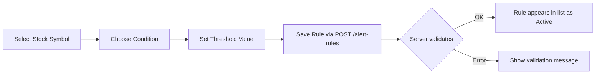

# Feature Breakdown

> Catalog of all user-facing features in the InventoryAlert UI.

## Feature Map

| Feature | Page | Description |
|---|---|---|
| **Register / Login** | `/auth` | JWT-based session creation with role assignment |
| **Dashboard** | `/dashboard` | Overview of all tracked stocks, current prices, and alert status |
| **Watchlist** | `/watchlists` | Add or remove stock symbols from personal tracking list |
| **Alert Rules** | `/alert-rules` | Create threshold rules (`PriceAbove`, `PriceBelow`) with visual feedback |
| **Price History** | `/products/{id}` | Historical price chart for a given stock symbol |
| **User Settings** | `/settings` | Manage account info and Telegram notification preferences |
| **Admin Panel** | `/admin` | Hangfire dashboard link + user management (Admin role only) |

## Alert Rule Editor (Key UX Flow)

