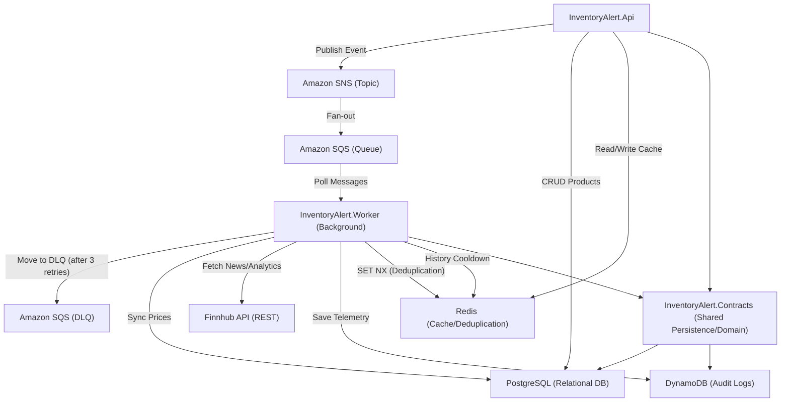

# InventoryAlert.Worker — Architectural Review & Flow Documentation

This document provides a technical walkthrough of the **InventoryAlert.Worker** project, detailing its architecture, infrastructure, event lifecycle, and background job logic.

---

## 1. High-Level Architecture

The Worker project follows a **Background Service / Worker** pattern, integrated with **Hangfire** for scheduling and **SQS** for event-driven processing. It shares the same Domain and Infrastructure (Partial) concepts as the API but is focused on side effects, data syncing, and external integration.

### Core Stack

- **Service SDK**: `Microsoft.NET.Sdk.Web` (Upgraded to support Hangfire Dashboard).
- **Job Orchestrator**: Hangfire (using PostgreSQL storage).
- **Communication**: Amazon SQS (Event-driven) + SNS (via API).
- **Caching/Deduplication**: Redis (StackExchange.Redis).
- **Persistence**:
  - **Relational**: PostgreSQL (via unified `InventoryDbContext` living in `Contracts`).
  - **Audit/Logs**: DynamoDB (via unified `EventLogDynamoRepository` living in `Contracts`).
- **External API**: Finnhub REST API.

### Infrastructure Diagram (Mermaid)

---

## 2. Event Processing Flow (SQS Pipeline)

The most critical flow is the ingestion and processing of market events via SQS.

### Lifecycle of an SQS Message

1. **Trigger**: `PollSqsJob` runs every 30 seconds (Scheduled by `JobSchedulerService`).
2. **Ingestion**:
   - `PollSqsJob` fetches up to 10 messages from `settings.Aws.SqsQueueUrl`.
   - Each message is deserialized into a generic `EventEnvelope`.
3. **Atomic Deduplication**:
   - Uses Redis `StringSetAsync` with `When.NotExists` (SET NX) on key `processed:msg:{envelope.MessageId}`.
   - If the lock is not acquired, the message is skipped and Deleted (ACK).
4. **Suppression Logic**:
   - Specifically for `MarketPriceAlert`, it checks Redis for an `alert:history:{symbol}`.
   - If an alert was sent recently (24h cooldown), the event is suppressed but ACKnowledged.
5. **Dispatching**:
   - The job uses a `BuildDispatcher()` dictionary to route the payload to the correct `IEventHandler<T>`.
   - Handlers (e.g., `PriceAlertHandler`) execute specific domain logic.
6. **Persistence & ACK**:
   - On **Success**:
     - Writes a `Status = "processed"` entry to **DynamoDB**.
     - Calls `DeleteMessageAsync` to remove the message from the queue.
   - On **Failure**:
     - Writes a `Status = "failed"` entry to **DynamoDB**.
     - Does NOT delete the message. It will be redelivered by SQS after the visibility timeout.
     - SQS RedrivePolicy handles the movement to DLQ after MaxReceiveCount exceeded.

---

## 3. Recurring Jobs Registry

Managed by `JobSchedulerService` (IHostedService), registered on application startup.

| Job Name | Frequency | Responsibility |
| :--- | :--- | :--- |
| `poll-sqs` | 30s | Dequeues events and triggers Handlers. |
| `sync-prices` | 10m (cfg) | Updates `CurrentPrice` in DB for all products via Finnhub. |
| `news-check` | 1h | Fetches latest market/company news. |

---

## 4. Big Picture: Jobs vs. Events

While both patterns run in the background, they serve fundamentally different purposes in the Worker's ecosystem.

### A. Scheduled Jobs (Pull-Based)
These are **time-triggered** routines managed by Hangfire. They are responsible for keeping the system's state in sync with external truth (Finnhub).
- **Orchestration**: Registered in `JobSchedulerService` via `IRecurringJobManager`.
- **Flow**: `Hangfire Trigger` → `Job.ExecuteAsync()` → `External API` → `Database Update`.
- **Key Jobs**: 
    - `SyncPricesJob`: The most frequent job. Reconciles DB prices with live market data.
    - `NewsCheckJob`: Periodically scrapes news to populate the `NewsRecords` table.

### B. Reactive Events (Push-Based)
These are **action-triggered** routines that respond to events happening elsewhere (usually the API).
- **Orchestration**: The `PollSqsJob` acts as a high-frequency (30s) "Ingestion Engine".
- **Dispatching**: It deserializes an `EventEnvelope` and uses a `Dispatcher` dictionary to route to specialized `IEventHandler<T>` instances.
- **Deduplication**: Every event must pass a Redis-backed "Processed Check" (`SET NX`) to prevent duplicate processing in clusters.
- **Flow**: `API Action` → `SNS` → `SQS` → `PollSqsJob` → `Handler.HandleAsync()`.

---

## 5. Handler Logic Review

| Handler | Purpose | Logic Notes |
| :--- | :--- | :--- |
| `PriceAlertHandler` | Process price drops. | Logs event; intended to trigger downstream notifications. |
| `NewsHandler` | Content ingestion. | Persists structured news snippets associated with tickers. |
| `UnknownEventHandler` | Safety Net. | Handles `EventEnvelope` with unrecognized `EventType`. |

---

## 6. Architectural Recommendations

### Current Strengths

- **Resilience**: Every message is audit-logged in DynamoDB regardless of success/failure.
- **Deduplication**: Redis locks prevent duplicate processing in scaled-out worker environments.
- **Observability**: Hangfire Dashboard integration provides real-time monitoring of retries and failures.

### Recent Architectural Refactorings

1. **Unified Persistence**: Previously, the API and Worker maintained disconnected DbContexts (`AppDbContext` vs `WorkerDbContext`). These were consolidated into a single `InventoryDbContext` residing centrally within `InventoryAlert.Contracts`.
2. **DynamoDB Unification**: The `EventLogDynamoRepository` and its data model were also moved to `Contracts`, eliminating duplicate SDK code between API log queries and Worker event telemetry writes.
3. **Internal Restructuring**: Event Handlers and background Jobs were cleanly bounded into an `Infrastructure/` namespace mimicking the API's Clean Architecture approach.

### Opportunities for Improvement

- **Interface Segregation**: `IEventHandler<T>` is clean, but the manual mapping in `PollSqsJob.BuildDispatcher` could be refactored to use a Strategy pattern or DI keyed services if the number of handlers grows significantly.
- **Resource Protection**: Add rate limiting to `SyncPricesJob` to honor Finnhub's tier-specific throughput limits.
- **DynamoDB Reallocation**: Currently, DynamoDB is heavily invoked for simple Event Logs. Future optimization is slated to migrate `NewsRecord` out of PostgreSQL and into DynamoDB to better leverage its time-series query performance.
