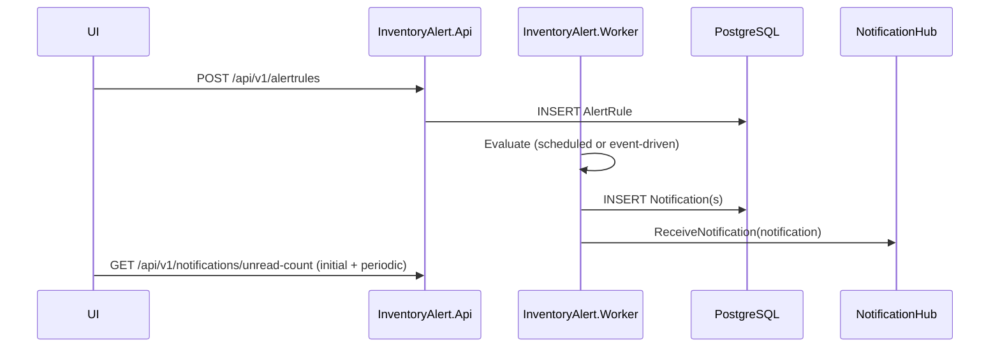

# Alert Rules & Notifications — Business Flow Review + Enhancements

Scope: end-to-end “alert rule → evaluation → notification → real-time delivery → user acknowledgement” across:

- API: `InventoryManagementSystem/InventoryAlert.Api`
- Worker: `InventoryManagementSystem/InventoryAlert.Worker`
- Infrastructure: SignalR hub + notifier
- UI: `InventoryAlert.UI` (SignalR + unread count)

Documentation-only (no code changes here).

---

## 1) Domain Model (Current)

### 1.1 AlertRule

Entity: `InventoryManagementSystem/InventoryAlert.Domain/Entities/Postgres/AlertRule.cs`

- Key fields:
  - `UserId`, `TickerSymbol`, `Condition`, `TargetValue`
  - `IsActive`, `TriggerOnce`, `LastTriggeredAt`

Conditions currently include:

- `PriceAbove`, `PriceBelow`, `PriceTargetReached`
- `PercentDropFromCost`
- `LowHoldingsCount`

### 1.2 Notification

Entity: `InventoryManagementSystem/InventoryAlert.Domain/Entities/Postgres/Notification.cs`

- Key fields:
  - `UserId`
  - `AlertRuleId?` (nullable)
  - `TickerSymbol?`
  - `Message`
  - `IsRead`
  - `CreatedAt`

DTO returned to clients:

- `InventoryManagementSystem/InventoryAlert.Domain/DTOs/NotificationDTOs.cs` → `NotificationResponse`

---

## 2) Current API Flow (Alert Rules + Notifications)

### 2.1 AlertRule CRUD

Controller: `InventoryManagementSystem/InventoryAlert.Api/Controllers/AlertRulesController.cs`

- `GET /api/v1/alertrules` → list current user’s rules
- `POST /api/v1/alertrules` → create
- `PUT /api/v1/alertrules/{id}` → full replace
- `PATCH /api/v1/alertrules/{id}/toggle` → enable/disable
- `DELETE /api/v1/alertrules/{id}` → delete

Service: `InventoryManagementSystem/InventoryAlert.Api/Services/AlertRuleService.cs`

Observed business behavior:

- Normalizes symbol on create (`Trim().ToUpperInvariant()`).
- Performs “symbol discovery” side-effect by calling `IStockDataService.GetProfileAsync` before persisting the rule.
- Uses `KeyNotFoundException` for missing rule (maps to 404 in middleware).

### 2.2 Notification query + acknowledgement

Controller: `InventoryManagementSystem/InventoryAlert.Api/Controllers/NotificationsController.cs`

- `GET /api/v1/notifications` (paged, supports `onlyUnread`)
- `GET /api/v1/notifications/unread-count`
- `PATCH /api/v1/notifications/{id}/read` → mark read
- `PATCH /api/v1/notifications/read-all` → mark all read
- `DELETE /api/v1/notifications/{id}` → dismiss (delete)
- `POST /api/v1/notifications/test-signalr` → pushes a test notification via SignalR (admin/dev utility)

Repository: `InventoryManagementSystem/InventoryAlert.Infrastructure/Persistence/Postgres/Repositories/NotificationRepository.cs`

- Uses `ExecuteUpdateAsync` for `MarkAllReadAsync` (efficient).

---

## 3) Current Delivery Flow (Worker → SignalR → UI)

### 3.1 SignalR hub and delivery mechanism

- Hub: `InventoryManagementSystem/InventoryAlert.Infrastructure/Hubs/NotificationHub.cs`
  - `[Authorize]`
  - Logs connect/disconnect using `Context.UserIdentifier`
- Hub route constant:
  - `InventoryManagementSystem/InventoryAlert.Domain/Interfaces/INotificationHub.cs` → `SignalRConstants.NotificationHubRoute = "/hubs/notifications"`
- API hosts hub:
  - `InventoryManagementSystem/InventoryAlert.Api/Program.cs` → `app.MapHub<NotificationHub>("/hubs/notifications")`
- Notifier:
  - `InventoryManagementSystem/InventoryAlert.Infrastructure/Utilities/NotificationAlertNotifier.cs`
  - Calls `Clients.User(notification.UserId.ToString()).ReceiveNotification(dto)`

### 3.2 UI consumption

`InventoryAlert.UI/src/components/NotificationProvider.tsx`:

- Reads `auth_token` from localStorage.
- If token exists, connects to SignalR hub (`/hubs/notifications`) using `NEXT_PUBLIC_API_URL`.
- Listens for `ReceiveNotification` and increments local unread count.
- Also calls `GET /api/v1/notifications/unread-count` to fetch initial state.

---

## 4) Current Evaluation Flows (Worker)

### 4.1 Scheduled evaluation (SyncPricesJob)

`InventoryManagementSystem/InventoryAlert.Worker/ScheduledJobs/SyncPricesJob.cs`:

- Fetches quotes in parallel (`MaxDegreeOfParallelism = 5`).
- Persists `PriceHistory` in bulk.
- Loads active alert rules in batch (`GetBySymbolsAsync`) and evaluates locally.
- Creates `Notification` rows (in-memory list), persists them, then calls `IAlertNotifier.NotifyAsync` for each notification.

### 4.2 Event-driven evaluation (MarketPriceAlertHandler + LowHoldingsHandler)

Handlers:

- `InventoryManagementSystem/InventoryAlert.Worker/IntegrationEvents/Handlers/MarketPriceAlertHandler.cs`
  - Evaluates rules for one symbol and creates/persists notifications in a transaction, then notifies via SignalR.
  - Trigger logic includes only:
    - `PriceAbove`, `PriceBelow`, `PriceTargetReached`
- `InventoryManagementSystem/InventoryAlert.Worker/IntegrationEvents/Handlers/LowHoldingsHandler.cs`
  - Creates/persists a notification, then notifies via SignalR.

---

## 5) Business Flow Issues / Gaps (Observed)

### 5.1 Two competing “sources of truth” for price alert evaluation

Both of these can generate price notifications:

- `SyncPricesJob` (scheduled)
- `MarketPriceAlertHandler` (event-driven)

Risk:

- Duplicate notifications for the same rule breach.
- Divergent rule behavior (ex: cost-basis alerts are implemented in `SyncPricesJob`, but not in `MarketPriceAlertHandler`).

### 5.2 Cooldown/dedup rules are inconsistent across flows

`ProcessQueueJob` contains an alert suppression key:

- `alert:cooldown:{payload.Symbol}` (24h)
  - `InventoryManagementSystem/InventoryAlert.Worker/ScheduledJobs/ProcessQueueJob.cs`

But `SyncPricesJob` creates notifications directly and does not share the same cooldown gate.

Risk:

- User experiences “alert storms” if the same condition is repeatedly breached across sync cycles.

### 5.3 Contract drift between docs and code

Some Wiki execution-flow docs describe SQS publishing for certain alert flows, while current code shows direct persistence + SignalR notify inside `SyncPricesJob`.

This makes debugging hard because operational expectations (“where should I look?”) are unclear.

### 5.4 Notification delivery is not coupled to persistence outcome

In `SyncPricesJob`, persistence (`AddRangeAsync`) and delivery (`NotifyAsync`) occur, but the notification loop is sequential and can fail per user.

In the notifier itself, delivery failures are logged and swallowed:

- `NotificationAlertNotifier.NotifyAsync` catches and logs; it does not throw.

Implication:

- DB state can show notification exists, but UI never received real-time push (UI should still fetch via API list/unread count, but the user may miss immediacy).

### 5.5 No explicit “notification type” or “severity”

Everything is just a string `Message`.

Impact:

- Hard to group alerts (price vs holdings vs system vs news).
- Hard to present consistent UI (icons, colors, filters).

### 5.6 Lack of explicit idempotency key at the “rule trigger” level

There is:

- SQS message-level dedup (MessageId) in `ProcessQueueJob`
- but no explicit rule-level dedup (“don’t fire the same rule twice for same symbol within X min”) when the source is scheduled evaluation.

---

## 6) Recommended Enhancements (Business + Technical)

### P0 — Choose one primary evaluation pipeline for price alerts

Pick one:

**Option A: scheduled-only**

- `SyncPricesJob` is the sole evaluator for price-based alert rules.
- Remove/disable event-driven `MarketPriceAlertHandler` for price rules (or keep it for a different event type).

**Option B: event-driven**

- `SyncPricesJob` only publishes events (or only updates `PriceHistory`), and `MarketPriceAlertHandler` becomes the sole evaluator.
- Ensure handler supports all relevant conditions (including cost-basis if desired).
- Ensure event payload includes enough context (`Symbol`, `NewPrice`, potentially `QuoteTimestamp`).

**Option C: Hybrid (User Preferred)**

- **Keep both** Hangfire jobs (scheduled) and event-driven handlers for redundancy and comprehensive coverage.
- Requires rigorous idempotency/dedup logic to prevent duplicate notifications for the same breach event across both pipelines.

Acceptance criteria:

- One breach → one notification → one delivery attempt.
- Same rule logic regardless of entry path.

### P0 — Standardize cooldown/dedup semantics

Define the canonical rule:

- Per `(UserId, AlertRuleId)` (recommended), or per `(UserId, Symbol, Condition)`.

Then enforce it in the chosen evaluation pipeline:

- Redis key pattern (example): `alert:cooldown:{userId}:{ruleId}`
- TTL configurable per rule type (e.g., 24h for news, 1h for price, etc.)

### P1 — Add “notification type” (and optional metadata) to support UX

Add fields conceptually (and later in DB if desired):

- `Type` (enum): `Price`, `Holdings`, `System`, `News`, …
- `Severity` (enum): `Info`, `Warning`, `Critical`
- Optional metadata: `CurrentPrice`, `TargetValue`, `Condition`, …

Even if DB isn’t changed immediately, you can standardize message templates and embed structured fields in logs for now.

### P1 — Make delivery robust and observable

Recommended:

- Ensure UI always reflects DB truth:
  - UI should periodically refresh unread count and/or latest notifications (not only via SignalR push).
  - **Manual Reload Feature:** Build a feature allowing the user to manually reload or pull-to-refresh to get the newest notifications directly from the API.
- Add explicit logging fields for each notification dispatch:
  - `NotificationId`, `UserId`, `AlertRuleId`, `TickerSymbol`
- Consider capturing “delivery status” only if needed (usually not needed if polling exists).

### P2 — Align docs to the implemented flow

Once a primary pipeline is chosen:

- Update execution flow docs to match it.
- Keep review/refactor notes under `doc/` (not Wiki), and keep Wiki “how to use” oriented.

---

## 7) Suggested “Golden Path” Flow (Target)

---

## 8) Practical Next Steps (Implementation Level)

1) **Implement Hybrid Evaluation:** ✅ Refactored `SyncPricesJob` and `MarketPriceAlertHandler` to share `IAlertRuleEvaluator`.
2) **Enforce Deduplication/Cooldown:** ✅ Implemented Redis-based cooldown (`alert:cooldown:{userId}:{ruleId}`) in `AlertRuleEvaluator`.
3) **Build Manual Reload in UI:** ✅ Added "Refresh" button in Notifications page and synchronized unread count badge.
4) **Standardize Taxonomy:** ✅ Implemented `NotificationType` and `NotificationSeverity` enums and updated UI to use icons/colors.
5) **Align Error Handling:** ✅ UI `fetchApi` and `NotificationProvider` are now resilient to background failures and synchronized via React Context.

---

## 9) Verification Status

- **Unit Tests:** ✅ 99/99 Passing (including new `AlertRuleEvaluatorTests`).
- **E2E Tests:** 🏗️ Planned for next step.
- **Docker:** 🏗️ Rebuild required to verify full flow.

