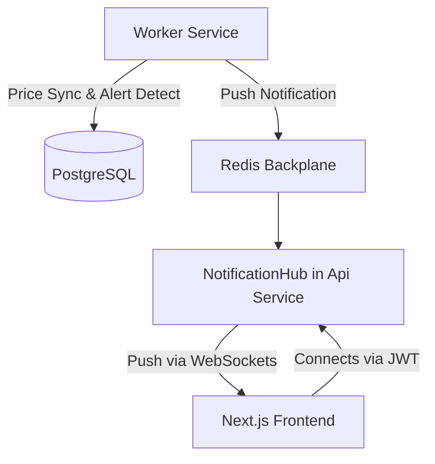

# SignalR Real-Time Notification Plan

This document outlines the architectural plan for integrating real-time notifications into the InventoryAlert system using SignalR and a Redis backplane.

## 1. Objectives
- **Real-time UI Updates:** Push price alerts and system notifications directly to the frontend without manual refresh.
- **Cross-Service Communication:** Allow the `InventoryAlert.Worker` (which detects alerts) to trigger SignalR messages on the `InventoryAlert.Api` (which hosts the hub).
- **Secure Delivery:** Ensure users only receive notifications intended for them using JWT authentication.

## 2. Architecture Diagram



## 3. Business & Data Flow

Why do we need this complex setup? Here is the step-by-step business logic:

1.  **The Trigger (External):** The market changes. Finnhub provides a new price for `AAPL`.
2.  **The Detector (Worker):** The `SyncPricesJob` in the **Worker Service** fetches this price. It runs the business rules (e.g., "Did it drop 10% from the user's cost?").
3.  **The Decision (Worker):** The Worker identifies a "Breach". It creates a `Notification` record in **PostgreSQL** so the user has a permanent history of the alert.
4.  **The Hand-off (Worker -> Redis):** The Worker doesn't know who is currently online. It publishes a "Real-time Signal" to the **Redis Backplane**.
5.  **The Relay (Api):** The **Api Service** (which hosts the SignalR Hub) is subscribed to Redis. It sees the alert and checks: "Is User A currently connected to my WebSocket?".
6.  **The Delivery (Api -> UI):** If User A is online, the Api pushes the message through the open WebSocket tunnel instantly.
7.  **The Experience (UI):** The user's browser receives the message. A **Toast notification** pops up, and the **Notification Badge** in the header increments without the user needing to refresh the page.

### Why not just use the API for everything?
- **Separation of Concerns:** The API is for fast User interactions (browsing, buying, settings). The Worker is for heavy, scheduled "Intelligence" tasks (syncing 1,000s of prices, calculating complex math).
- **Scalability:** If we have 10,000 users, we can add more API instances to handle traffic. All instances stay synced through Redis.

## 4. Implementation Steps

### Phase 1: Infrastructure (Backend)
1. **Add Dependencies:**
   - Add `Microsoft.AspNetCore.SignalR.StackExchangeRedis` to both **Api** and **Worker** projects.
2. **Shared Hub Definition:**
   - Create `INotificationHub` interface in `InventoryAlert.Domain` for type-safe client methods.
   - Define a shared constant for the Hub route (e.g., `/hubs/notifications`).

### Phase 2: InventoryAlert.Api (The Host)
1. **Create Hub:**
   - Implement `NotificationHub : Hub<INotificationHub>`.
   - Add `[Authorize]` attribute to ensure only authenticated users connect.
2. **Configure SignalR:**
   - In `Program.cs`: `builder.Services.AddSignalR().AddStackExchangeRedis(redisConnectionString)`.
   - Map the hub: `app.MapHub<NotificationHub>("/hubs/notifications")`.
3. **JWT Configuration:**
   - Update `JwtBearer` configuration to handle SignalR access tokens from query strings (standard for WebSockets).

### Phase 3: InventoryAlert.Worker (The Producer)
1. **Configure SignalR Client Logic:**
   - In `Program.cs`: Add SignalR services and Redis backplane (even though it doesn't host the hub).
2. **Refactor `NotificationAlertNotifier`:**
   - Inject `IHubContext<NotificationHub, INotificationHub>`.
   - Update `NotifyAsync` to call `_hubContext.Clients.User(notification.UserId).ReceiveNotification(dto)`.

### Phase 4: InventoryAlert.UI (The Consumer)
1. **Install Client:**
   - `npm install @microsoft/signalr`
2. **Notification Hook:**
   - Create `useSignalR` or `useNotifications` hook.
   - Handle connection lifecycle (start, stop, reconnect).
   - Listen for `ReceiveNotification` events.
3. **UI Integration:**
   - Integration with **Toast notifications**.
   - Auto-increment notification badge in the navbar.
   - (Optional) Trigger sound or browser desktop notification.

## 4. Technical Details

### INotificationHub Interface
```csharp
public interface INotificationHub
{
    Task ReceiveNotification(NotificationResponse notification);
}
```

### Authentication Handling (Api)
Since WebSockets don't support custom headers easily, we must handle the token in the query string:
```csharp
options.Events = new JwtBearerEvents
{
    OnMessageReceived = context =>
    {
        var accessToken = context.Request.Query["access_token"];
        var path = context.HttpContext.Request.Path;
        if (!string.IsNullOrEmpty(accessToken) && path.StartsWithSegments("/hubs"))
        {
            context.Token = accessToken;
        }
        return Task.CompletedTask;
    }
};
```

## 5. Next Steps
1. [ ] Create `INotificationHub` and DTOs in Domain.
2. [ ] Setup Redis Backplane in both services.
3. [ ] Implement `NotificationHub` in Api.
4. [ ] Refactor `NotificationAlertNotifier` in Worker.
5. [ ] Build the UI listener.
