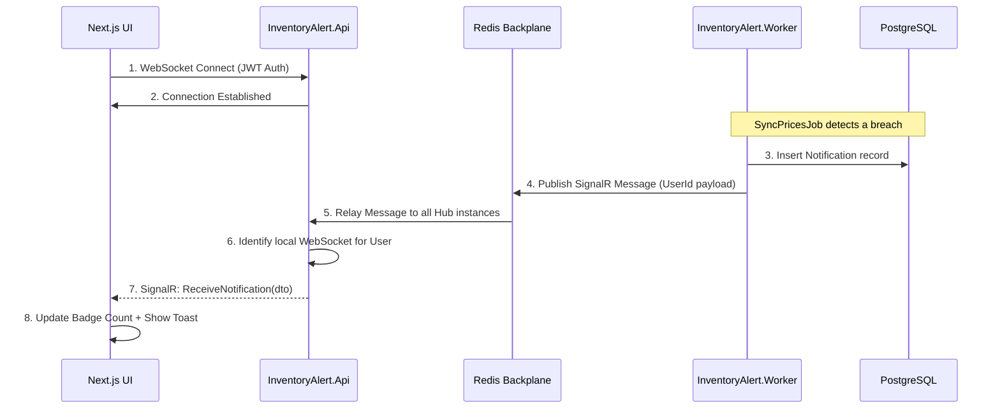
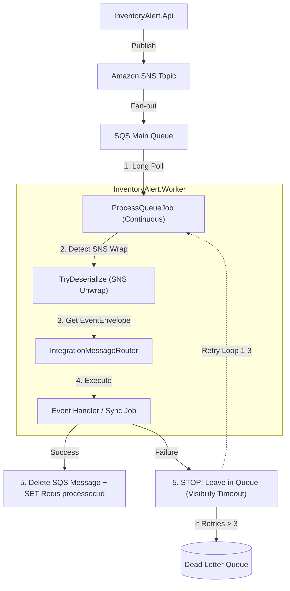

# InventoryAlert v3 — System Architecture & Flow Review

This document provides a technical walkthrough of the refined event-driven architecture, covering the interaction between the Next.js UI, ASP.NET Core API, and the Background Worker.

## 1. High-Level Architecture

The system follows a **Reactive Hybrid** approach:
- **Scheduled**: Driven by Hangfire (Polling).
- **Event-Driven**: Driven by SQS/SNS (Instant).
- **Real-Time**: Driven by SignalR + Redis Backplane (Push).

---

## 2. The Real-Time Notification Flow
This flow describes how a user receives a price alert without refreshing their browser.

---

## 3. SQS Message & DLQ Flow
This flow ensures zero data loss when the API requests heavy work from the Worker.

---

## 4. Worker Message Handling & Reliability

### 4.1 Does the Worker scan SNS or SQS?
The Worker **polls (scans) SQS only**. 

- **SNS (Pub/Sub)**: Acts as the "Dispatcher". The API publishes an event to SNS, which then "pushes" that event into the SQS queue. The Worker never talks to SNS directly for consumption.
- **SQS (Queue)**: Acts as the "Buffer". It stores the messages until the Worker is ready to process them.
- **The Poller**: The `ProcessQueueJob` runs a continuous `while` loop, calling `ReceiveMessagesAsync` on the SQS queue every few seconds (Long Polling).

### 4.2 How the Worker handles Retries and Failures

The system uses a **"Non-Acknowledge"** failure strategy combined with **SQS Visibility Timeouts**.

1.  **Lease**: The Worker pulls a message. SQS marks it as "Invisible" to other workers for **30 seconds**.
2.  **Processing**: The Worker attempts to route and execute the handler.
3.  **Outcome A (Success)**:
    - The handler finishes without errors.
    - The Worker calls `DeleteMessageAsync` (the **ACK**).
    - The message is permanently removed from SQS.
4.  **Outcome B (Failure/Crash)**:
    - An exception is thrown (e.g., Database down, API error).
    - The Worker **stops** and logs the error. It **does NOT** delete the message.
5.  **Retry**:
    - After the 30-second "Visibility Timeout" expires, SQS sees that the message was never deleted.
    - SQS makes the message **visible again** in the main queue.
    - The Worker (or another instance) picks it up again.
6.  **Dead Letter Queue (DLQ)**:
    - Every time SQS redelivers a message, its `ReceiveCount` increases.
    - Once the count exceeds **3** (the `maxReceiveCount`), SQS automatically moves the message to the **DLQ**.
    - This prevents a "Poison Message" from crashing the worker in an infinite loop.

---

## 5. Scheduled Jobs (Hangfire)
Driven background tasks that require high consistency and persistence.

| Job Name | Trigger | Logic |
| :--- | :--- | :--- |
| **SyncPricesJob** | Every 15 min | Parallel fetch (v3) -> Batch Evaluate -> SignalR Push. |
| **NewsSyncJob** | Every 2 hours | **Consolidated:** Syncs both Market News and Company News in parallel. |
| **CleanupPrices** | Daily at 02:10 | Batched delete of PriceHistory older than 1 year. |

---

## 5. UI Technical Stack (Next.js 15)

### 5.1 Real-Time Hook (`useSignalR`)
- **Lifecycle**: Automatically starts connection on mount, stops on unmount.
- **Resilience**: Configured with `withAutomaticReconnect()`.
- **Security**: Uses `accessTokenFactory` to safely pull JWT from `localStorage`.

### 5.2 Global State (`NotificationProvider`)
- Centralizes `unreadCount` via React Context.
- Replaces legacy 30s polling with event-based updates.
- **Sync Logic**: Calls `/unread-count` once on app load, then relies on SignalR for increments.

### 5.3 Resilient API Client (`api.ts`)
- **Late-binding CID**: Automatically captures `X-Correlation-Id` from headers on failure.
- **Loop Protection**: Prevents the `/auth/refresh` endpoint from triggering its own refresh loop on 401.

---

## 6. Operational Technical Notes

### Deduplication Strategy
We use a **"Late-Commit"** Redis strategy:
1. Message received.
2. Check if `msg:processed:{id}` exists.
3. Process task.
4. **Only if successful**: Set `msg:processed:{id}` with 24h TTL and delete from SQS.
*Benefit: Ensures that if the worker pod crashes during processing, the message is not lost and will be retried.*

### Correlation Tracing
Every request/event now carries a `CorrelationId`.
- **In Seq**: Use query `CorrelationId = "your-id"` to see the logs from API request -> SQS Publish -> Worker Receipt -> Final DB Save.
