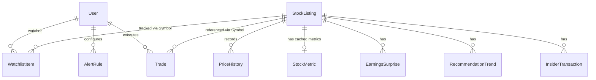
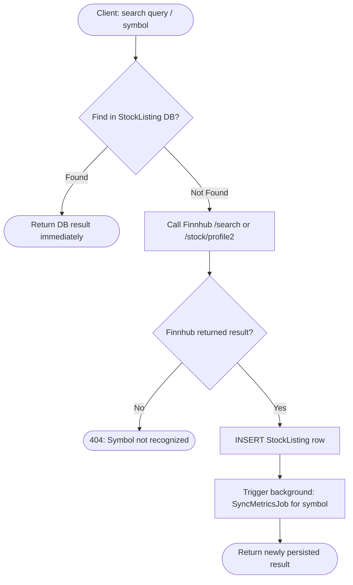
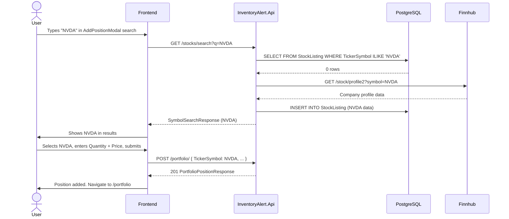
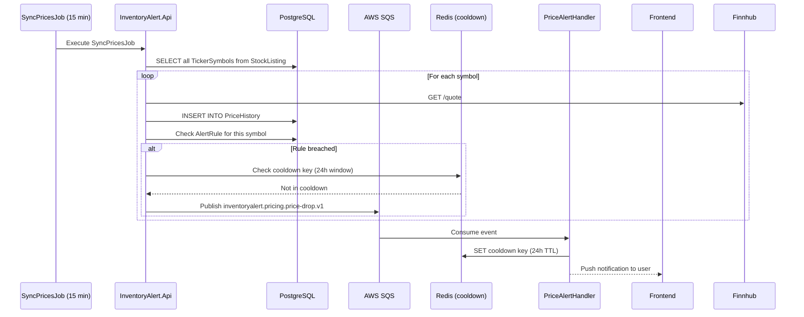
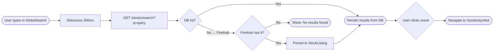

# InventoryAlert.Api — Technical Specification (v2)

> **Refactor Target.** This document supersedes v1. All entity names, API routes, and worker roles have been updated to align with finance-domain terminology and the full Finnhub Free-Tier endpoint surface.

---

> [!CAUTION]
> ## ⚠️ Refactor Notice — Old Business Must Be Removed
>
> **This spec describes the NEW system entirely.** The existing codebase uses `Product`/`StockTransaction` inventory terminology leftover from the original OJT project. That old business logic is **fully superseded**.
>
> **Rule**: If a file is not listed as `KEEP`, `RENAME`, or `UPDATE` in Section 13, it is old business and **must be deleted**.
>
> **Do NOT attempt to preserve old business logic** by adapting it. Use the Domain entities, interfaces, and DTOs defined in this spec as the single source of truth. The Infrastructure, Api, and Worker layers follow from those contracts.

---

## Changelog (v1 → v2)

| # | Change | Reason |
| :- | :--- | :--- |
| 1 | `Product` → **`StockListing`** | "Product" is an inventory term. "StockListing" is accurate for a market catalog entry. |
| 2 | `StockTransaction` → **`Trade`** | Finance standard. Enum values: `Buy`, `Sell`, `Dividend`, `Split`. |
| 3 | Removed `WatchlistItem.IsWatchOnly` | Redundant. All watchlist rows are watch-only by definition. |
| 4 | `Portfolio.GET /catalog` → `Stocks.GET /` | Catalog is global; portfolio is personal. Correct layer separation. |
| 5 | Added **`StockMetric`** table | Maps to Finnhub `/stock/metric` (Basic Financials). Cached daily. |
| 6 | Added **`EarningsSurprise`** table | Maps to Finnhub `/stock/earnings`. Last 4 quarters, free tier. |
| 7 | Added **`RecommendationTrend`** table | Maps to Finnhub `/stock/recommendation`. Analyst buy/hold/sell counts. |
| 8 | Added **`InsiderTransaction`** table | Maps to Finnhub `/stock/insider-transactions`. Last 100 entries. |
| 9 | Added 8 new API endpoints | Covers earnings/IPO calendars, market holidays, peers, recommendations. |
| 10 | `PATCH /{id}/stock` → `PATCH /{id}/trade` | Matches the renamed `Trade` entity. |

---

## 1. Domain Entities (PostgreSQL)

### 1.1 Relationship Overview



---

### 1.2 Entity Specifications

#### `User`
**Core Identity.** Root account for all personal data.

| Property | Type | Description |
| :--- | :--- | :--- |
| `Id` | `Guid` | Primary Key. |
| `Username` | `string` | Unique login handle. |
| `PasswordHash` | `string` | Argon2/BCrypt hashed credential. |
| `Email` | `string` | Recovery and alert notification address. |
| `Role` | `enum` | `User` \| `Admin`. |
| `CreatedAt` | `DateTime` | Account creation timestamp. |

---

#### `StockListing` _(was `Product`)_
**Global Catalog.** Read-only market reference data shared across the system. Seeded from Finnhub `/stock/symbol` and enriched via `/stock/profile2`.

| Property | Type | Description |
| :--- | :--- | :--- |
| `Id` | `int` | Primary Key (auto-increment). |
| `Name` | `string` | Company display name (e.g., "Tesla Inc"). |
| `TickerSymbol` | `string` | **Unique** market ticker (e.g., "TSLA"). |
| `Exchange` | `string?` | Exchange code (e.g., "NASDAQ"). |
| `Currency` | `string?` | ISO currency code (e.g., "USD"). |
| `Country` | `string?` | Domicile country code (e.g., "US"). |
| `Industry` | `string?` | Finnhub industry classification. |
| `MarketCap` | `decimal?` | Market capitalization in USD. |
| `Ipo` | `DateOnly?` | IPO date. |
| `WebUrl` | `string?` | Company website URI. |
| `Logo` | `string?` | Company logo URI (from Finnhub profile2). |
| `LastProfileSync` | `DateTime?` | UTC timestamp of last profile2 sync. |

---

#### `WatchlistItem`
**Personal Watchlist.** Tracks user interest without ownership. No `IsWatchOnly` — that is implied.

| Property | Type | Description |
| :--- | :--- | :--- |
| `UserId` | `Guid` | **FK** → `User.Id` |
| `TickerSymbol` | `string` | **FK** → `StockListing.TickerSymbol` |
| `CreatedAt` | `DateTime` | Timestamp of entry. |

> **PK**: Composite key `(UserId, TickerSymbol)`.

---

#### `AlertRule`
**Unified Notification Rules.** Triggers on both price and inventory conditions.

| Property | Type | Description |
| :--- | :--- | :--- |
| `Id` | `Guid` | Primary Key. |
| `UserId` | `Guid` | **FK** → `User.Id` |
| `TickerSymbol` | `string` | **FK** → `StockListing.TickerSymbol` |
| `Condition` | `enum` | See `AlertCondition` enum below. |
| `TargetValue` | `decimal` | Threshold to breach. |
| `IsActive` | `bool` | Enabled/disabled state. |
| `TriggerOnce` | `bool` | Deactivate automatically after first trigger. |
| `LastTriggeredAt` | `DateTime?` | UTC timestamp of last successful trigger. |
| `CreatedAt` | `DateTime` | Rule creation timestamp. |

**`AlertCondition` Enum**

| Value | Description |
| :--- | :--- |
| `PriceAbove` | Trigger when current price exceeds `TargetValue`. |
| `PriceBelow` | Trigger when current price falls below `TargetValue`. |
| `PriceTargetReached` | Trigger when price hits an exact target (±tolerance). |
| `PercentDropFromCost` | Trigger when unrealized loss % exceeds `TargetValue`. |
| `LowHoldingsCount` | Trigger when user's share count drops below `TargetValue`. |

---

#### `Trade` _(was `StockTransaction`)_
**Ownership Ledger.** Immutable record of position changes.

| Property | Type | Description |
| :--- | :--- | :--- |
| `Id` | `Guid` | Primary Key. |
| `UserId` | `Guid` | **FK** → `User.Id` |
| `TickerSymbol` | `string` | **FK** → `StockListing.TickerSymbol` |
| `Type` | `enum` | `Buy`, `Sell`, `Dividend`, `Split`. |
| `Quantity` | `decimal` | **Always positive.** Direction is encoded by `Type`. Net holdings = `SUM(Buy) - SUM(Sell)` computed by service. |
| `UnitPrice` | `decimal` | Execution price per share. `0` for `Dividend`/`Split`. |
| `TradedAt` | `DateTime` | UTC execution timestamp. |
| `Notes` | `string?` | Optional user annotation. |

---

#### `PriceHistory`
**Price Log.** Point-in-time market price snapshots for charting and alert evaluation.

| Property | Type | Description |
| :--- | :--- | :--- |
| `Id` | `long` | Primary Key (bigserial). |
| `TickerSymbol` | `string` | **FK** → `StockListing.TickerSymbol` |
| `Price` | `decimal` | Close/current price at snapshot. |
| `High` | `decimal?` | Day high at snapshot time. |
| `Low` | `decimal?` | Day low at snapshot time. |
| `Open` | `decimal?` | Day open at snapshot time. |
| `PrevClose` | `decimal?` | Previous close price. |
| `RecordedAt` | `DateTime` | UTC snapshot timestamp. |

> **Index**: `(TickerSymbol, RecordedAt DESC)` — supports range queries for charts.

---

#### `StockMetric` _(new)_
**Cached Basic Financials.** One row per ticker. Updated daily by worker. Maps to Finnhub `/stock/metric`.

| Property | Type | Description |
| :--- | :--- | :--- |
| `TickerSymbol` | `string` | **PK + FK** → `StockListing.TickerSymbol` |
| `PeRatio` | `double?` | Price-to-Earnings ratio (TTM). |
| `PbRatio` | `double?` | Price-to-Book ratio. |
| `EpsBasicTtm` | `double?` | Earnings per share (TTM). |
| `DividendYield` | `double?` | Dividend yield (annual %). |
| `Week52High` | `decimal?` | 52-week high price. |
| `Week52Low` | `decimal?` | 52-week low price. |
| `RevenueGrowthTtm` | `double?` | YoY revenue growth (TTM). |
| `MarginNet` | `double?` | Net profit margin (TTM). |
| `LastSyncedAt` | `DateTime` | UTC timestamp of last Finnhub sync. |

---

#### `EarningsSurprise` _(new)_
**Historical Earnings.** Last 4 quarters of actual vs. estimated EPS. Maps to Finnhub `/stock/earnings`.

| Property | Type | Description |
| :--- | :--- | :--- |
| `Id` | `int` | Primary Key. |
| `TickerSymbol` | `string` | **FK** → `StockListing.TickerSymbol` |
| `Period` | `DateOnly` | Fiscal quarter end date in Finnhub format (e.g., `2024-09-30`). Unique constraint with `TickerSymbol`. |
| `ActualEps` | `double?` | Actual reported EPS. |
| `EstimateEps` | `double?` | Consensus estimate EPS. |
| `SurprisePercent` | `double?` | `(Actual - Estimate) / |Estimate| * 100`. Computed on write. |
| `ReportDate` | `DateOnly?` | Date of public earnings release. |

> **C2 fix**: Finnhub returns `period` as `"2024-09-30"` (last day of fiscal quarter). Stored as `DateOnly`, not a "Q4" string. Unique constraint on `(TickerSymbol, Period)` prevents duplicate upserts.

---

#### `RecommendationTrend` _(new)_
**Analyst Consensus.** Monthly analyst buy/hold/sell counts. Maps to Finnhub `/stock/recommendation`.

| Property | Type | Description |
| :--- | :--- | :--- |
| `Id` | `int` | Primary Key. |
| `TickerSymbol` | `string` | **FK** → `StockListing.TickerSymbol` |
| `Period` | `string` | Month period (e.g., "2025-03-01"). |
| `StrongBuy` | `int` | Count of "Strong Buy" ratings. |
| `Buy` | `int` | Count of "Buy" ratings. |
| `Hold` | `int` | Count of "Hold" ratings. |
| `Sell` | `int` | Count of "Sell" ratings. |
| `StrongSell` | `int` | Count of "Strong Sell" ratings. |
| `SyncedAt` | `DateTime` | UTC timestamp of last sync. |

---

#### `InsiderTransaction` _(new)_
**Insider Activity.** Last 100 insider transactions. Maps to Finnhub `/stock/insider-transactions`.

| Property | Type | Description |
| :--- | :--- | :--- |
| `Id` | `int` | Primary Key. |
| `TickerSymbol` | `string` | **FK** → `StockListing.TickerSymbol` |
| `Name` | `string?` | Insider full name. |
| `Share` | `long?` | Net share count (positive = buy, negative = sell). |
| `Value` | `decimal?` | Total transaction value in USD. |
| `TransactionDate` | `DateOnly?` | Date of transaction. |
| `FilingDate` | `DateOnly?` | SEC filing date. |
| `TransactionCode` | `string?` | SEC code (e.g., "P" = purchase, "S" = sale). |

---

#### `Notification` _(new — D5)_
**In-App Alerts Delivery.** Stores triggered alert messages for the authenticated user. UI polls this endpoint every 30 seconds.

| Property | Type | Description |
| :--- | :--- | :--- |
| `Id` | `Guid` | Primary Key. |
| `UserId` | `Guid` | **FK** → `User.Id`. Cascade delete. |
| `AlertRuleId` | `Guid?` | **FK** → `AlertRule.Id`. Nullable (for system messages). |
| `TickerSymbol` | `string?` | Symbol that triggered the alert. |
| `Message` | `string` | Human-readable alert message. |
| `IsRead` | `bool` | Whether the user has acknowledged it. Default `false`. |
| `CreatedAt` | `DateTime` | UTC timestamp of notification creation. |

> **Index**: `(UserId, IsRead, CreatedAt DESC)` — supports fast unread notification queries.

### 1.3 DynamoDB Collections

News articles are **permanent historical assets**, not ephemeral cache entries. They are never TTL-deleted. Queries use SK range filters to get recent articles, and a GSI is used for cross-collection lookups.

#### `MarketNews`

| Attribute | Type | Role | Notes |
| :--- | :--- | :--- | :--- |
| `PK` | `string` | Partition Key | `CATEGORY#<category>` e.g. `CATEGORY#general` |
| `SK` | `string` | Sort Key | `TS#<unix_timestamp_ms>` — enables range queries for "last N hours" |
| `NewsId` | `long` | Attribute | Finnhub `id` field. Used for deduplication. |
| `Headline` | `string` | Attribute | Article headline. |
| `Summary` | `string` | Attribute | Short article summary. |
| `Source` | `string` | Attribute | Publisher name. |
| `Url` | `string` | Attribute | External article link. |
| `Image` | `string?` | Attribute | Thumbnail image URL. |
| `Category` | `string` | Attribute | `general`, `forex`, `crypto`, `merger`. |
| `SyncedAt` | `string` | Attribute | ISO-8601 UTC timestamp of when this record was written. |

> **No TTL.** News is retained indefinitely as a queryable historical archive. Use SK range (`TS#<now-30d>` → `TS#<now>`) to retrieve recent articles.

#### `CompanyNews`

| Attribute | Type | Role | Notes |
| :--- | :--- | :--- | :--- |
| `PK` | `string` | Partition Key | `SYMBOL#<ticker>` e.g. `SYMBOL#TSLA` |
| `SK` | `string` | Sort Key | `TS#<unix_timestamp_ms>` |
| `NewsId` | `long` | Attribute | Finnhub `id`. Deduplication key. |
| `Headline` | `string` | Attribute | Article headline. |
| `Summary` | `string` | Attribute | Short summary. |
| `Source` | `string` | Attribute | Publisher name. |
| `Url` | `string` | Attribute | External article link. |
| `Image` | `string?` | Attribute | Thumbnail URL. |
| `Symbol` | `string` | Attribute | Denormalized ticker (for GSI). |
| `SyncedAt` | `string` | Attribute | ISO-8601 UTC timestamp. |

> **No TTL.** Finnhub free tier provides up to 1 year of historical company news on first sync. Retained indefinitely thereafter.

#### GSI: `BySymbolAndDate` (on `CompanyNews`)

| Attribute | Key Role |
| :--- | :--- |
| `Symbol` | GSI Partition Key |
| `SK` | GSI Sort Key (reused) |

Enables efficient cross-symbol queries (e.g., "all TSLA news this month") without scanning.

---

## 2. API Reference

### Base Configuration

- **Version**: `v1`
- **Authentication**: JWT Bearer Token required unless marked `[Public]`.
- **Base URL**: `https://{host}/api/v1`

---

### Finnhub Endpoint Coverage Map

| Finnhub Endpoint | Our API Route | Status |
| :--- | :--- | :--- |
| `/search` | `GET /stocks/search` | ✅ Implemented |
| `/quote` | `GET /stocks/{symbol}/quote` | ✅ Implemented |
| `/stock/profile2` | `GET /stocks/{symbol}/profile` | ✅ Implemented |
| `/stock/market-status` | `GET /market/status` | ✅ Implemented |
| `/news` | `GET /market/news` | ✅ Implemented |
| `/company-news` | `GET /stocks/{symbol}/news` | ✅ Implemented |
| `/stock/metric` | `GET /stocks/{symbol}/financials` | 🆕 New |
| `/stock/earnings` | `GET /stocks/{symbol}/earnings` | 🆕 New |
| `/stock/recommendation` | `GET /stocks/{symbol}/recommendation` | 🆕 New |
| `/stock/insider-transactions` | `GET /stocks/{symbol}/insiders` | 🆕 New |
| `/stock/peers` | `GET /stocks/{symbol}/peers` | 🆕 New |
| `/calendar/earnings` | `GET /market/calendar/earnings` | 🆕 New |
| `/calendar/ipo` | `GET /market/calendar/ipo` | 🆕 New |
| `/stock/market-holiday` | `GET /market/holiday` | 🆕 New |
| `/stock/symbol` | Internal (worker seed only) | ⚙️ Worker |
| `/forex/exchange`, `/crypto/*` | Not planned (out of scope) | ❌ N/A |

---

### Symbol Discovery Strategy (DB-First + Finnhub Fallback)

> **Design Goal**: Minimize external Finnhub calls over time. Every successful Finnhub resolution permanently enriches our local `StockListing` database, making future lookups free and instant.

This pattern applies to **every flow that requires resolving a ticker symbol** — search, add to portfolio, add to watchlist, create alert.



#### Rules

| Rule | Detail |
| :--- | :--- |
| **DB check is always first** | Query `StockListing` by `TickerSymbol` (exact) or `Name` (ILIKE for search). |
| **Finnhub is the fallback** | Only called if no DB match. Uses `/search` for fuzzy lookup, `/stock/profile2` for enrichment. |
| **Always persist on resolution** | A resolved Finnhub result is immediately `INSERT`-ed into `StockListing`. Duplicates handled with `ON CONFLICT DO NOTHING`. |
| **Background enrichment** | After insert, enqueue a background job to pull `StockMetric`, `EarningsSurprise`, and `RecommendationTrend` for the new symbol. |
| **Never block the user** | The response is returned immediately after the `StockListing` insert. Enrichment jobs run async. |
| **Rate limit guard** | Finnhub calls are guarded by a Redis counter (`finnhub:ratelimit`) capped at 55 rpm (buffer below the 60/min free limit). |

#### Affected Endpoints

| Endpoint | Behavior |
| :--- | :--- |
| `GET /stocks/search?q=` | DB ILIKE search first → Finnhub `/search` fallback → persists any new matches. |
| `POST /portfolio/` | Validates symbol via DB → Finnhub fallback if missing → reject only if both miss. |
| `POST /watchlist/{symbol}` | Same as portfolio: DB resolve → Finnhub fallback → insert → add to watchlist. |
| `POST /alerts/` | Same symbol resolution chain before creating rule. |

---

### [Auth] — `/api/v1/auth`

| Method | Endpoint | Auth | Description |
| :--- | :--- | :--- | :--- |
| `POST` | `/login` | `[Public]` | Authenticate and receive JWT + refresh token. 429 rate-limited. |
| `POST` | `/register` | `[Public]` | Create a new user account. |
| `POST` | `/refresh` | `[Public]` | Exchange a valid refresh token for a new access JWT. |
| `POST` | `/logout` | JWT | Revoke the current refresh token. |

---

### [Portfolio] — `/api/v1/portfolio`

_Personal position management. Requires JWT. All data is scoped to the authenticated user._

> **D1 fix**: Routes use `{symbol}` (the ticker string), not a numeric `{id}`. A portfolio position is uniquely identified by `(UserId, TickerSymbol)` — no separate position table exists.

| Method | Endpoint | Description |
| :--- | :--- | :--- |
| `GET` | `/` | List user's positions (paged). |
| `GET` | `/{symbol}` | Detailed position breakdown for one holding. |
| `GET` | `/alerts` | Breached alert results for user's portfolio (threshold-based). |
| `POST` | `/` | Open a new position. |
| `POST` | `/bulk` | Import multiple positions at once. |
| `PATCH` | `/{symbol}/trade` | Record a trade (buy/sell/etc.) to adjust holdings. |
| `DELETE` | `/{symbol}` | Remove a position from portfolio. |

---

### [Stocks] — `/api/v1/stocks`

_Global stock catalog and market intelligence. Read-heavy; most endpoints cache aggressively._

| Method | Endpoint | Description |
| :--- | :--- | :--- |
| `GET` | `/` | Browse full global StockListing catalog (paged, searchable). |
| `GET` | `/search` | Symbol lookup by name, ISIN, or ticker. |
| `GET` | `/{symbol}/quote` | Real-time price quote from Finnhub or local cache. |
| `GET` | `/{symbol}/profile` | Full company profile (Logo, Industry, MarketCap, IPO date). |
| `GET` | `/{symbol}/financials` | 🆕 Basic Financials (P/E, EPS, 52-week range, margins). |
| `GET` | `/{symbol}/earnings` | 🆕 Last 4 quarters of earnings surprises (actual vs. estimate). |
| `GET` | `/{symbol}/recommendation` | 🆕 Latest analyst recommendation trend (Buy/Hold/Sell counts). |
| `GET` | `/{symbol}/insiders` | 🆕 Last 100 insider transactions (SEC-reported). |
| `GET` | `/{symbol}/peers` | 🆕 List of peer companies in the same sector/country. |
| `GET` | `/{symbol}/news` | 🆕 Latest company-specific news (from DynamoDB cache). |
| `POST` | `/sync` | `[Admin]` Manually trigger global price sync job. |

---

### [Market] — `/api/v1/market`

_Exchange-level data. Partially public._

| Method | Endpoint | Auth | Description |
| :--- | :--- | :--- | :--- |
| `GET` | `/status` | JWT | Current open/closed status of major exchanges. |
| `GET` | `/news` | JWT | Global financial news feed (paged). |
| `GET` | `/holiday` | JWT | 🆕 Upcoming and past market holidays by exchange. |
| `GET` | `/calendar/earnings` | JWT | 🆕 Upcoming earnings release calendar (1-month window). |
| `GET` | `/calendar/ipo` | JWT | 🆕 Upcoming and recent IPOs. |

---

### [Watchlist] — `/api/v1/watchlist`

| Method | Endpoint | Description |
| :--- | :--- | :--- |
| `GET` | `/` | List user's watchlist with live price and basic metrics. |
| `GET` | `/{symbol}` | Detailed view of a single watchlist entry. |
| `POST` | `/{symbol}` | Add a ticker symbol to watchlist. |
| `DELETE` | `/{symbol}` | Remove a ticker from watchlist. |

---

### [Alert Rules] — `/api/v1/alerts`

_Manages definitions for advanced, dynamic notification triggers._

| Method | Endpoint | Description |
| :--- | :--- | :--- |
| `GET` | `/` | List all alert rules for the authenticated user. |
| `POST` | `/` | Create a new alert rule. |
| `PUT` | `/{ruleId}` | Replace an existing alert rule. |
| `PATCH` | `/{ruleId}/toggle` | Enable or disable a rule without full replacement. |
| `DELETE` | `/{ruleId}` | Permanently remove an alert rule. |

---

### [Notifications] — `/api/v1/notifications`

_In-app notification delivery. Polls every 30s from UI. Requires JWT._

| Method | Endpoint | Description |
| :--- | :--- | :--- |
| `GET` | `/` | List all notifications for current user (unread first). |
| `GET` | `/unread-count` | Returns `{ Count: int }` — used for bell badge. |
| `PATCH` | `/{id}/read` | Mark a single notification as read. |
| `PATCH` | `/read-all` | Mark all notifications as read. |
| `DELETE` | `/{id}` | Dismiss a notification permanently. |

---

### [Events] — `/api/v1/events` `[Admin/Internal]`

| Method | Endpoint | Description |
| :--- | :--- | :--- |
| `POST` | `/` | Publish an integration event to SQS. |
| `GET` | `/types` | List all supported event type strings. |

---

## 3. Background Processing (Worker Architecture)

### Hybrid Strategy

| Layer | Engine | Purpose |
| :--- | :--- | :--- |
| **Scheduled Jobs** | Hangfire | Recurring heartbeats (price sync, news batching, metrics). |
| **Event Handlers** | SQS + Redis | Reactive tasks (alert evaluation, news on-demand). |

---

### Scheduled Jobs

Located in `InventoryAlert.Worker/ScheduledJobs`.

| Job | Schedule | Finnhub Endpoint(s) Used | Description |
| :--- | :--- | :--- | :--- |
| **SyncPricesJob** | Every 15 min | `/quote` | Full sweep of `StockListing` catalog. Updates `PriceHistory`, evaluates all `AlertRule` conditions. |
| **SyncMetricsJob** | Daily at 06:00 UTC | `/stock/metric` | 🆕 Updates `StockMetric` table for all active symbols. |
| **SyncEarningsJob** | Daily at 07:00 UTC | `/stock/earnings` | 🆕 Refreshes `EarningsSurprise` rows for watchlisted symbols. |
| **SyncRecommendationsJob** | Weekly (Monday) | `/stock/recommendation` | 🆕 Refreshes `RecommendationTrend` for portfolio + watchlist symbols. |
| **SyncInsidersJob** | Daily at 08:00 UTC | `/stock/insider-transactions` | 🆕 Pulls last 100 insider transactions for actively-watched symbols. |
| **CompanyNewsJob** | Every 6 hours | `/company-news` | Batch news sync for all symbols on any user's watchlist → DynamoDB. |
| **MarketNewsJob** | Every 2 hours | `/news` | Global news refresh → DynamoDB `MarketNews`. |
| **ProcessQueueJob** | Continuous long-poll | — | SQS reader with Redis-based idempotency (30-min window). |
| **SqsScheduledPollerJob** | Every 5 min | — | Fallback SQS drain if the continuous poller fails. |

---

### Event-Driven Handlers

Located in `InventoryAlert.Worker/IntegrationEvents/Handlers`.

| Handler | SQS Event Type | Logic |
| :--- | :--- | :--- |
| **PriceAlertHandler** | `inventoryalert.pricing.price-drop.v1` | On-demand quote fetch → cache update → `PriceHistory` insert → full `AlertRule` evaluate for symbol. |
| **LowHoldingsHandler** | `inventoryalert.inventory.stock-low.v1` | Post-trade trigger → queries `AlertRule` for `LowHoldingsCount` → notifies if breached. |
| **CompanyNewsHandler** | `inventoryalert.news.headline.v1` | Immediate sync of ticker news → DynamoDB `CompanyNews`. |
| **DefaultHandler** | `*` (unmatched) | Acknowledge and delete. Logs warning. Prevents poison-message queue blockage. |

---

### Flow & Deduplication

1. **Publish**: API/Services wrap payloads in an `EventEnvelope` and push to SQS.
2. **Poll**: `ProcessQueueJob` retrieves messages and checks Redis for atomic duplicates (30-min TTL window).
3. **Cooldown**: `PriceAlertHandler` carries a **24-hour per-symbol cooldown** via Redis to prevent alert storms.
4. **Route**: `IIntegrationMessageRouter` maps `EventType` → `IIntegrationEventHandler`.
5. **Audit**: After 5 failed attempts, messages are acknowledged and deleted to unblock the queue. All failures are logged via `ILogger<T>`.

---

## 4. Data Transfer Objects

### 4.1 Authentication

| DTO | Properties |
| :--- | :--- |
| `LoginRequest` | `Username` (string), `Password` (string) |
| `RegisterRequest` | `Username` (string), `Password` (string), `Email` (string) |
| `AuthResponse` | `AccessToken` (string, JWT), `ExpiresAt` (DateTime, UTC), `RefreshToken` (string — delivered as `httpOnly` cookie, not body) |
| `RefreshRequest` | No body. Refresh token read from `httpOnly` cookie automatically. |

> **JWT config**: Access token TTL = **15 minutes**. Refresh token TTL = **7 days**, stored as `httpOnly; Secure; SameSite=Strict` cookie. Refresh tokens are single-use (rotated on each refresh).

---

### 4.2 Portfolio & Trades

| DTO | Properties |
| :--- | :--- |
| `CreatePositionRequest` | `TickerSymbol` (string), `Quantity` (decimal, must be > 0), `UnitPrice` (decimal, must be > 0), `TradedAt` (DateTime?) |
| `TradeRequest` | `Type` (enum: `Buy`/`Sell`/`Dividend`/`Split`), `Quantity` (decimal, **always positive**), `UnitPrice` (decimal), `Notes` (string?) |
| `PortfolioPositionResponse` | `StockId` (int), `Symbol` (string), `Name` (string), `Exchange` (string), `Logo` (string), `HoldingsCount` (decimal), `AveragePrice` (decimal), `CurrentPrice` (decimal), `MarketValue` (decimal), `TotalCost` (decimal), `TotalReturn` (decimal), `TotalReturnPercent` (double), `PriceChange` (decimal), `PriceChangePercent` (double), `Industry` (string) |
| `PortfolioAlertResponse` | `Symbol` (string), `CurrentPrice` (decimal), `Threshold` (decimal), `LossPercent` (double), `LastUpdated` (DateTime) |
| `NotificationResponse` | `Id` (Guid), `Message` (string), `TickerSymbol` (string?), `IsRead` (bool), `CreatedAt` (DateTime) |

---

### 4.3 Alert Rules

| DTO | Properties |
| :--- | :--- |
| `AlertRuleRequest` | `TickerSymbol` (string), `Condition` (enum), `TargetValue` (decimal), `TriggerOnce` (bool) |
| `AlertRuleResponse` | `Id` (Guid), `TickerSymbol` (string), `Condition` (enum), `TargetValue` (decimal), `IsActive` (bool), `TriggerOnce` (bool), `LastTriggeredAt` (DateTime?) |
| `ToggleAlertRequest` | `IsActive` (bool) |

---

### 4.4 Market & Stock Data

| DTO | Properties |
| :--- | :--- |
| `StockQuoteResponse` | `Symbol`, `Price`, `Change`, `ChangePercent`, `High`, `Low`, `Open`, `PrevClose`, `Timestamp` |
| `StockProfileResponse` | `Symbol`, `Name`, `Exchange`, `Currency`, `Country`, `Industry`, `MarketCap`, `Ipo`, `WebUrl`, `Logo` |
| `StockMetricResponse` | `Symbol`, `PeRatio`, `PbRatio`, `EpsBasicTtm`, `DividendYield`, `Week52High`, `Week52Low`, `RevenueGrowthTtm`, `MarginNet`, `LastSyncedAt` |
| `EarningsSurpriseResponse` | `Period`, `ActualEps`, `EstimateEps`, `SurprisePercent`, `ReportDate` |
| `RecommendationResponse` | `Period`, `StrongBuy`, `Buy`, `Hold`, `Sell`, `StrongSell` |
| `InsiderTransactionResponse` | `Name`, `Share`, `Value`, `TransactionDate`, `FilingDate`, `TransactionCode` |
| `SymbolSearchResponse` | `Symbol`, `Description`, `Type`, `Exchange` |
| `MarketStatusResponse` | `Exchange`, `IsOpen`, `Session`, `Holiday`, `Timezone` |
| `MarketHolidayResponse` | `Exchange`, `EventName`, `Date`, `AtTime` |
| `NewsResponse` | `Id` (long), `Headline`, `Summary`, `Source`, `Url`, `DateTime`, `Image`, `Category` |
| `EarningsCalendarResponse` | `Symbol`, `Date`, `EpsEstimate`, `EpsActual`, `RevenueEstimate`, `RevenueActual` |
| `IpoCalendarResponse` | `Symbol`, `Name`, `Date`, `Price`, `Shares`, `Status` |
| `PeersResponse` | `Symbol`, `Peers` (List\<string\>) |

---

## 5. Comprehensive Interface Catalog

### 5.1 Auth — `/api/v1/auth`

**POST `/login`**
- **Request**: `{ Username, Password }`
- **200 OK**: `AuthResponse` — `{ AccessToken, ExpiresAt }`. Refresh token set as `httpOnly` cookie.
- **401**: "Invalid username or password."
- **429**: "Login rate limit exceeded. Try again in 15m."

**POST `/register`**
- **Request**: `{ Username, Password, Email }`
- **200 OK**: `{ Message: "Registration successful." }`
- **409**: "Username or email already in use."

**POST `/refresh`**
- **Request**: No body. Reads `refreshToken` from `httpOnly` cookie.
- **200 OK**: New `AuthResponse` (rotated refresh token set in cookie).
- **401**: "Refresh token expired or invalid."

**POST `/logout`**
- **Request**: No body.
- **200 OK**: `{ Message: "Logged out." }`. Clears `httpOnly` cookie server-side.

---

### 5.2 Portfolio — `/api/v1/portfolio`

**GET `/`**
- **Query**: `Page` [int], `PageSize` [int], `Search` [string]
- **200 OK**: `PagedResult<PortfolioPositionResponse>`

**GET `/{symbol}`** _(D1: symbol replaces id)_
- **200 OK**: `PortfolioPositionResponse`
- **404**: "No position found for symbol '{symbol}'."

**GET `/alerts`**
- **200 OK**: `List<PortfolioAlertResponse>`

**POST `/`**
- **Request**: `CreatePositionRequest`
- **201 Created**: `PortfolioPositionResponse`
- **409**: "Symbol already exists in your portfolio."
- **422**: "Invalid or unrecognized ticker symbol."

**POST `/bulk`**
- **Request**: `List<CreatePositionRequest>`
- **200 OK**: `{ Imported: int, Failed: int, Errors: List<string> }`

**PATCH `/{symbol}/trade`** _(D1 + D2)_
- **Request**: `TradeRequest` — `Quantity` must always be positive; direction from `Type`.
- **200 OK**: Updated `PortfolioPositionResponse`
- **404**: "No position found for symbol '{symbol}'."
- **422**: "Resulting holdings count cannot be negative."

**DELETE `/{symbol}`** _(D1)_
- **200 OK**: `{ Message: "Position removed." }`
- **404**: "No position found for symbol '{symbol}'."
- **409**: "Cannot remove a position with active alert rules. Delete rules first."

> ❗ **Cascade Scope (Critical).** Deleting a portfolio position is a **user-scoped** operation only. It does **NOT** touch any global tables:
> - ✅ **Deleted**: The user's position row + all their `Trade` ledger entries for this symbol.
> - ✅ **Deleted**: The user's `AlertRule` rows for this symbol (must confirm first via 409 guard above).
> - ✅ **Deleted**: The user's `WatchlistItem` for this symbol, if present (auto-cascade).
> - ❌ **NOT deleted**: `StockListing` — global catalog, shared by all users.
> - ❌ **NOT deleted**: `PriceHistory` — global time-series data, never user-owned.
> - ❌ **NOT deleted**: `StockMetric`, `EarningsSurprise`, `RecommendationTrend`, `InsiderTransaction` — market data, never user-owned.
>
> **Rationale**: `StockListing` is the backbone of the symbol database. Removing a position means the user is exiting a trade, not declaring the company no longer exists.

---

### 5.3 Stocks — `/api/v1/stocks`

**GET `/`**
- **Query**: `Page` [int], `PageSize` [int], `Exchange` [string], `Industry` [string]
- **200 OK**: `PagedResult<StockProfileResponse>`

**GET `/search`**
- **Query**: `q` [string, required]
- **200 OK**: `List<SymbolSearchResponse>`

**GET `/{symbol}/quote`**
- **200 OK**: `StockQuoteResponse`
- **404**: "Symbol not found in catalog."

**GET `/{symbol}/profile`**
- **200 OK**: `StockProfileResponse`
- **404**: "Symbol not supported."

**GET `/{symbol}/financials`** _(new)_
- **200 OK**: `StockMetricResponse`
- **404**: "Metrics not yet available for this symbol."

**GET `/{symbol}/earnings`** _(new)_
- **200 OK**: `List<EarningsSurpriseResponse>` (last 4 quarters)
- **404**: "Earnings data not found."

**GET `/{symbol}/recommendation`** _(new)_
- **200 OK**: `List<RecommendationResponse>` (last 3 months)
- **404**: "Recommendation data not found."

**GET `/{symbol}/insiders`** _(new)_
- **200 OK**: `List<InsiderTransactionResponse>` (last 100)
- **404**: "Insider data not found."

**GET `/{symbol}/peers`** _(new)_
- **200 OK**: `PeersResponse`
- **404**: "Peer list not available."

**GET `/{symbol}/news`** _(new)_
- **Query**: `From` [DateOnly], `To` [DateOnly]
- **200 OK**: `List<NewsResponse>`

**POST `/sync`** `[Admin]`
- **202 Accepted**: `{ Message: "Price sync job enqueued." }`

---

### 5.4 Market — `/api/v1/market`

**GET `/status`**
- **200 OK**: `List<MarketStatusResponse>`

**GET `/news`**
- **Query**: `Category` [string: general/forex/crypto/merger], `Page` [int]
- **200 OK**: `PagedResult<NewsResponse>`

**GET `/holiday`** _(new)_
- **Query**: `Exchange` [string, required]
- **200 OK**: `List<MarketHolidayResponse>`

**GET `/calendar/earnings`** _(new)_
- **Query**: `From` [DateOnly], `To` [DateOnly], `Symbol` [string?]
- **200 OK**: `List<EarningsCalendarResponse>`
- **Note**: Free tier limited to 1-month window.

**GET `/calendar/ipo`** _(new)_
- **Query**: `From` [DateOnly], `To` [DateOnly]
- **200 OK**: `List<IpoCalendarResponse>`

---

### 5.5 Watchlist — `/api/v1/watchlist`

**GET `/`**
- **200 OK**: `List<PortfolioPositionResponse>` (live quote merged with listing data)

**GET `/{symbol}`**
- **200 OK**: `PortfolioPositionResponse`
- **404**: "Symbol not on your watchlist."

**POST `/{symbol}`**
- **201 Created**: `PortfolioPositionResponse`
- **409**: "Symbol already on watchlist."
- **422**: "Unrecognized ticker symbol."

**DELETE `/{symbol}`**
- **200 OK**: `{ Message: "Removed from watchlist." }`
- **404**: "Symbol not on your watchlist."

---

### 5.6 Alert Rules — `/api/v1/alerts`

**GET `/`**
- **200 OK**: `List<AlertRuleResponse>`

**POST `/`**
- **Request**: `AlertRuleRequest`
- **201 Created**: `AlertRuleResponse`
- **400**: "TargetValue must be positive."
- **422**: "Symbol not recognized."

**PUT `/{ruleId}`**
- **Request**: `AlertRuleRequest`
- **200 OK**: `AlertRuleResponse`
- **403**: "You do not own this rule."
- **404**: "Alert rule not found."

**PATCH `/{ruleId}/toggle`**
- **Request**: `ToggleAlertRequest`
- **200 OK**: `AlertRuleResponse`
- **404**: "Alert rule not found."

**DELETE `/{ruleId}`**
- **200 OK**: `{ Message: "Alert rule deleted." }`
- **403**: "You do not own this rule."
- **404**: "Alert rule not found."

---

### 5.7 Notifications — `/api/v1/notifications`

**GET `/`**
- **Query**: `OnlyUnread` [bool, default false], `Page` [int]
- **200 OK**: `PagedResult<NotificationResponse>` — ordered by `CreatedAt DESC`.

**GET `/unread-count`**
- **200 OK**: `{ Count: int }` — used by UI navbar bell badge.

**PATCH `/{id}/read`**
- **200 OK**: `{ Message: "Marked as read." }`
- **404**: "Notification not found."

**PATCH `/read-all`**
- **200 OK**: `{ Updated: int }`

**DELETE `/{id}`**
- **200 OK**: `{ Message: "Notification dismissed." }`
- **404**: "Notification not found."

> **C1 note**: `LowHoldingsCount` alert evaluation in `LowHoldingsHandler` must join `Trade` ledger filtered by **both** `UserId` AND `TickerSymbol` to compute the correct per-user net holdings. Never evaluate holdings across all users.

---

### 5.7 Events — `/api/v1/events` `[Admin]`

**POST `/`**
- **Request**: `{ EventType: string, Payload: object }`
- **202 Accepted**: `{ MessageId: string, Status: "Queued" }`

**GET `/types`**
- **200 OK**: `[ "inventoryalert.pricing.price-drop.v1", "inventoryalert.inventory.stock-low.v1", "inventoryalert.news.headline.v1" ]`

---

## 6. Error Handling

### Standard Error Response

```json
{
  "errorCode": "string",
  "userFriendlyMessage": "string",
  "message": "string (technical detail — omitted in production)"
}
```

### HTTP Status Code Reference

| Code | HTTP Status | Description |
| :--- | :--- | :--- |
| `NotFound` | 404 | Resource (symbol, rule, position) does not exist. |
| `Conflict` | 409 | Duplicate create or locked state conflict. |
| `BadRequest` | 400 | Validation failed or malformed body. |
| `Unauthorized` | 401 | Missing or invalid JWT. |
| `Forbidden` | 403 | Authenticated but lacks ownership of resource. |
| `UnprocessableEntity` | 422 | Semantic error (e.g., negative quantity, bad ticker). |
| `TooManyRequests` | 429 | Rate limit exceeded (login endpoint). |
| `Internal` | 500 | Unhandled server error. |

---

## 7. Scheduled Job Catalog Summary

| Job | Schedule | Tables Affected | Finnhub Source |
| :--- | :--- | :--- | :--- |
| `SyncPricesJob` | `*/15 * * * *` | `PriceHistory`, evaluates `AlertRule` | `/quote` |
| `SyncMetricsJob` | `0 6 * * *` | `StockMetric` | `/stock/metric` |
| `SyncEarningsJob` | `0 7 * * *` | `EarningsSurprise` | `/stock/earnings` |
| `SyncRecommendationsJob` | `0 8 * * 1` | `RecommendationTrend` | `/stock/recommendation` |
| `SyncInsidersJob` | `0 8 * * *` | `InsiderTransaction` | `/stock/insider-transactions` |
| `CompanyNewsJob` | `0 */6 * * *` | DynamoDB `CompanyNews` | `/company-news` |
| `MarketNewsJob` | `0 */2 * * *` | DynamoDB `MarketNews` | `/news` |
| `ProcessQueueJob` | Continuous | — | SQS consumer |
| `SqsScheduledPollerJob` | `*/5 * * * *` | — | SQS fallback |
| `CleanupPriceHistoryJob` | `@daily` (00:00 UTC) | `PriceHistory` (DELETE) | — |

> **D4 — CleanupPriceHistoryJob**: Deletes `PriceHistory` rows where `RecordedAt < NOW() - INTERVAL '1 year'`. Prevents unbounded table growth (est. 35M+ rows/year at 1,000 symbols). Uses a batched delete (`DELETE ... WHERE id IN (SELECT id ... LIMIT 10000)`) to avoid lock contention.

---

## 8. SQS Event Handler Catalog

| Event Type | Payload | Handler | Logic |
| :--- | :--- | :--- | :--- |
| `inventoryalert.pricing.price-drop.v1` | `{ Symbol }` | `PriceAlertHandler` | Quote → cache → `PriceHistory` → evaluate all `AlertRule` for symbol. |
| `inventoryalert.inventory.stock-low.v1` | `{ UserId, TickerSymbol, Threshold }` | `LowHoldingsHandler` | Verify `Trade` ledger count → check `AlertRule[LowHoldingsCount]` → notify if breached. |
| `inventoryalert.news.headline.v1` | `{ Symbol }` | `CompanyNewsHandler` | Sync company news → DynamoDB `CompanyNews`. |
| `*` (unmatched) | — | `DefaultHandler` | Log + acknowledge. Prevents poison-message blockage. |

---

## 9. UI Plan

> **Stack**: Next.js (App Router) + TypeScript + Tailwind CSS. State: React Query (server state) + Zustand (UI state). Charts: Recharts.

---

### 9.1 Page Inventory

| Route | Page Name | Auth | Description |
| :--- | :--- | :--- | :--- |
| `/login` | Login | Public | JWT authentication form. |
| `/register` | Register | Public | New account creation. |
| `/dashboard` | Dashboard | ✅ | Overview: portfolio summary card, watchlist strip, market status, top news. |
| `/portfolio` | Portfolio | ✅ | Full paginated position list with search/filter. |
| `/portfolio/[id]` | Position Detail | ✅ | Deep-dive: price chart, trade history, alert rules for one position. |
| `/stocks` | Stocks Catalog | ✅ | Browse/search global `StockListing` catalog with filters. |
| `/stocks/[symbol]` | Stock Detail | ✅ | Quote, profile, financials, earnings chart, recommendation gauge, insider table, news, peers. |
| `/watchlist` | Watchlist | ✅ | Live watchlist with quick-add via symbol search. |
| `/alerts` | Alert Rules | ✅ | CRUD interface for all user alert rules with active/inactive toggle. |
| `/market` | Market Overview | ✅ | Exchange status, market news feed, earnings calendar, IPO calendar. |

---

### 9.2 Shared Component Library

#### Navigation

| Component | Location | Description |
| :--- | :--- | :--- |
| `Navbar` | Layout | Top bar: logo, nav links, user avatar menu, notification bell, search bar trigger. |
| `Sidebar` | Layout (desktop) | Collapsible left nav: Dashboard, Portfolio, Watchlist, Stocks, Alerts, Market. |
| `MarketStatusBanner` | Layout (top) | Color-coded strip: exchange name + open/closed state. Polls `GET /market/status` every 60s. |
| `GlobalSearch` | Navbar | Cmd+K search modal. Uses DB-first symbol discovery flow. Shows results as user types (debounce 300ms). |

#### Market Data Widgets

| Component | Used On | API | Description |
| :--- | :--- | :--- | :--- |
| `StockQuoteCard` | Dashboard, Stock Detail, Watchlist | `GET /stocks/{symbol}/quote` | Price, change, change%, high, low. Refreshes every 30s. |
| `PriceLineChart` | Portfolio Detail, Stock Detail | `PriceHistory` (local) | Recharts `AreaChart`. Supports 1D / 1W / 1M / 3M / 1Y range selector. |
| `EarningsBarChart` | Stock Detail | `GET /stocks/{symbol}/earnings` | Grouped bar: actual vs. estimate EPS per quarter. Color-coded surprise (green/red). |
| `RecommendationDonut` | Stock Detail | `GET /stocks/{symbol}/recommendation` | Recharts `PieChart` — Strong Buy / Buy / Hold / Sell / Strong Sell slices. |
| `MetricsPanel` | Stock Detail | `GET /stocks/{symbol}/financials` | Grid of KPI chips: P/E, P/B, EPS, DividendYield, 52w High/Low, Revenue Growth, Net Margin. |
| `InsiderTable` | Stock Detail | `GET /stocks/{symbol}/insiders` | Sortable table: Name, Date, Shares, Value, Code badge. |
| `PeersChipRow` | Stock Detail | `GET /stocks/{symbol}/peers` | Clickable symbol chips. Click navigates to `/stocks/[symbol]`. |
| `StockProfileHeader` | Stock Detail | `GET /stocks/{symbol}/profile` | Logo + name + exchange + industry + website link + market cap. |

#### Portfolio Components

| Component | Used On | API | Description |
| :--- | :--- | :--- | :--- |
| `PortfolioSummaryCard` | Dashboard, Portfolio | `GET /portfolio/` | Net portfolio value, total return ($ + %), day P&L, positions count. |
| `PositionTable` | Portfolio | `GET /portfolio/` (paged) | Sortable, searchable table of open positions. Columns: Symbol, Holdings, Avg Price, Current Price, Market Value, Return %, Alert Badge. |
| `PositionRow` | Portfolio | — | Single row of `PositionTable`. Inline sparkline mini-chart. |
| `PositionDetailPanel` | Portfolio Detail | `GET /portfolio/{id}` | Full position breakdown: cost basis, unrealized P&L, trade history timeline. |
| `TradeModal` | Portfolio, Portfolio Detail | `PATCH /portfolio/{id}/trade` | Modal form: Type (Buy/Sell/Dividend/Split), Quantity, Unit Price, Notes, Date. |
| `AddPositionModal` | Portfolio | `POST /portfolio/` | Symbol search (uses discovery flow) → quantity/price form → submit. |
| `BulkImportModal` | Portfolio | `POST /portfolio/bulk` | CSV drag-and-drop → preview table → confirm import with error summary. |
| `AlertBadge` | PositionRow, PositionDetail | `GET /portfolio/alerts` | Red badge on positions that have breached their `AlertRule`. |

#### Watchlist Components

| Component | Used On | API | Description |
| :--- | :--- | :--- | :--- |
| `WatchlistCard` | Watchlist | `GET /watchlist/` | Compact card: logo, symbol, price, day change%, add-to-portfolio button. |
| `WatchlistAddBar` | Watchlist | `POST /watchlist/{symbol}` | Inline symbol search input. Uses DB-first discovery. Pins new item on success. |
| `WatchlistEmptyState` | Watchlist | — | Illustrated empty state with a CTA to search for stocks. |

#### Alert Rule Components

| Component | Used On | API | Description |
| :--- | :--- | :--- | :--- |
| `AlertRuleTable` | Alerts | `GET /alerts/` | Full list of rules. Columns: Symbol, Condition, Target, Status, Last Triggered, Actions. |
| `AlertRuleForm` | Alerts, Portfolio Detail | `POST /alerts/`, `PUT /alerts/{id}` | Symbol search → Condition dropdown → Target value input → TriggerOnce checkbox. |
| `AlertToggle` | AlertRuleTable | `PATCH /alerts/{ruleId}/toggle` | Inline toggle switch. Optimistic UI update. |

#### Market Overview Components

| Component | Used On | API | Description |
| :--- | :--- | :--- | :--- |
| `NewsFeedCard` | Dashboard, Market | `GET /market/news`, `GET /stocks/{symbol}/news` | Headline, source, timestamp, image thumbnail. Links to original article. |
| `NewsFeed` | Dashboard, Market, Stock Detail | — | Virtualised scrollable list of `NewsFeedCard`. Supports category filter tabs. |
| `EarningsCalendarTable` | Market | `GET /market/calendar/earnings` | Date-grouped table: Symbol, EPS Estimate, EPS Actual (colour-coded post-release). |
| `IpoCalendarTable` | Market | `GET /market/calendar/ipo` | Upcoming IPOs: Symbol, Name, Price Range, Date, Status badge. |
| `HolidayList` | Market | `GET /market/holiday` | Exchange selector dropdown → sorted list of upcoming market holidays. |
| `ExchangeStatusGrid` | Dashboard, Market | `GET /market/status` | Grid of exchange cards (NYSE, NASDAQ, LSE…): open/closed indicator + local time. |

---

### 9.3 Page-Level API Map

#### Dashboard (`/dashboard`)

```
GET /portfolio/                  → PortfolioSummaryCard (aggregate values)
GET /watchlist/                  → WatchlistStrip (first 5 items)
GET /market/status               → MarketStatusBanner + ExchangeStatusGrid
GET /market/news?category=general&page=1  → NewsFeed (top 10)
GET /portfolio/alerts            → AlertBadge counts in summary
```

#### Portfolio (`/portfolio`)

```
GET /portfolio/?page=&search=    → PositionTable (paged)
GET /portfolio/alerts            → AlertBadge overlay per row
PATCH /portfolio/{id}/trade      → TradeModal submit
POST /portfolio/                 → AddPositionModal submit (after symbol discovery)
POST /portfolio/bulk             → BulkImportModal submit
DELETE /portfolio/{id}           → Confirm delete → reload table
```

#### Position Detail (`/portfolio/[id]`)

```
GET /portfolio/{id}              → PositionDetailPanel + header
GET /stocks/{symbol}/quote       → StockQuoteCard (live price)
[local PriceHistory data]        → PriceLineChart (from API response)
GET /alerts/?symbol=             → AlertRuleTable (scoped to position)
PATCH /portfolio/{id}/trade      → TradeModal
POST /alerts/                    → AlertRuleForm (create for this position)
```

#### Stock Detail (`/stocks/[symbol]`)

```
GET /stocks/{symbol}/quote           → StockQuoteCard
GET /stocks/{symbol}/profile         → StockProfileHeader
GET /stocks/{symbol}/financials      → MetricsPanel
GET /stocks/{symbol}/earnings        → EarningsBarChart
GET /stocks/{symbol}/recommendation  → RecommendationDonut
GET /stocks/{symbol}/insiders        → InsiderTable
GET /stocks/{symbol}/peers           → PeersChipRow
GET /stocks/{symbol}/news            → NewsFeed (company-scoped)
[PriceHistory from quote response]   → PriceLineChart
```

#### Market (`/market`)

```
GET /market/status                → ExchangeStatusGrid
GET /market/news?category=&page= → NewsFeed (paginated, filterable)
GET /market/calendar/earnings     → EarningsCalendarTable
GET /market/calendar/ipo          → IpoCalendarTable
GET /market/holiday?exchange=     → HolidayList
```

---

### 9.4 Key User Flows

#### Flow 1: Add Stock to Portfolio (Symbol Not Yet in DB)



#### Flow 2: Alert Trigger (Price Drop)



#### Flow 3: Global Symbol Search (Navbar)



---

### 9.5 State Management Strategy

| Concern | Tool | Rationale |
| :--- | :--- | :--- |
| Server data (quotes, portfolio, news) | React Query | Auto-refresh, stale-while-revalidate, cache invalidation on mutations. |
| UI state (modals, selected tab, filters) | Zustand | Lightweight, no boilerplate, easy DevTools. |
| Auth token | `httpOnly` cookie | Secure; never exposed to `localStorage`. |
| Optimistic updates | React Query `onMutate` | Used for alert toggles, watchlist add/remove — feels instant. |
| Quote polling | React Query `refetchInterval: 30_000` | Only active when tab is visible (`refetchIntervalInBackground: false`). |

---

## 10. Request Validation

> All validation is enforced at the **Web layer** using `FluentValidation`. The Application layer trusts that inputs have already been validated. Controllers must not contain inline `if` checks.

### 10.1 Validation Rules by DTO

#### `LoginRequest`

| Field | Rule |
| :--- | :--- |
| `Username` | `NotEmpty`. `MaxLength(50)`. |
| `Password` | `NotEmpty`. `MinLength(6)`. `MaxLength(100)`. |

#### `RegisterRequest`

| Field | Rule |
| :--- | :--- |
| `Username` | `NotEmpty`. `MaxLength(50)`. `Matches(^[a-zA-Z0-9_]+$)` — alphanumeric + underscore only. |
| `Password` | `NotEmpty`. `MinLength(8)`. Must contain at least 1 uppercase, 1 digit, 1 special character. |
| `Email` | `NotEmpty`. `EmailAddress()`. `MaxLength(200)`. |

#### `CreatePositionRequest`

| Field | Rule |
| :--- | :--- |
| `TickerSymbol` | `NotEmpty`. `MaxLength(10)`. `Matches(^[A-Z0-9.]+$)` — uppercase ticker format. |
| `Quantity` | `GreaterThan(0)`. No fractional shares below 0.001. |
| `UnitPrice` | `GreaterThan(0)`. `LessThan(1_000_000)`. |
| `TradedAt` | Optional. If provided: `LessThanOrEqualTo(DateTime.UtcNow)`. Cannot be in the future. |

#### `TradeRequest`

| Field | Rule |
| :--- | :--- |
| `Type` | `NotNull`. Must be a valid `TradeType` enum value. |
| `Quantity` | `GreaterThan(0)`. For `Sell`: service validates resulting holdings ≥ 0 (422). |
| `UnitPrice` | `GreaterThan(0)`. Required for `Buy`/`Sell`. Optional (set 0) for `Dividend`/`Split`. |
| `Notes` | Optional. `MaxLength(500)`. |

#### `AlertRuleRequest`

| Field | Rule |
| :--- | :--- |
| `TickerSymbol` | `NotEmpty`. `MaxLength(10)`. |
| `Condition` | `NotNull`. Must be valid `AlertCondition` enum. |
| `TargetValue` | `GreaterThan(0)`. For `LowHoldingsCount`: must be a whole number (no decimals). |
| `TriggerOnce` | Required boolean. |

#### `AlertRuleRequest` — Condition-Specific Cross-Field Rules

| Condition | Extra Validation |
| :--- | :--- |
| `PriceAbove`, `PriceBelow`, `PriceTargetReached` | `TargetValue` must be a monetary value > 0. |
| `PercentDropFromCost` | `TargetValue` must be between `0.01` and `100.00`. |
| `LowHoldingsCount` | `TargetValue` must be a positive integer (whole number). |

### 10.2 Validation Error Format

FluentValidation's failure map is surfaced as a `400 Bad Request` using the standard error body:

```json
{
  "errorCode": "BadRequest",
  "userFriendlyMessage": "One or more validation errors occurred.",
  "errors": {
    "TickerSymbol": ["TickerSymbol must not be empty."],
    "Quantity": ["Quantity must be greater than 0."]
  }
}
```

> **Implementation note**: Register validators via `services.AddValidatorsFromAssemblyContaining<CreatePositionRequestValidator>()` + add `FluentValidation.AspNetCore` filter globally so no controller has to call `.Validate()` manually.

---

## 11. Database Configuration

### 11.1 PostgreSQL — EF Core

#### Connection

```json
// appsettings.Example.json
{
  "ConnectionStrings": {
    "DefaultConnection": "Host=localhost;Port=5432;Database=inventoryalert;Username=postgres;Password=YOUR_PASSWORD;Include Error Detail=true"
  }
}
```

#### `AppDbContext` — Key Table Configurations

| Entity | Table Name | Key Config |
| :--- | :--- | :--- |
| `User` | `users` | `Id` (Guid, default `gen_random_uuid()`). Unique index on `Username` + `Email`. |
| `StockListing` | `stock_listings` | `Id` (int, serial). Unique index on `TickerSymbol`. |
| `WatchlistItem` | `watchlist_items` | Composite PK `(UserId, TickerSymbol)`. FK cascade delete on User. |
| `AlertRule` | `alert_rules` | `Id` (Guid). FK cascade delete on User. Index on `(TickerSymbol, IsActive)`. |
| `Trade` | `trades` | `Id` (Guid). FK cascade delete on User. Index on `(UserId, TickerSymbol, TradedAt DESC)`. |
| `PriceHistory` | `price_history` | `Id` (bigserial). Index on `(TickerSymbol, RecordedAt DESC)`. No FK cascade — global data. |
| `StockMetric` | `stock_metrics` | `TickerSymbol` (string PK). 1-to-1 with `StockListing`. |
| `EarningsSurprise` | `earnings_surprises` | `Id` (int, serial). Unique constraint on `(TickerSymbol, Period)`. |
| `RecommendationTrend` | `recommendation_trends` | `Id` (int, serial). Unique constraint on `(TickerSymbol, Period)`. |
| `InsiderTransaction` | `insider_transactions` | `Id` (int, serial). Index on `(TickerSymbol, TransactionDate DESC)`. |

#### Migration Naming Convention

```
Verb + Entity + Detail
Examples:
  InitialCreate
  AddStockListingTable
  RenameProductToStockListing
  AddTradeTable
  AddStockMetricAndEarningsTable
  AddInsiderTransactionTable
```

Run from solution root:
```powershell
dotnet ef migrations add <MigrationName> \
  --project InventoryAlert.Api \
  --startup-project InventoryAlert.Api

dotnet ef database update \
  --project InventoryAlert.Api \
  --startup-project InventoryAlert.Api
```

### 11.2 DynamoDB — Configuration

```json
// appsettings.Example.json
{
  "AWS": {
    "Region": "ap-southeast-1",
    "DynamoDB": {
      "MarketNewsTable": "inventoryalert-market-news",
      "CompanyNewsTable": "inventoryalert-company-news",
      "ServiceURL": "http://localhost:8000"  // local only; remove for production
    }
  }
}
```

#### Table Provisioning (IaC reference)

| Table | PK | SK | GSI |
| :--- | :--- | :--- | :--- |
| `inventoryalert-market-news` | `PK` (S) | `SK` (S) | — |
| `inventoryalert-company-news` | `PK` (S) | `SK` (S) | `BySymbolAndDate` (Symbol, SK) |

> Use `PAY_PER_REQUEST` billing mode. No provisioned throughput required at this scale.

### 11.3 Redis — Configuration

```json
// appsettings.Example.json
{
  "Redis": {
    "ConnectionString": "localhost:6379",
    "InstanceName": "inventoryalert:"
  }
}
```

#### Key Namespaces

| Key Pattern | TTL | Purpose |
| :--- | :--- | :--- |
| `quote:{symbol}` | 30 seconds | Cached stock quote from Finnhub. |
| `cooldown:alert:{symbol}` | 24 hours | Prevents repeated alerts for same symbol within 24h. |
| `dedup:sqs:{messageId}` | 30 minutes | Idempotency guard for SQS message processing. |
| `finnhub:ratelimit` | Rolling 60s | Sliding window counter. Cap at 55 calls/min. |

### 11.4 Hangfire — Configuration

```json
// appsettings.Example.json
{
  "Hangfire": {
    "DashboardPath": "/hangfire",
    "SqlServerConnectionString": "..."  // or use PostgreSQL storage
  }
}
```

> **Security**: Hangfire dashboard must be gated behind `[Authorize(Roles = "Admin")]`. Never expose it publicly.

---

## 12. Seed Data

> Seed data is applied in `AppDbContext.OnModelCreating` (or a dedicated `DataSeeder` service invoked at startup) using `modelBuilder.Entity<T>().HasData(...)`. Seeded rows use **fixed Guids** so re-running migrations is idempotent.

### 12.1 Users

```csharp
new User
{
    Id = Guid.Parse("00000000-0000-0000-0000-000000000001"),
    Username = "admin",
    PasswordHash = "<bcrypt hash of 'Admin@1234'>",
    Email = "admin@inventoryalert.dev",
    Role = "Admin",
    CreatedAt = DateTime.Parse("2025-01-01T00:00:00Z")
},
new User
{
    Id = Guid.Parse("00000000-0000-0000-0000-000000000002"),
    Username = "demo_user",
    PasswordHash = "<bcrypt hash of 'Demo@1234'>",
    Email = "demo@inventoryalert.dev",
    Role = "User",
    CreatedAt = DateTime.Parse("2025-01-01T00:00:00Z")
}
```

### 12.2 StockListings (Global Catalog — 10 Baseline Symbols)

```csharp
// Seeded to ensure watchlist/alert demos work out-of-the-box.
// Finnhub will enrich these on first SyncPricesJob run.
new StockListing { Id=1,  TickerSymbol="AAPL",  Name="Apple Inc",       Exchange="NASDAQ", Currency="USD", Country="US", Industry="Technology" },
new StockListing { Id=2,  TickerSymbol="MSFT",  Name="Microsoft Corp",  Exchange="NASDAQ", Currency="USD", Country="US", Industry="Technology" },
new StockListing { Id=3,  TickerSymbol="GOOGL", Name="Alphabet Inc",     Exchange="NASDAQ", Currency="USD", Country="US", Industry="Technology" },
new StockListing { Id=4,  TickerSymbol="AMZN",  Name="Amazon.com Inc",  Exchange="NASDAQ", Currency="USD", Country="US", Industry="Consumer Cyclical" },
new StockListing { Id=5,  TickerSymbol="NVDA",  Name="NVIDIA Corp",     Exchange="NASDAQ", Currency="USD", Country="US", Industry="Technology" },
new StockListing { Id=6,  TickerSymbol="TSLA",  Name="Tesla Inc",       Exchange="NASDAQ", Currency="USD", Country="US", Industry="Automotive" },
new StockListing { Id=7,  TickerSymbol="META",  Name="Meta Platforms",  Exchange="NASDAQ", Currency="USD", Country="US", Industry="Technology" },
new StockListing { Id=8,  TickerSymbol="JPM",   Name="JPMorgan Chase",  Exchange="NYSE",   Currency="USD", Country="US", Industry="Financial Services" },
new StockListing { Id=9,  TickerSymbol="V",     Name="Visa Inc",        Exchange="NYSE",   Currency="USD", Country="US", Industry="Financial Services" },
new StockListing { Id=10, TickerSymbol="BRK.B", Name="Berkshire Hathaway", Exchange="NYSE", Currency="USD", Country="US", Industry="Financial Services" },
```

### 12.3 WatchlistItems (demo_user)

```csharp
new WatchlistItem { UserId = Guid.Parse("00000000-0000-0000-0000-000000000002"), TickerSymbol = "AAPL",  CreatedAt = DateTime.UtcNow },
new WatchlistItem { UserId = Guid.Parse("00000000-0000-0000-0000-000000000002"), TickerSymbol = "NVDA",  CreatedAt = DateTime.UtcNow },
new WatchlistItem { UserId = Guid.Parse("00000000-0000-0000-0000-000000000002"), TickerSymbol = "TSLA",  CreatedAt = DateTime.UtcNow },
```

### 12.4 AlertRules (demo_user)

```csharp
new AlertRule
{
    Id = Guid.Parse("10000000-0000-0000-0000-000000000001"),
    UserId = Guid.Parse("00000000-0000-0000-0000-000000000002"),
    TickerSymbol = "AAPL",
    Condition = AlertCondition.PriceBelow,
    TargetValue = 150.00m,
    IsActive = true,
    TriggerOnce = false,
    CreatedAt = DateTime.Parse("2025-01-01T00:00:00Z")
},
new AlertRule
{
    Id = Guid.Parse("10000000-0000-0000-0000-000000000002"),
    UserId = Guid.Parse("00000000-0000-0000-0000-000000000002"),
    TickerSymbol = "TSLA",
    Condition = AlertCondition.PercentDropFromCost,
    TargetValue = 15.00m,  // Alert if TSLA drops 15% from cost basis
    IsActive = true,
    TriggerOnce = false,
    CreatedAt = DateTime.Parse("2025-01-01T00:00:00Z")
}
```

### 12.5 Trades (demo_user — sample portfolio)

```csharp
new Trade
{
    Id = Guid.NewGuid(), UserId = Guid.Parse("00000000-0000-0000-0000-000000000002"),
    TickerSymbol = "AAPL", Type = TradeType.Buy,
    Quantity = 10m, UnitPrice = 172.50m, TradedAt = DateTime.Parse("2024-11-01T14:30:00Z")
},
new Trade
{
    Id = Guid.NewGuid(), UserId = Guid.Parse("00000000-0000-0000-0000-000000000002"),
    TickerSymbol = "NVDA", Type = TradeType.Buy,
    Quantity = 5m, UnitPrice = 480.00m, TradedAt = DateTime.Parse("2024-11-15T10:00:00Z")
},
new Trade
{
    Id = Guid.NewGuid(), UserId = Guid.Parse("00000000-0000-0000-0000-000000000002"),
    TickerSymbol = "TSLA", Type = TradeType.Buy,
    Quantity = 8m, UnitPrice = 245.00m, TradedAt = DateTime.Parse("2024-12-01T09:45:00Z")
},
new Trade
{
    Id = Guid.NewGuid(), UserId = Guid.Parse("00000000-0000-0000-0000-000000000002"),
    TickerSymbol = "TSLA", Type = TradeType.Sell,
    Quantity = 3m, UnitPrice = 410.00m, TradedAt = DateTime.Parse("2025-01-20T11:00:00Z"),
    Notes = "Partial profit-take after earnings."
}
```

> **Result**: `demo_user` has a live portfolio of 10 AAPL @ avg $172.50, 5 NVDA @ avg $480, and 5 TSLA @ avg $245. Demonstrates both open positions and a realized-gain sell event.

---

## 13. Project File Layout

> **Placement Rule**: If a type is used by **both** `InventoryAlert.Api` and `InventoryAlert.Worker`, it belongs in `InventoryAlert.Domain` (the shared project). If it is used by only one, keep it local to that project.

---

### 13.1 `InventoryAlert.Domain` — Shared Contracts

#### `Entities/Postgres/`

| File | Action | Notes |
| :--- | :--- | :--- |
| `User.cs` | **KEEP** | Add `CreatedAt` property. |
| `Product.cs` | **DELETE** | Replaced by `StockListing.cs`. |
| `StockListing.cs` | **NEW** (rename from `Product.cs`) | Add `Exchange`, `Currency`, `Country`, `MarketCap`, `Ipo`, `WebUrl`, `LastProfileSync`. |
| `WatchlistItem.cs` | **UPDATE** | Remove `IsWatchOnly`. Confirm composite PK `(UserId, TickerSymbol)`. |
| `AlertRule.cs` | **UPDATE** | Add `LastTriggeredAt`, `TriggerOnce`. Update `AlertCondition` enum values. |
| `StockTransaction.cs` | **DELETE** | Replaced by `Trade.cs`. |
| `Trade.cs` | **NEW** (rename from `StockTransaction.cs`) | `Type` enum: `Buy`/`Sell`/`Dividend`/`Split`. `Quantity` always positive. Add `TradedAt`, `Notes`. |
| `PriceHistory.cs` | **UPDATE** | Add `High`, `Low`, `Open`, `PrevClose`. Change PK to `long` (bigserial). |
| `StockMetric.cs` | **NEW** | `TickerSymbol` as PK. All financial metric fields. |
| `EarningsSurprise.cs` | **NEW** | `Period` as `DateOnly` (Finnhub format). Unique on `(TickerSymbol, Period)`. |
| `RecommendationTrend.cs` | **NEW** | Monthly analyst counts. Unique on `(TickerSymbol, Period)`. |
| `InsiderTransaction.cs` | **NEW** | SEC insider filing data. |
| `Notification.cs` | **NEW** | `AlertRuleId?` FK. Index on `(UserId, IsRead, CreatedAt DESC)`. |

#### `Entities/Dynamodb/`

| File | Action | Notes |
| :--- | :--- | :--- |
| `MarketNewsDynamoEntry.cs` | **UPDATE** | Add full attribute schema: `NewsId`, `Headline`, `Summary`, `Source`, `Url`, `Image`, `Category`, `SyncedAt`. |
| `NewsDynamoEntry.cs` | **UPDATE** | Rename to `CompanyNewsDynamoEntry.cs`. Add `Symbol` attribute (for GSI). |

#### `DTOs/`

| File | Action | Notes |
| :--- | :--- | :--- |
| `AuthRequests.cs` | **UPDATE** → rename `AuthDTOs.cs` | `AuthResponse`: add `AccessToken`, `ExpiresAt`. Add `RefreshRequest` (empty body — cookie-based). |
| `ProductRequest.cs` | **DELETE** | Replaced by `PortfolioDTOs.cs`. |
| `ProductResponse.cs` | **DELETE** | Replaced by `PortfolioDTOs.cs`. |
| `UpdateStockRequest.cs` | **DELETE** | Merged into `TradeRequest` in `PortfolioDTOs.cs`. |
| `ProductQueryParams.cs` | **DELETE** | Replaced by `PortfolioQueryParams.cs`. |
| `PriceLossResponse.cs` | **DELETE** | Replaced by `PortfolioAlertResponse` in `PortfolioDTOs.cs`. |
| `PortfolioDTOs.cs` | **NEW** | `CreatePositionRequest`, `TradeRequest`, `PortfolioPositionResponse` (`StockId` not `Id`), `PortfolioAlertResponse`, `PortfolioQueryParams`. |
| `AlertRuleDTOs.cs` | **UPDATE** | `AlertRuleResponse` add `LastTriggeredAt`. Update `AlertCondition` enum. Add `ToggleAlertRequest`. |
| `MarketDTOs.cs` | **UPDATE** | Add `StockMetricResponse`, `EarningsSurpriseResponse` (`Period` as `DateOnly`), `RecommendationResponse`, `InsiderTransactionResponse`, `MarketHolidayResponse`, `PeersResponse`. |
| `StockDTOs.cs` | **NEW** | `StockQuoteResponse`, `StockProfileResponse`, `SymbolSearchResponse`. |
| `CalendarDTOs.cs` | **NEW** | `EarningsCalendarResponse`, `IpoCalendarResponse`. |
| `NotificationDTOs.cs` | **NEW** | `NotificationResponse`. |
| `PagedResult.cs` | **KEEP** | No changes. |
| `PaginationParams.cs` | **KEEP** | No changes. |
| `EventDTOs.cs` | **KEEP** | No changes. |

#### `Interfaces/`

| File | Action | Notes |
| :--- | :--- | :--- |
| `IGenericRepository.cs` | **KEEP** | |
| `IDynamoDbGenericRepository.cs` | **KEEP** | |
| `IUnitOfWork.cs` | **KEEP** | |
| `IRedisHelper.cs` | **KEEP** | |
| `IEventPublisher.cs` | **KEEP** | |
| `IQueueService.cs` | **KEEP** | |
| `ICorrelationProvider.cs` | **KEEP** | |
| `IEventService.cs` | **KEEP** | |
| `IAlertRuleRepository.cs` | **KEEP** | |
| `IAlertRuleService.cs` | **KEEP** | |
| `IUserRepository.cs` | **KEEP** | |
| `IWatchlistItemRepository.cs` | **KEEP** | |
| `IPriceHistoryRepository.cs` | **UPDATE** | Add `DeleteOlderThanAsync(DateTime cutoff, CancellationToken ct)` for cleanup job. |
| `INewsDynamoRepository.cs` | **KEEP** | Rename to `ICompanyNewsDynamoRepository.cs` for clarity. |
| `IMarketNewsDynamoRepository.cs` | **KEEP** | |
| `IFinnhubClient.cs` | **UPDATE** | Add methods: `GetMetricsAsync`, `GetEarningsAsync`, `GetRecommendationsAsync`, `GetInsidersAsync`, `GetPeersAsync`, `GetEarningsCalendarAsync`, `GetIpoCalendarAsync`, `GetMarketHolidayAsync`. |
| `IProductRepository.cs` | **DELETE** | Replaced by `IStockListingRepository.cs`. |
| `IStockListingRepository.cs` | **NEW** (from `IProductRepository.cs`) | CRUD + `FindBySymbolAsync`, `SearchAsync(query)`. |
| `IProductService.cs` | **DELETE** | Replaced by `IPortfolioService.cs`. |
| `IPortfolioService.cs` | **NEW** (from `IProductService.cs`) | All position management methods using `TickerSymbol` routes. |
| `IStockTransactionRepository.cs` | **DELETE** | Replaced by `ITradeRepository.cs`. |
| `ITradeRepository.cs` | **NEW** (from `IStockTransactionRepository.cs`) | `GetByUserAndSymbolAsync`, `GetNetHoldingsAsync(userId, symbol)`. |
| `IStockDataService.cs` | **UPDATE** | Add methods for new Finnhub endpoints. |
| `IAlertNotifier.cs` | **UPDATE** | Signature: `NotifyAsync(Notification notification, CancellationToken ct)`. |
| `IStockMetricRepository.cs` | **NEW** | `UpsertAsync(StockMetric metric, CancellationToken ct)`. |
| `IEarningsSurpriseRepository.cs` | **NEW** | `UpsertRangeAsync(IEnumerable<EarningsSurprise>, CancellationToken ct)`. |
| `IRecommendationTrendRepository.cs` | **NEW** | `UpsertRangeAsync`. |
| `IInsiderTransactionRepository.cs` | **NEW** | `ReplaceForSymbolAsync(symbol, entries, CancellationToken ct)`. |
| `INotificationRepository.cs` | **NEW** | CRUD + `GetUnreadCountAsync(userId)`, `MarkAllReadAsync(userId)`. |
| `INotificationService.cs` | **NEW** | `CreateAsync(userId, message, symbol?, alertRuleId?)`, `GetPagedAsync`, `MarkReadAsync`. |

#### `Events/`

| File | Action | Notes |
| :--- | :--- | :--- |
| `EventEnvelope.cs` | **KEEP** | |
| `EventTypes.cs` | **KEEP** | Verify 3 event type constants are present. |
| `Payloads/` | **KEEP** | Rename `StockLowAlertPayload` → `LowHoldingsAlertPayload`. |

#### `Validators/`

| File | Action | Notes |
| :--- | :--- | :--- |
| *(existing validators)* | **UPDATE** | Align with renamed DTOs. |
| `CreatePositionRequestValidator.cs` | **NEW** | From `ProductRequestValidator`. |
| `TradeRequestValidator.cs` | **NEW** | From `UpdateStockRequestValidator`. `Quantity > 0` always. |
| `AlertRuleRequestValidator.cs` | **UPDATE** | Cross-field: `PercentDropFromCost` → 0.01–100. `LowHoldingsCount` → whole number. |

---

### 13.2 `InventoryAlert.Infrastructure`

#### `Persistence/Postgres/`

| File | Action | Notes |
| :--- | :--- | :--- |
| `InventoryDbContext.cs` | **UPDATE** | Register all new entities. Rename class to `AppDbContext`. |
| `DatabaseSeeder.cs` | **UPDATE** | Replace with Section 12 seed data. |
| `Configurations/ProductConfiguration.cs` | **DELETE** | Replaced by `StockListingConfiguration.cs`. |
| `Configurations/StockListingConfiguration.cs` | **NEW** | Unique index on `TickerSymbol`. |
| `Configurations/AlertRuleConfiguration.cs` | **UPDATE** | Index on `(TickerSymbol, IsActive)`. |
| `Configurations/UserConfiguration.cs` | **KEEP** | |
| `Configurations/WatchlistItemConfiguration.cs` | **UPDATE** | Remove `IsWatchOnly`. Confirm composite PK. |
| `Configurations/TradeConfiguration.cs` | **NEW** | Index on `(UserId, TickerSymbol, TradedAt DESC)`. |
| `Configurations/PriceHistoryConfiguration.cs` | **NEW** | bigserial PK. Index on `(TickerSymbol, RecordedAt DESC)`. |
| `Configurations/StockMetricConfiguration.cs` | **NEW** | PK = `TickerSymbol`. |
| `Configurations/EarningsSurpriseConfiguration.cs` | **NEW** | Unique on `(TickerSymbol, Period)`. |
| `Configurations/RecommendationTrendConfiguration.cs` | **NEW** | Unique on `(TickerSymbol, Period)`. |
| `Configurations/InsiderTransactionConfiguration.cs` | **NEW** | Index on `(TickerSymbol, TransactionDate DESC)`. |
| `Configurations/NotificationConfiguration.cs` | **NEW** | Index on `(UserId, IsRead, CreatedAt DESC)`. |
| `Repositories/ProductRepository.cs` | **DELETE** | Replaced by `StockListingRepository.cs`. |
| `Repositories/StockListingRepository.cs` | **NEW** | Implements `IStockListingRepository`. |
| `Repositories/StockTransactionRepository.cs` | **DELETE** | Replaced by `TradeRepository.cs`. |
| `Repositories/TradeRepository.cs` | **NEW** | Implements `ITradeRepository`. Computes net holdings via `SUM(Buy) - SUM(Sell)`. |
| `Repositories/AlertRuleRepository.cs` | **KEEP** | |
| `Repositories/PriceHistoryRepository.cs` | **UPDATE** | Implement `DeleteOlderThanAsync` (batched: `LIMIT 10000`). |
| `Repositories/UserRepository.cs` | **KEEP** | |
| `Repositories/WatchlistItemRepository.cs` | **KEEP** | |
| `Repositories/GenericRepository.cs` | **KEEP** | |
| `Repositories/UnitOfWork.cs` | **UPDATE** | Register new repos. |
| `Repositories/StockMetricRepository.cs` | **NEW** | `UpsertAsync` via `ON CONFLICT DO UPDATE`. |
| `Repositories/EarningsSurpriseRepository.cs` | **NEW** | Bulk upsert. |
| `Repositories/RecommendationTrendRepository.cs` | **NEW** | Bulk upsert. |
| `Repositories/InsiderTransactionRepository.cs` | **NEW** | Delete-all-for-symbol + bulk insert (replace strategy). |
| `Repositories/NotificationRepository.cs` | **NEW** | Implements `INotificationRepository`. |

#### `External/`

| File | Action | Notes |
| :--- | :--- | :--- |
| `FinnhubClient.cs` | **UPDATE** | Add 8 new endpoint methods matching `IFinnhubClient`. |
| `FinnhubModels.cs` | **UPDATE** | Add response models for new endpoints (metrics, earnings, recommendations, insiders, peers, calendars, holidays). |

#### `Caching/`, `Messaging/`

| File | Action |
| :--- | :--- |
| `RedisHelper.cs` | **KEEP** |
| `SqsService.cs` | **KEEP** |
| `EventPublisher.cs` | **KEEP** |

---

### 13.3 `InventoryAlert.Api`

#### `Controllers/`

| File | Action | Notes |
| :--- | :--- | :--- |
| `AuthController.cs` | **UPDATE** | Add `POST /refresh`, `POST /logout`. Set `httpOnly` cookie on login/refresh/logout. |
| `PortfolioController.cs` | **UPDATE** | Routes now use `{symbol}` not `{id}`. Add `DELETE /{symbol}`. Wire `NotificationService` for alert triggers. |
| `StocksController.cs` | **UPDATE** | Add 8 new endpoints: `/financials`, `/earnings`, `/recommendation`, `/insiders`, `/peers`, `/news`, `/calendar/earnings`, `/calendar/ipo`. |
| `WatchlistController.cs` | **UPDATE** | Add `GET /{symbol}` detail endpoint. |
| `AlertRulesController.cs` | **UPDATE** | Add `PATCH /{ruleId}/toggle`, `DELETE /{ruleId}`. |
| `NotificationsController.cs` | **NEW** | Full CRUD: `GET /`, `GET /unread-count`, `PATCH /{id}/read`, `PATCH /read-all`, `DELETE /{id}`. |
| `EventsController.cs` | **KEEP** | |
| `MarketController.cs` | **UPDATE** | Add `GET /holiday`, `GET /calendar/earnings`, `GET /calendar/ipo`. |

#### `Services/`

| File | Action | Notes |
| :--- | :--- | :--- |
| `ProductService.cs` | **DELETE** | Replaced by `PortfolioService.cs`. |
| `PortfolioService.cs` | **NEW** (from `ProductService.cs`) | All position logic using `(UserId, TickerSymbol)` as identity key. Implements `IPortfolioService`. |
| `AuthService.cs` | **UPDATE** | Add `RefreshAsync`, `LogoutAsync`. Implement single-use refresh token rotation. |
| `StockDataService.cs` | **UPDATE** | Add methods for 8 new Finnhub endpoints. Implement DB-first + Finnhub-fallback for search. |
| `AlertRuleService.cs` | **KEEP** | |
| `EventService.cs` | **KEEP** | |
| `NotificationService.cs` | **NEW** | Implements `INotificationService`. Creates `Notification` rows when alerts fire. |

#### `Validations/`

| Decision | Notes |
| :--- | :--- |
| Move all `FluentValidation` validators to `Domain/Validators/` | Both Api and Worker may need validation. Domain is the shared home. `Api/Validations/` folder can be deleted once migrated. |

#### Other

| File | Action |
| :--- | :--- |
| `Middleware/` | **KEEP** |
| `Filters/` | **KEEP** |
| `Extensions/`, `ServiceExtensions/` | **UPDATE** — register `NotificationService`, `PortfolioService`, new repos. |
| `Models/` | **REVIEW** — move any shared models to Domain/DTOs; delete API-local models that duplicate Domain DTOs. |

---

### 13.4 `InventoryAlert.Worker`

#### `ScheduledJobs/`

| File | Action | Notes |
| :--- | :--- | :--- |
| `SyncPricesJob.cs` | **UPDATE** | Use `IStockListingRepository` (was `IProductRepository`). Write `PriceHistory` with new fields. Evaluate `AlertRule` → write `Notification`. |
| `CompanyNewsJob.cs` | **KEEP** | |
| `MarketNewsJob.cs` | **KEEP** | |
| `ProcessQueueJob.cs` | **KEEP** | |
| `SqsScheduledPollerJob.cs` | **KEEP** | |
| `SyncMetricsJob.cs` | **NEW** | Daily. Calls `IFinnhubClient.GetMetricsAsync` for all active symbols → `IStockMetricRepository.UpsertAsync`. |
| `SyncEarningsJob.cs` | **NEW** | Daily. Calls `/stock/earnings` for watchlisted symbols → `IEarningsSurpriseRepository.UpsertRangeAsync`. |
| `SyncRecommendationsJob.cs` | **NEW** | Weekly (Monday). Calls `/stock/recommendation` → `IRecommendationTrendRepository.UpsertRangeAsync`. |
| `SyncInsidersJob.cs` | **NEW** | Daily. Calls `/stock/insider-transactions` → `IInsiderTransactionRepository.ReplaceForSymbolAsync`. |
| `CleanupPriceHistoryJob.cs` | **NEW** | Nightly. Calls `IPriceHistoryRepository.DeleteOlderThanAsync(NOW() - 1 year)`. Batched. |

#### `IntegrationEvents/Handlers/`

| File | Action | Notes |
| :--- | :--- | :--- |
| `PriceAlertHandler.cs` | **UPDATE** | On breach: call `INotificationService.CreateAsync(...)` instead of any direct push. |
| `StockLowHandler.cs` | **DELETE** | Replaced by `LowHoldingsHandler.cs`. |
| `LowHoldingsHandler.cs` | **NEW** | Filter `Trade` ledger by `(UserId, TickerSymbol)`. Never aggregate across all users. |
| `MarketNewsHandler.cs` | **UPDATE** | Rename to `CompanyNewsHandler.cs`. |
| `DefaultHandler.cs` | **KEEP** | |
| `UnknownEventHandler.cs` | **DELETE** | Merged into `DefaultHandler.cs`. |
| `Routing/` | **UPDATE** | Register renamed handlers in `IntegrationMessageRouter`. |

#### Folders to DELETE (old business)

| Folder/File | Reason |
| :--- | :--- |
| `Worker/Telegram/` | Old Telegram notification integration. Replaced by in-app `Notification` table. |
| `Worker/Interfaces/` | Move any shared interfaces to `Domain/Interfaces/`. Worker-local interfaces only if truly internal. |
| `Worker/Models/` | Move shared models to `Domain/DTOs/`. Delete Worker-local duplicates. |
| `Worker/External/` | If delegating to `Infrastructure/External/FinnhubClient.cs` via DI, this folder is redundant. |

---

### 13.5 Placement Decision Reference

> Use this table to decide where a new file goes when it is not clear.

| Type | Used by Api only | Used by Worker only | Used by both |
| :--- | :--- | :--- | :--- |
| Entity class | — | — | **Domain/Entities/** |
| Repository interface | — | — | **Domain/Interfaces/** |
| Service interface | Api/Services OR Domain | Worker/Interfaces OR Domain | **Domain/Interfaces/** |
| Request/Response DTO | Api/Models (or Domain) | — | **Domain/DTOs/** |
| FluentValidation validator | **Domain/Validators/** | — | **Domain/Validators/** |
| SQS event payload | — | — | **Domain/Events/Payloads/** |
| EF Core configuration | — | — | **Infrastructure/Persistence/Configurations/** |
| Repository implementation | — | — | **Infrastructure/Persistence/Repositories/** |
| Caching / Messaging impl | — | — | **Infrastructure/Caching or Messaging/** |
| Controller | **Api/Controllers/** | — | — |
| Scheduled job | — | **Worker/ScheduledJobs/** | — |
| Event handler | — | **Worker/IntegrationEvents/Handlers/** | — |
