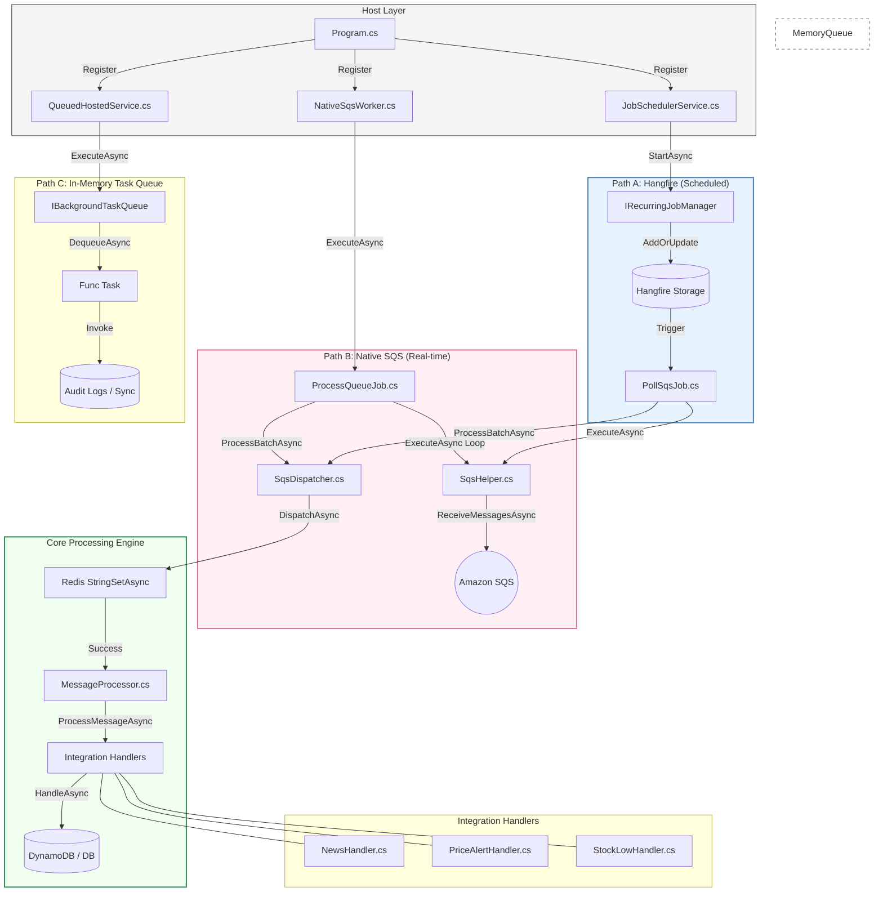

# InventoryAlert.Worker — Detailed Implementation Architecture

This diagram details the specific files and methods involved in the background processing ecosystem.

### 1. High-Detail Flow Diagram



### 2. SQS Dispatch Sequence

```mermaid
sequenceDiagram
    participant SQS as Amazon SQS
    participant Loop as ProcessQueueJob.ExecuteAsync
    participant Help as SqsHelper.ReceiveMessagesAsync
    participant Disp as SqsDispatcher.DispatchAsync
    participant Redis as Redis Cache
    participant Proc as MessageProcessor.ProcessMessageAsync
    participant Final as IntegrationHandler.HandleAsync

    Loop->>Help: ReceiveMessagesAsync(queueUrl)
    Help->>SQS: SDK: ReceiveMessageAsync
    SQS-->>Help: List of Messages
    Help-->>Loop: List<Message>
    
    loop Each Message in Batch
        Loop->>Disp: DispatchAsync(message)
        Disp->>Redis: StringSetAsync(dedupKey)
        Redis-->>Disp: Success / Duplicate
        
        alt Message is Unique
            Disp->>Proc: ProcessMessageAsync(message)
            Proc->>Final: HandleAsync(payload)
            Final-->>Proc: Complete
            Proc-->>Disp: Handled
            Disp->>Disp: WriteTelemetryAsync (DynamoDB)
        else Duplicate
            Disp-->>Loop: Handled (Skipped)
        end
    end
```

### Component & Method Registry

| File Name | Method | Purpose |
| :--- | :--- | :--- |
| **NativeSqsWorker.cs** | `ExecuteAsync` | Initiates the native polling implementation during app startup. |
| **ProcessQueueJob.cs** | `ExecuteAsync` | Runs an infinite `while(!ct.IsCancellationRequested)` loop for SQS. |
| **SqsHelper.cs** | `ReceiveMessagesAsync` | Low-level AWS SDK call to fetch messages from an SQS URL. |
| **SqsDispatcher.cs** | `DispatchAsync` | Core middleware for de-duplication, telemetery, and early return logic. |
| **MessageProcessor.cs** | `ProcessMessageAsync`| Logic for routing a raw SQS body to a typed C# event handler. |
| **JobSchedulerService.cs**| `StartAsync` | One-time registration of recurring Hangfire jobs into persistent storage. |
| **QueuedHostedService.cs** | `ExecuteAsync` | Continuous consumer of the internal `IBackgroundTaskQueue`. |

> [!IMPORTANT]
> **Path B (Native)** is the most efficient for production as it utilizes "Long Polling" (`WaitTimeSeconds=20`), which stays connected to AWS until a message is available, significantly reducing SDK overhead compared to the Hangfire trigger.
