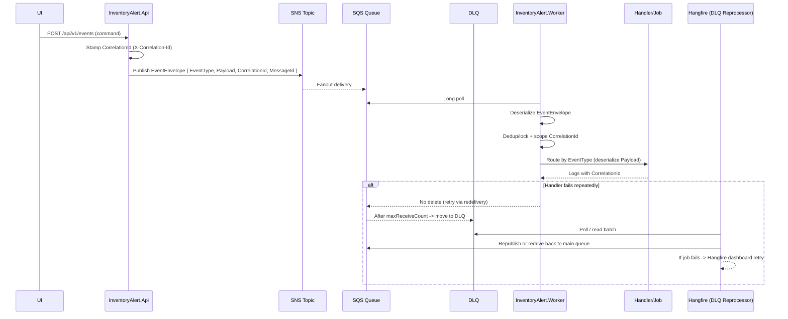

# Worker Jobs & Event Flow (Review + Enhancements)

This document contains **review findings and enhancement recommendations** for:

- `InventoryManagementSystem/InventoryAlert.Worker` (Hangfire jobs + SQS processing)
- API → messaging → Worker end-to-end event flow

Per request, this content is kept under `doc/` (not in Wiki pages).

---

## 1) Current Worker Topology (Observed in Code)

### 1.1 Recurring jobs (Hangfire)

Registered in `InventoryManagementSystem/InventoryAlert.Worker/Hosting/JobSchedulerService.cs`:

- `sync-prices` → `SyncPricesJob.ExecuteAsync`
- `sync-metrics` → `SyncMetricsJob.ExecuteAsync`
- `sync-earnings` → `SyncEarningsJob.ExecuteAsync`
- `sync-recommendations` → `SyncRecommendationsJob.ExecuteAsync`
- `sync-insiders` → `SyncInsidersJob.ExecuteAsync`
- `news-sync` → `NewsSyncJob.ExecuteAsync`
- `cleanup-prices` → `CleanupPriceHistoryJob.ExecuteAsync`

### 1.2 SQS processing (native BackgroundService)

`InventoryManagementSystem/InventoryAlert.Worker/Hosting/SqsListenerService.cs` runs a continuous polling loop (gated by `WorkerSettings.IsPollMessage`), delegating to:

- `InventoryManagementSystem/InventoryAlert.Worker/ScheduledJobs/ProcessQueueJob.cs`
  - long-polls SQS via `ISqsHelper.ReceiveMessagesAsync`
  - runs Redis dedup (`SET NX`) + cooldown logic
  - routes to `IIntegrationMessageRouter`

### 1.2.1 DLQ + retry behavior (what happens today when a message fails?)

This clarifies the **actual runtime behavior** when the Worker polls SQS and message handling fails.

**SQS-side retry/DLQ mechanics (in general)**

- Each time a message is received but **not deleted**, SQS will make it visible again after the **queue `VisibilityTimeout`**.
- SQS tracks a delivery counter (`ApproximateReceiveCount`).
- If the main queue is configured with a **RedrivePolicy** (DLQ + `maxReceiveCount`), then once the counter exceeds that value, SQS will move the message to the **DLQ** and it will no longer be delivered to consumers from the main queue.

Local/dev evidence (Moto init script):

- `InventoryManagementSystem/SolutionFolder/moto-init/init-all.sh` creates:
  - `event-queue` with `VisibilityTimeout=30s` and `RedrivePolicy.maxReceiveCount=3`
  - `inventory-event-dlq` as the DLQ target

**Worker-side behavior (current code)**

- Polling: `SqsHelper.ReceiveMessagesAsync` long-polls (`WaitTimeSeconds=20`) and requests system attributes including `ApproximateReceiveCount`.
  - File: `InventoryManagementSystem/InventoryAlert.Worker/Utilities/SqsHelper.cs`
- Delete-on-success: `ProcessQueueJob.ProcessBatchAsync` deletes the message **only when** `DispatchInternalAsync(...)` returns `success=true`.
  - File: `InventoryManagementSystem/InventoryAlert.Worker/ScheduledJobs/ProcessQueueJob.cs`
- On handler exception, `DispatchInternalAsync(...)` returns `false` → message is **not deleted** → SQS will retry after `VisibilityTimeout`.
  - This is the intended “retry by redelivery” mechanism.

**Important caveat: current Redis dedup logic effectively cancels retries after the first failure**

In `DispatchInternalAsync(...)` the Worker sets a Redis “processed” key **before** executing the router/handler:

- `dedupKey = msg:processed:{envelope.MessageId}`
- It is written with TTL 30 minutes using `SET NX`.

If handling then throws:

- The method returns `false` (so SQS will redeliver),
- but on redelivery the dedup key already exists, so the Worker treats the message as a duplicate and returns `true` (ACK), which deletes it from the main queue.

Net effect (today):

- “Retry” happens at most once (a redelivery), but the Worker will usually **ACK the redelivery without re-processing**, so the message is effectively **dropped** after the first failure.
- Because the message gets deleted on that redelivery, it may never reach the DLQ even if the queue has a redrive policy.

**Additional caveat: manual receive-count cutoff is inconsistent with DLQ**

`ProcessQueueJob` contains a hard-coded cutoff:

- if `ApproximateReceiveCount > 5` it logs a warning and returns `true` (ACK/delete).

This is not aligned with the dev queue redrive policy (`maxReceiveCount=3`), and if the queue has a DLQ configured, deleting the message at high receive count prevents SQS from redriving it to DLQ (message is removed instead).

**What to expect operationally**

- If a message fails due to a transient downstream error, you currently may not get automatic retries; it can be lost due to Redis dedup behavior.
- DLQ will only reliably capture poison messages if the Worker allows them to be retried/redriven (i.e., does not delete them early).

**Recommended target behavior (so retries + DLQ are meaningful)**

- Let SQS manage retries:
  - On failure: do **not** delete the message.
  - On success: delete the message.
  - Configure `VisibilityTimeout` and `RedrivePolicy.maxReceiveCount` to match desired retry cadence.
- Move “processed/dedup” markers to **after** successful processing, or store a separate “in-flight” key with a short TTL that doesn’t suppress redelivery attempts.
  - Rule of thumb: never let dedup turn a failure into a successful ACK.
- Avoid manual “receiveCount cutoff → ACK” unless you explicitly persist the failed payload somewhere (DynamoDB / DB / blob) before deleting it.
  - If you want a manual cutoff, prefer: on cutoff → emit a “dead-lettered” event / persist diagnostics → then delete.
- Decide (and document) the retry policy knobs as configuration:
  - `MaxReceiveCount` (DLQ threshold)
  - `VisibilityTimeoutSeconds`
  - `BackoffStrategy` (if using `ChangeMessageVisibility` to slow down hot-failing messages)

**DLQ operations (today)**

- The Worker polls only the main queue (`event-queue`). Messages in the DLQ (`inventory-event-dlq`) will sit until a human/tool inspects or redrives them.
- In local dev (Moto), you can inspect DLQ messages with AWS CLI (same endpoint used in `moto-init`):

```bash
aws sqs receive-message --queue-url "$(aws sqs get-queue-url --queue-name inventory-event-dlq --endpoint-url http://moto:5000 --query 'QueueUrl' --output text)" --endpoint-url http://moto:5000
```

- Retrying a DLQ message typically means “redrive” back to the source queue (AWS console has a Redrive UI) or manually `SendMessage` back to `event-queue` after you’ve fixed the root cause.

### 1.3 Unused / not wired (needs decision)

Found in code but not referenced:

- `InventoryManagementSystem/InventoryAlert.Worker/ScheduledJobs/SqsScheduledPollerJob.cs` (Hangfire-style single-shot poller)
- `InventoryManagementSystem/InventoryAlert.Worker/Filters/HangfireJobLoggingFilter.cs` (Hangfire failure/retry logging filter)

Recommendation: pick one supported polling strategy (native BackgroundService OR Hangfire poller) and wire/remove the other to reduce confusion.

Also present but unused today:

- `InventoryManagementSystem/InventoryAlert.Worker/Hosting/BackgroundTaskQueue.cs`
- `InventoryManagementSystem/InventoryAlert.Worker/Hosting/BackgroundTaskProcessor.cs`

These implement a C# internal work queue (`System.Threading.Channels`) pattern, but there is currently no producer calling `QueueBackgroundWorkItemAsync`, so SQS processing is **not** using the internal queue.

---

## 2) Event Flow: Known Mismatches / Risks

### 2.1 Message contract mismatch: `EventEnvelope` vs raw payload

`ProcessQueueJob` deserializes `message.Body` as `EventEnvelope`:

- `InventoryManagementSystem/InventoryAlert.Domain/Events/EventEnvelope.cs`
- `InventoryManagementSystem/InventoryAlert.Worker/ScheduledJobs/ProcessQueueJob.cs`

But `IntegrationMessageRouter` currently:

- expects `message.MessageAttributes["MessageType"]`
- deserializes `message.Body` directly into handler payload models

File: `InventoryManagementSystem/InventoryAlert.Worker/IntegrationEvents/Routing/IntegrationMessageRouter.cs`

Risk:

- routing can fail even when SQS contains valid `EventEnvelope` bodies.

### 2.2 SQS message attributes are not requested in the poller

`InventoryManagementSystem/InventoryAlert.Worker/Utilities/SqsHelper.cs` requests system attributes only:

- `MessageSystemAttributeNames = ["ApproximateReceiveCount", "SentTimestamp"]`
- does not request `MessageAttributeNames`

Risk:

- attribute-based routing won’t work reliably even if attributes exist.

### 2.3 CorrelationId propagation is intended, but fragile

Strengths:

- API stamps `X-Correlation-Id` (`CorrelationIdMiddleware`)
- Worker pushes `CorrelationId` into log scope when it has an envelope (`ProcessQueueJob`)

Risk:

- publishing must reliably stamp `EventEnvelope.CorrelationId` (API `EventService` currently doesn’t).

---

## 3) Enhancement Plan (Recommended)

### Chosen direction (per preference): Option C — SQS retries + DLQ, with Hangfire DLQ reprocessor

Primary goal:

- Let **SQS** handle automatic retries and DLQ routing (visibility timeout + redrive policy).
- Use **Hangfire Dashboard** to manage *manual recovery* by running a **DLQ reprocessor/redrive job** you can retry from the UI.

What this gives you:

- Automatic retries remain “queue-native”.
- Operators get a reliable “button” in Hangfire to re-run recovery tasks (redrive/replay batches from DLQ after a fix).

### P0 — Make event handling deterministic (one contract, one router)

Goal:

- SQS body is always `EventEnvelope` JSON
- Worker routes by `envelope.EventType`
- Worker deserializes `envelope.Payload`
- message attributes are optional (debug / filtering), not required for correctness

### P0 — Ensure correlation is end-to-end (search by one id)

Goal: searching Seq by `CorrelationId` shows:

1) API request
2) publish log
3) Worker consumption
4) handler logs

### P1 — Improve job operability (Hangfire)

Goal:

- Wire `HangfireJobLoggingFilter` globally so failures/retries are logged consistently.
- Standardize job logs (`JobName`, `ElapsedMs`, `Succeeded`, `ItemsProcessed`, `CorrelationId` when event-triggered).

Add (Option C core):

- Introduce a **DLQ reprocessor** Hangfire job (design described below) to:
  - inspect DLQ,
  - republish/redrive messages back to the main queue,
  - record what was replayed (ids + counts),
  - and surface failures in Hangfire so the Dashboard “Retry” button is meaningful.

### P1 — Make DLQ actually capture failures (don’t ACK failures accidentally)

Goal: if a message keeps failing, it should naturally reach DLQ; if it succeeds, ACK/delete it.

Key changes required (because current behavior can drop messages before DLQ):

- Ensure “dedup/processed” markers never convert a failure into a successful ACK.
  - Today Redis `msg:processed:{MessageId}` is written before processing and can cause the first redelivery to be ACK’d as a “duplicate”.
- Remove/align the manual cutoff that ACKs messages by `ApproximateReceiveCount`.
  - The queue redrive policy already controls the cutoff (`maxReceiveCount`).
  - If you keep a manual cutoff, treat it as “move to DLQ / persist diagnostics”, not “delete silently”.

### P1 — Make concurrency & rate limits configurable

Goal:

- Move hard-coded `MaxDegreeOfParallelism = 5` into config (`WorkerSettings`).
- Define backoff for Finnhub 429/5xx.
- Avoid logging large payloads by default (log excerpt + ids).

### P2 — Clarify supported polling strategy

Goal:

- Decide between native `SqsListenerService` vs `SqsScheduledPollerJob`.
- Document the chosen strategy and remove ambiguity.

---

## 4) Golden Path (Target)



---

## 4.1 Option C — DLQ reprocessor job (recommended spec)

This is the missing piece that makes “retry via Hangfire Dashboard” practical without forcing Hangfire to own the main SQS consumption loop.

### What the job does

Hangfire job example names:

- `dlq-reprocess` (recurring) — periodically scans DLQ and replays safe messages
- `dlq-redrive-once` (manual) — one-off job to replay `N` messages when an operator clicks “Enqueue”

Operational responsibilities:

- Pull a bounded batch from DLQ (e.g., `max=10..50`).
- For each message:
  - validate it’s an `EventEnvelope` and extract `MessageId`, `EventType`, `CorrelationId`
  - optionally check a “replay allowlist” (which event types are safe to replay)
  - republish back to the main queue (or publish back to SNS depending on your desired fanout semantics)
  - write an audit log entry (Seq + optional DB/Dynamo row) with replay metadata
  - delete from DLQ only after successful republish (or keep in DLQ and mark “attempted”)

### What “Retry” means in Hangfire

- If the DLQ reprocessor job fails (AWS outage, invalid payloads, permission issue), Hangfire marks the job as failed.
- An operator can click “Retry” in Hangfire Dashboard to rerun the recovery job.
- This is a **job-level retry** (re-run the recovery operation), not a direct per-message retry button inside Hangfire. If you need per-message selection, add parameters (eventType filter, messageId list, max batch size) and expose them via a small admin endpoint or a dashboard command pattern.

### Recommended guardrails

- Don’t create replay storms:
  - cap batch size per run
  - introduce a replay delay/backoff
  - record replay attempts per message id to prevent infinite loops
- Preserve traceability:
  - keep original `CorrelationId`
  - emit a new `ReplayId` / `ReprocessAttemptId` for recovery runs


## 5) Wiki doc drift notes (for later cleanup)

Wiki docs currently contain both current and legacy naming/flow descriptions (job naming, routing assumptions). Recommend keeping Wiki pages “how to use” oriented and referencing this `doc/` review for deeper refactor plans.
