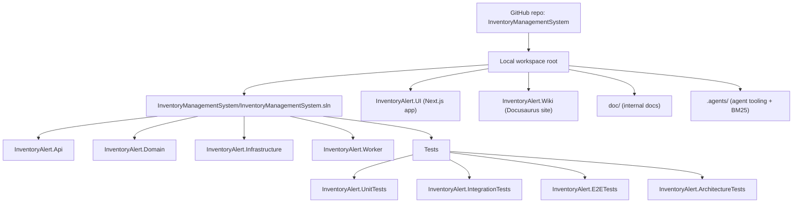

# Naming & Project Location Audit

## Canonical Naming Standard (Recommended)

Use **one umbrella name** for the repository and solution, and keep **InventoryAlert** as the application/product name.

- **GitHub repo name (canonical):** `InventoryManagementSystem`
- **Local root folder (canonical):** `InventoryManagementSystem` (this workspace root currently contains the `InventoryManagementSystem/` solution folder)
- **.NET solution name:** `InventoryManagementSystem.sln`
- **Application name:** `InventoryAlert`
  - Backend projects: `InventoryAlert.Api`, `InventoryAlert.Domain`, `InventoryAlert.Infrastructure`, `InventoryAlert.Worker`
  - Test projects: `InventoryAlert.UnitTests`, `InventoryAlert.IntegrationTests`, `InventoryAlert.E2ETests`, `InventoryAlert.ArchitectureTests`
  - Frontend app: `InventoryAlert.UI`
  - Documentation site: `InventoryAlert.Wiki`

### Visualization

### Why this standard

- Prevents “three names for one system” drift (`InventoryManagementSystem` vs `InvestManagementSystem` vs `InventoryAlert`).
- Keeps solution-level naming stable while allowing multiple apps/modules under the umbrella.
- Makes docs and onboarding clearer: umbrella = repo/solution, product = app.

## Scope

This document evaluates whether repository naming and file locations match the current solution structure, and records recommended conventions for docs and folders.

## Current Repository Top-Level Layout

| Path | Purpose | Notes |
|---|---|---|
| `.agents/` | Agent workflows/skills/scripts | BM25 tooling lives in `.agents/scripts/core/`. |
| `doc/` | Working internal documentation | Should use YAML frontmatter (see `/doc` skill standard). |
| `InventoryManagementSystem/` | .NET solution root | Contains `InventoryManagementSystem.sln` and all `.csproj`. |
| `InventoryAlert.UI/` | Next.js UI | Frontend app; has its own `package.json`. |
| `InventoryAlert.Wiki/` | Docusaurus documentation site | Built output in `InventoryAlert.Wiki/build` (should remain gitignored). |

## .NET Solution Structure (`InventoryManagementSystem/`)

**Solution file**
- `InventoryManagementSystem/InventoryManagementSystem.sln`

**Projects (observed `.csproj`)**
- `InventoryManagementSystem/InventoryAlert.Api/InventoryAlert.Api.csproj`
- `InventoryManagementSystem/InventoryAlert.Domain/InventoryAlert.Domain.csproj`
- `InventoryManagementSystem/InventoryAlert.Infrastructure/InventoryAlert.Infrastructure.csproj`
- `InventoryManagementSystem/InventoryAlert.Worker/InventoryAlert.Worker.csproj`
- `InventoryManagementSystem/InventoryAlert.UnitTests/InventoryAlert.UnitTests.csproj`
- `InventoryManagementSystem/InventoryAlert.IntegrationTests/InventoryAlert.IntegrationTests.csproj`
- `InventoryManagementSystem/InventoryAlert.E2ETests/InventoryAlert.E2ETests.csproj`
- `InventoryManagementSystem/InventoryAlert.ArchitectureTests/InventoryAlert.ArchitectureTests.csproj`
- `InventoryManagementSystem/InventoryAlert.Sample/InventoryAlert.Sample.csproj`

**Naming convention check**
- Project folders use `InventoryAlert.<Slice>` (PascalCase) and match `.csproj` names: OK.
- Shared kernel is `InventoryAlert.Domain` (not `InventoryAlert.Contracts`): ensure non-archive docs match this.

## Frontend App Structure (`InventoryAlert.UI/`)

| Path | Purpose |
|---|---|
| `InventoryAlert.UI/src/` | Next.js app code |
| `InventoryAlert.UI/public/` | Static assets |
| `InventoryAlert.UI/package.json` | Frontend scripts/deps |

**Naming convention check**
- `InventoryAlert.UI` matches product name and avoids conflicting with `.NET` projects: OK.
- `src/` and `public/` are standard Next.js structure: OK.

## Wiki Site Structure (`InventoryAlert.Wiki/`)

| Path | Purpose |
|---|---|
| `InventoryAlert.Wiki/docs/` | Docusaurus docs source (what we should edit) |
| `InventoryAlert.Wiki/sidebars.ts` | Autogenerated sidebar config |
| `InventoryAlert.Wiki/build/` | Generated static site output |

**Naming convention check**
- `docs/` subfolders use ordered prefixes like `04-execution-flows`: OK for navigation.
- `build/` should remain ignored by Git (see `InventoryAlert.Wiki/.gitignore`): OK.

## `doc/` Folder Conventions (Internal Docs)

Recommended conventions for **new** files:
- Filenames: prefer `snake_case.md` for internal specs/plans (matches existing style like `feature_audit.md`).
- Add YAML frontmatter header to every `doc/*.md` (required by `/doc` workflow).
- Keep anything superseded in `doc/archive/` and treat archive as historical (may contain stale names/paths).

## Known Mismatches / Drift (Observed)

### 1) Legacy name: `InventoryAlert.Contracts` (archive)

Many files under `doc/archive/` still reference the historical `InventoryAlert.Contracts` project name. This is expected if archive is treated as historical, but should not be used as current guidance.

**Recommendation**
- Keep `doc/archive/` as-is, but ensure any “active” doc points to `InventoryAlert.Domain`.

### 2) API version label (“v1” vs “v2”)

API routes in code are prefixed with `/api/v1/...` (controllers use `Route("api/v1/[controller]")`). Any doc claiming “v2” should be corrected to avoid confusion.

**Recommendation**
- Use “(v1)” in API reference titles unless the API is actually versioned differently.

### 3) Doc links pointing to non-existent files

Internal docs may contain links to planned directories (e.g., `doc/plan/*`) that are not present. This creates review friction.

**Recommendation**
- Keep `doc/README.md` as an index of files that exist *now*.
- Put aspirational plans under `doc/archive/` (or create the actual `doc/plan/` structure if it becomes active work).

## BM25 Indexing Scope (Docs)

BM25 indexing reads `.agents/scripts/core/bm25_config.json`.

**Recommendation**
- Index `InventoryAlert.Wiki/docs` (source docs) rather than `InventoryAlert.Wiki/` (includes irrelevant folders like `build/`, `src/`, etc.).
- Index `doc/` for internal specs and references.

## Summary

Overall, the repo layout is coherent:
- `.NET` projects are correctly nested under `InventoryManagementSystem/`.
- UI and Wiki are split into their own top-level apps.
- Primary remaining drift is within `doc/archive/` (historical naming like `InventoryAlert.Contracts`) and any leftover “v2” labels in docs.
